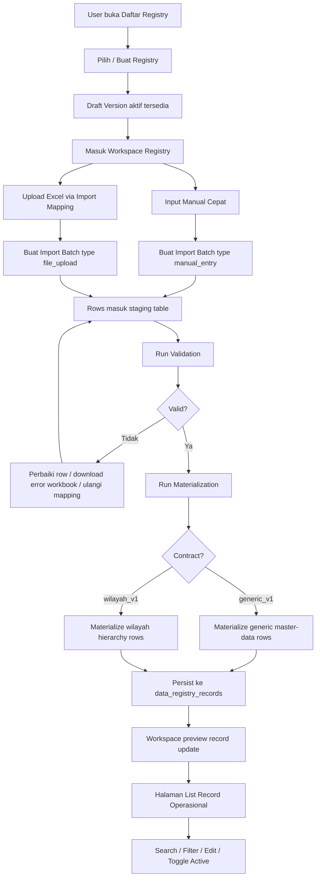
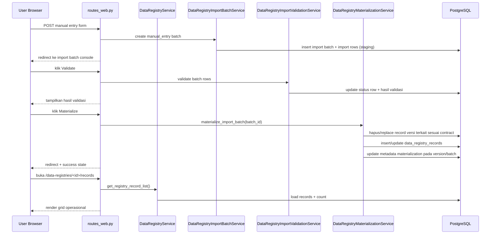
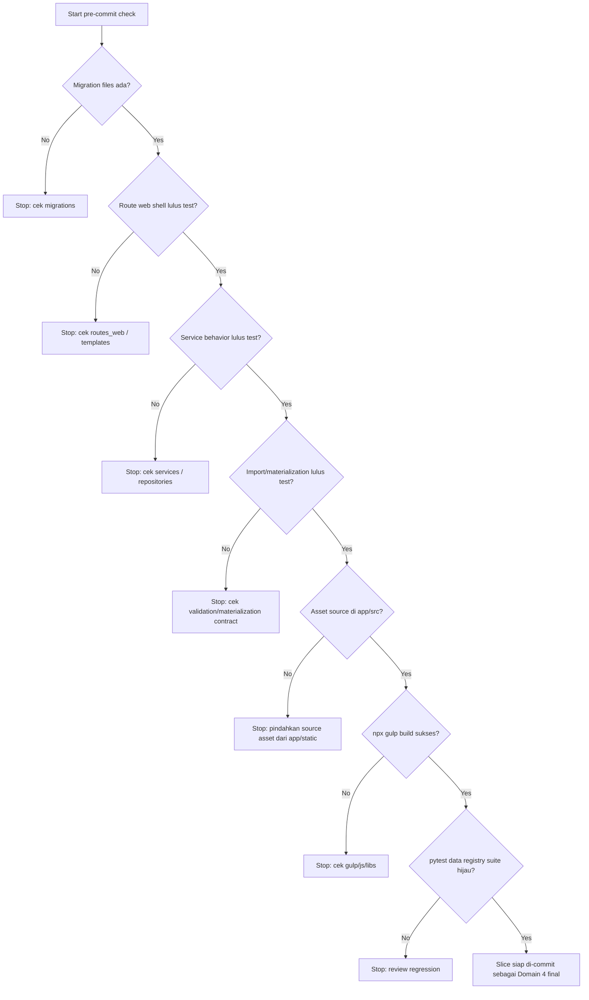

# Domain 4 Final Audit & Workflow v1

## Tujuan

Dokumen ini merangkum audit cepat untuk slice akhir Domain 4 `Data Registry / Master Data Registry` yang saat ini sudah siap diuji dan dipaketkan sebagai commit final sebelum masuk ke Domain 5 `Analytics Module`.

Fokus audit:
- alur setup registry browser-ready
- manual entry -> batch staging -> validasi -> materialisasi
- workspace operasional untuk preview batch/record
- list record operasional berbasis Grid.js
- migrasi final Domain 4 yang sudah menyerap constraint `manual_entry` dan `master_data`
- cakupan test utama untuk guard regression

---

## Ringkasan status audit

Status umum: `READY FOR DOMAIN 4 FINAL COMMIT`

Yang sudah sehat:
1. Registry sekarang bisa dibuat dari browser dengan starter preset.
2. Workspace registry sudah menjadi shell operasional untuk entry manual cepat.
3. Manual entry tidak menulis langsung ke record final, tetapi konsisten lewat batch staging.
4. Materialization generic sudah sinkron dengan payload master data/manual entry.
5. Constraint database sudah dibuka untuk:
   - `batch_type = manual_entry`
   - `admin_level = master_data`
6. Halaman list record sudah siap pakai untuk operasi dasar:
   - search
   - filter status
   - filter level
   - edit record
   - aktif/nonaktif record
7. Asset page-specific JS sudah kembali ke source pipeline yang benar di `app/src/js/pages/`.

Hal yang sengaja ditunda ke turn berikutnya:
- merapikan batch migrasi alter table menjadi lebih rapi/terkonsolidasi.

---

## Cakupan file Domain 4 final

### 1. Backend service & repository

- `app/modules/data_registry/services.py`
- `app/modules/data_registry/repositories.py`
- `app/modules/data_registry/routes_web.py`

Peran utamanya:
- `DataRegistryService.create_registry()`
  - membuat registry + draft version awal
- `DataRegistryService.get_registry_workspace()`
  - menyusun shell workspace browser
- `DataRegistryService.get_registry_record_list()`
  - menyusun kolom + row serialisasi untuk grid operasional
- `DataRegistryService.update_registry_record()`
  - edit payload/identity field record generic
- `DataRegistryService.set_registry_record_active()`
  - toggle aktif/nonaktif
- `DataRegistryRecordRepository.list_by_registry_version()`
  - sumber preview/list record
- `DataRegistryRecordRepository.count_by_registry_version()`
  - sumber counter record

### 2. Template/UI web

- `app/templates/pages/data_registry/registry_index.html`
- `app/templates/pages/data_registry/registry_workspace.html`
- `app/templates/pages/data_registry/registry_records.html`

Peran utamanya:
- `registry_index.html`
  - pintu masuk daftar registry browser-ready
- `registry_workspace.html`
  - UI manual entry cepat + preview record + recent batches
- `registry_records.html`
  - tabel operasional record + modal edit + form toggle status

### 3. Frontend source asset

- `app/src/js/pages/data-registry-records.js`

Peran utamanya:
- init Grid.js
- local search/filter orchestration
- open modal edit
- submit toggle active/inactive
- binding payload JSON preview

Catatan penting pipeline:
- source asset wajib di `app/src/`
- hasil build ditulis ke `app/static/`
- jangan edit file page JS langsung di `app/static/` karena akan hilang saat rebuild

### 4. Migration

- `migrations/versions/c4d7a9e2b1f0_backfill_data_registry_materialization_metadata.py`

Peran utamanya setelah squash Domain 4:
- backfill metadata materialization legacy
- membuka kontrak DB untuk `registry_type = master_data`
- membuka kontrak DB untuk `data_shape = hierarchical|tabular`
- membuka kontrak DB untuk `batch_type = manual_entry`
- membuka kontrak DB untuk `admin_level = master_data`

### 5. Test suite utama

- `tests/test_data_registry_web_registry_shell.py`
- `tests/test_data_registry_service_behaviors.py`
- `tests/test_data_registry_import_service_behaviors.py`
- `tests/test_data_registry_import_batch_type_migration.py`
- `tests/test_data_registry_record_admin_level_migration.py`

---

## Audit per area

### A. Pembuatan registry browser-ready

Status: OK

Audit cepat:
- route web create registry sudah menghasilkan payload preset yang cocok untuk starter `master_data_hierarkis`
- draft version awal langsung dibuat agar user tidak buntu setelah create
- mapping contract default sudah diarahkan ke `generic_v1`

Risiko residual:
- validasi uniqueness sudah ada untuk slug/code, tetapi UX conflict handling bisa dipoles lagi nanti bila dibutuhkan.

### B. Workspace manual entry

Status: OK

Audit cepat:
- workspace menampilkan metadata registry, versi draft/published, preview record, dan batch terbaru
- form manual entry dibangun dari schema field importable
- submit manual entry diarahkan ke batch staging, bukan bypass ke record final

Nilai desain yang benar:
- jalur manual entry dan upload Excel sekarang memakai jalur data yang konsisten
- ini penting untuk audit, validasi, dan materialization contract yang sama

### C. Materialization generic master data

Status: OK

Audit cepat:
- generic registry sekarang diserialisasi dan dimaterialisasi dengan kontrak field yang relevan untuk master data
- resolver identity generic sudah lebih toleran terhadap alias umum seperti `kode`, `code`, `record_code`, `label`, `name`
- constraint `admin_level = master_data` sudah dibuka di DB

Risiko residual:
- bila nanti ada keluarga registry generic lain dengan kebutuhan identity yang lebih kompleks, resolver alias mungkin perlu dipromosikan menjadi config-driven strategy.

### D. List record operasional

Status: OK

Audit cepat:
- halaman list record sudah punya UX operasional yang cukup manusiawi
- data tabel dibentuk dari `record_columns` + `record_rows`, bukan dump payload mentah
- ada modal edit dan toggle active tanpa perlu masuk SQL/manual patch

Catatan UX:
- sudah layak untuk operasional dasar internal
- belum masuk ke kebutuhan lanjutan seperti bulk action, inline validation lebih kaya, atau audit timeline per-record

### E. Asset pipeline frontend

Status: OK

Audit cepat:
- page script sudah benar berada di `app/src/js/pages/data-registry-records.js`
- template memuat Grid.js dari `static/libs`, bukan CDN
- sudah sesuai prinsip asset source vs build output di proyek ini

### F. Migration

Status: OK setelah squash batch migration Domain 4

Audit cepat:
- migration final Domain 4 sudah menyerap alter constraint kecil yang sebelumnya terpisah
- chain revision tetap linear tetapi lebih bersih karena tidak menyisakan patch alter-table kecil di ujung Domain 4
- test migration tetap bisa mengunci kontrak lama vs kontrak hasil squash

---

## Mermaid: alur kerja operasional Domain 4 final



---

## Mermaid: urutan backend manual entry sampai record final



---

## Mermaid: checklist pengecekan sebelum commit Domain 4 final



---

## Checklist verifikasi praktis

### A. Test Python

Jalankan:

```bash
docker exec -w /usr/src/app dasborkanwil_app sh -lc 'PYTHONPATH=/usr/src/app pytest tests/test_data_registry*.py -q'
```

Expected:
- seluruh suite data registry hijau
- saat audit terakhir: `75 passed, 2 skipped`

### B. Build asset frontend

Jalankan:

```bash
docker exec -w /usr/src/app dasborkanwil_asset sh -lc 'npx gulp build'
```

Expected:
- task build sukses
- `jsPages` ikut sukses
- output page JS tersedia di `app/static/js/pages/`

### C. Smoke check file penting

Periksa bahwa file-file ini ada:
- `app/src/js/pages/data-registry-records.js`
- `app/static/js/pages/data-registry-records.js`
- `app/static/libs/gridjs/dist/gridjs.umd.js`
- `app/static/libs/gridjs/dist/theme/mermaid.min.css`

### D. Smoke check UX browser

Jalur cek manual:
1. buka `/data-registries`
2. buka salah satu workspace registry
3. kirim 1 row manual entry
4. validate batch
5. materialize batch
6. buka `/data-registries/<registry_id>/records`
7. pastikan:
   - grid tampil
   - search/filter jalan
   - modal edit muncul
   - toggle status redirect balik ke list

---

## Rekomendasi commit slice

Karena Domain 4 saat ini sudah membentuk satu workflow utuh, commit sebaiknya dibungkus sebagai vertical slice, bukan dipisah terlalu kecil.

Contoh commit message yang sehat:

```text
feat(data-registry): finalize manual entry workspace and operational record UI
```

Alternatif lebih eksplisit:

```text
feat(domain-4): finalize registry manual-entry, materialization, and record operations
```

---

## Rekomendasi lanjutan setelah commit

Setelah commit Domain 4 final:
1. migrasi Domain 4 sudah rapi; tidak perlu turn housekeeping terpisah lagi
2. freeze contract Domain 4 yang sudah stabil
3. lanjut ke Domain 5 Analytics Module
   - dataset contract
   - freshness contract
   - transform/query layer
   - dashboard/chart serving boundary

---

## Kesimpulan audit

Untuk tujuan `Domain 4 final before Domain 5`, slice ini sudah cukup matang.

Checklist keputusan:
- workflow utama ada: ya
- DB contract minimum ada: ya
- web shell operasional ada: ya
- asset pipeline benar: ya
- test suite utama ada: ya
- masih ada pekerjaan housekeeping migration: tidak, batch final sudah disquash

Kesimpulan akhir: `aman untuk commit Domain 4 final dengan batch migrasi yang sudah dirapikan sebelum lanjut ke Domain 5`.
