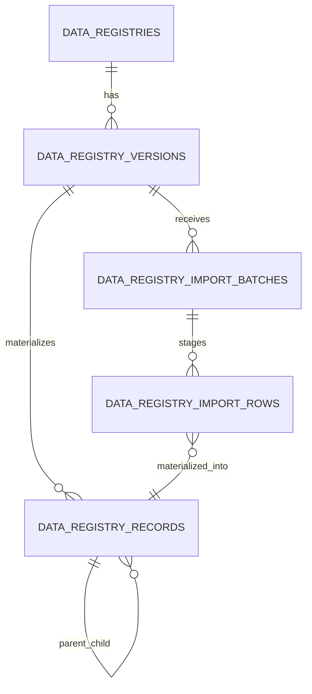
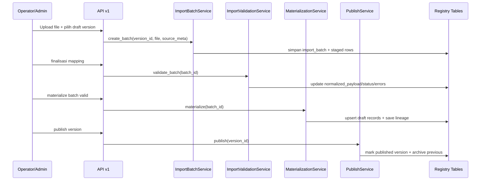
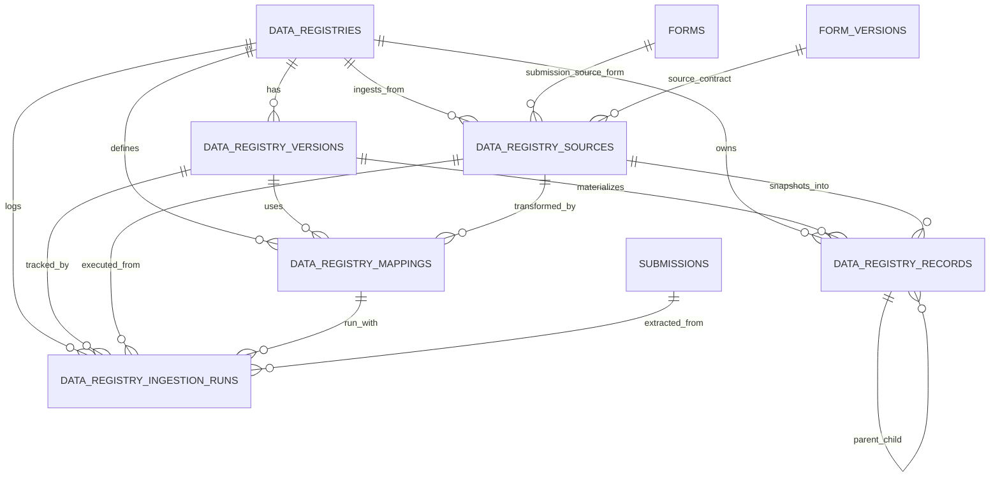
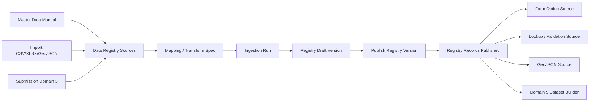

# Domain 4 — Master Data / Data Registry v1

Dokumen kerja lokal untuk mematangkan Domain 4 sebagai fondasi reusable data layer sebelum masuk lebih jauh ke analytics/reporting.

## 1. Posisi Domain 4 di arsitektur enterprise

Domain 4 bukan sekadar tempat CRUD master data dinamis.
Domain 4 diposisikan sebagai:

`canonical reusable data layer`

Artinya Domain 4 bertugas:
- menerima data dari sumber referensial/manual,
- menerima data dari hasil import file,
- menerima data dari submission/domain operasional,
- melakukan kurasi dan transformasi terkontrol,
- mem-publish hasilnya menjadi sumber data reusable untuk domain lain.

Dengan posisi ini, Domain 4 menjadi penghubung antara:
- Domain 2 `Form Registry / Form Builder`
- Domain 3 `Submission / Response Store`
- Domain 5 `Analytics & Visualization`

## 2. Batas Domain 4 vs Domain 5

Batas ini harus tegas sejak awal.

### Domain 4 — Master Data / Data Registry
Fokus pada:
- reusable reference data
- reusable lookup data
- submission-derived reusable records
- source registry untuk form lain
- source registry untuk validasi/lookup
- curated published data contracts

### Domain 5 — Analytics & Visualization
Fokus pada:
- dataset analitik
- agregasi/metric
- chart config
- dashboard
- reporting
- visualization output

Prinsip:
- Domain 4 berhenti di titik "data reusable yang siap dikonsumsi".
- Domain 5 baru mengolah data reusable tersebut menjadi insight, dataset analitik, dan visualisasi.

Jangan biarkan Domain 5 query raw `submissions` JSONB secara liar bila use case tersebut sebenarnya bisa distabilkan dulu di Domain 4.

## 3. Masalah bisnis yang harus diselesaikan Domain 4

Domain 4 harus mampu menangani minimal masalah berikut:

1. Master data referensial reusable
- contoh: provinsi, kabupaten/kota, kategori, unit kerja, daftar pegawai, lookup statis lain.

2. Field/data source reusable lintas form
- contoh: komponen select pada Form A mengambil data kabupaten/kota dari registry wilayah.

3. Submission sebagai source data reusable
- contoh: hasil submission Form X dipakai sebagai sumber option atau referensi untuk Form Y.

4. Jalur ETL ringan dan terkontrol
- source data tidak langsung dipakai mentah,
- ada tahap extract -> transform -> publish.

5. Kesiapan ke hilir untuk reporting
- output Domain 4 harus cukup stabil untuk dijadikan bahan dataset analitik di Domain 5.

## 3.1. Taxonomy registry Domain 4 v1

Taxonomy ini dipakai untuk menjawab pertanyaan dasar:
- data seperti apa yang memang layak masuk Domain 4,
- data seperti apa yang cukup menjadi registry reusable,
- dan data seperti apa yang seharusnya tetap hidup sebagai domain kaya tersendiri.

Prinsip utamanya:
- tidak semua entity harus dipaksa menjadi registry,
- registry cocok untuk data reusable yang kontraknya bisa dipublish dan dikonsumsi lintas domain,
- bila sebuah entity punya workflow kaya, approval rumit, lifecycle bisnis berat, dan perilaku domain yang dominan, entity itu sebaiknya tetap menjadi bounded context/domain sendiri lalu hanya mem-publish view/registry turunannya ke Domain 4.

### 3.1.1. Kelas registry yang disepakati untuk v1

#### A. `lookup/codebook`
Dipakai untuk daftar nilai referensial yang relatif sederhana dan stabil.

Contoh:
- kategori program
- status entitas
- tipe dokumen
- kode indikator
- pilihan referensial statis lain

Karakteristik:
- umumnya flat, bukan hierarchy berat
- cenderung kecil sampai menengah
- consumer utama: select, autocomplete, validasi value
- source bisa manual CRUD atau import file sederhana

#### B. `organization/scope`
Dipakai untuk data referensial organisasi dan scope yang mendukung ABAC/runtime filtering.

Contoh:
- unit kerja
- bidang/seksi
- scope registry sementara
- jabatan referensial ringan

Karakteristik:
- sering dipakai sebagai context authorization dan filtering
- beberapa atribut penting harus relasional/indexed
- dapat menjadi jembatan bootstrap sebelum master data organisasi resmi lebih matang
- consumer utama: auth context enrichment, select internal, ownership/target scope mapping

#### C. `geo/wilayah`
Dipakai untuk registry administratif/geografis yang berhierarki.

Contoh:
- provinsi
- kabupaten/kota
- kecamatan
- kelurahan/desa

Karakteristik:
- hierarchy kuat
- butuh `parent_record_id` dan helper ancestry columns
- source awal saat ini curated seeder/materialization, bukan generic import end-user
- chaining consumer bersifat opsional; field tetap boleh standalone per level
- geometry bisa nullable sampai source polygon resmi tersedia

#### D. `master entity reference`
Dipakai untuk bank data referensial yang lebih kaya daripada lookup, tetapi belum menjadi bounded context operasional tersendiri di aplikasi ini.

Contoh:
- daftar sekolah
- daftar fasilitas kesehatan
- daftar program bantuan
- daftar proyek/kegiatan referensial
- bank data institusional yang dipakai lintas form

Karakteristik:
- sering punya lebih banyak atribut bisnis daripada lookup biasa
- bisa flat atau semi-hierarkis
- sering perlu unique business key, display field, searchable fields, dan payload fleksibel
- source bisa manual, import file, API pull, atau registry copy

#### E. `submission-derived registry`
Dipakai untuk registry reusable yang dibentuk dari hasil kurasi/proyeksi data submission Domain 3.

Contoh:
- daftar entitas dari form pendataan tertentu
- daftar penerima/manfaat/objek hasil publish submission
- dataset reusable hasil form operasional tahunan

Karakteristik:
- source berasal dari form/submission, tetapi consumer tidak query raw `submissions` langsung
- wajib punya transform contract, lineage, dan freshness comparison terhadap submission terakhir
- bisa year-scoped atau period-scoped
- cocok untuk reuse lintas form dan sebagai jembatan ke Domain 5

### 3.1.2. Aturan klasifikasi: apa yang masuk registry dan apa yang tidak

Suatu data cenderung cocok menjadi registry bila:
- dibaca berulang oleh banyak consumer,
- kontraknya bisa distabilkan menjadi published reusable data,
- kebutuhannya dominan lookup/list/filter/validation/reference,
- perubahan datanya masih bisa dikurasi melalui lifecycle draft/published.

Suatu data sebaiknya tidak langsung dipaksa menjadi registry bila:
- perilaku bisnisnya lebih dominan daripada fungsi referensinya,
- butuh workflow approval/assignment/transaction yang kaya,
- state machine dan rule domainnya berat,
- lebih tepat dimodelkan sebagai domain operasional lalu hanya menurunkan published view ke Domain 4.

Contoh:
- `pegawai` ringan untuk option source masih bisa menjadi registry,
- tetapi HR domain penuh dengan mutasi, riwayat jabatan, payroll, absensi, approval, dan relasi kompleks sebaiknya tetap domain sendiri.

### 3.1.3. Dimensi klasifikasi yang direkomendasikan

Agar taxonomy tidak tercampur dengan bentuk penyimpanan, gunakan beberapa dimensi terpisah:

1. `registry_type`
- `lookup`
- `scope`
- `geo`
- `master_data`
- `submission_derived`

2. `category_key`
- subtype/bucket bisnis yang lebih spesifik
- contoh:
  - `wilayah`
  - `organisasi`
  - `indikator`
  - `program`
  - `entitas_pendataan`

3. `data_shape`
- `flat`
- `hierarchical`
- `entity_like`
- `geo_hierarchical`
- `submission_projection`

4. `source_mode`
- `manual`
- `import_file`
- `seeded`
- `submission_sync`
- `api_pull`
- `hybrid`

Dengan pemisahan ini:
- `registry_type` menjawab kelas registry-nya,
- `category_key` menjawab bucket bisnisnya,
- `data_shape` menjawab bentuk record/relasinya,
- `source_mode` menjawab cara data masuknya.

Contoh klasifikasi yang konsisten:
- wilayah administratif
  - `registry_type=geo`
  - `category_key=wilayah`
  - `data_shape=geo_hierarchical`
  - `source_mode=seeded`
- unit kerja internal
  - `registry_type=scope`
  - `category_key=organisasi`
  - `data_shape=hierarchical`
  - `source_mode=manual` atau `import_file`
- daftar program
  - `registry_type=master_data`
  - `category_key=program`
  - `data_shape=entity_like`
  - `source_mode=import_file`
- daftar entitas hasil submit form pendataan
  - `registry_type=submission_derived`
  - `category_key=entitas_pendataan`
  - `data_shape=submission_projection`
  - `source_mode=submission_sync`

### 3.1.4. Implikasi taxonomy untuk langkah berikutnya

Keputusan taxonomy ini memberi dampak langsung:
- step 2 harus mendefinisikan schema contract generik yang cukup fleksibel untuk `lookup`, `scope`, `master_data`, dan `submission_derived` tanpa mengorbankan indexing relasional penting;
- subdomain `geo/wilayah` boleh tetap punya optimasi khusus, tetapi tidak boleh mendikte seluruh import workflow generik;
- generic import workflow di step 3 difokuskan terutama untuk `lookup`, `scope`, dan `master_data`, sementara `geo/wilayah` tetap boleh stay di curated seeder/materialization pada fase saat ini;
- serving contract consumer harus tetap sederhana dan dibatasi oleh kelas registry, bukan query bebas.

## 3.2. Schema contract generik untuk registry non-wilayah

Section ini mematangkan Step 2 untuk kelas registry selain `geo/wilayah`, terutama:
- `lookup`
- `scope`
- `master_data`
- `submission_derived`

Tujuannya adalah memastikan fleksibilitas tidak berubah menjadi kekacauan.
Kita tetap memberi ruang payload dinamis, tetapi kontrak published-nya harus eksplisit, tervalidasi, dan nyaman dikonsumsi oleh service/API/UI.

### 3.2.1. Prinsip dasar schema contract

Setiap registry version non-wilayah harus diperlakukan sebagai kontrak data yang dipublish, bukan sekadar dump record.

Artinya `schema_json` bukan aksesori. Ia menjadi sumber aturan untuk:
- field apa yang ada,
- field mana yang wajib,
- field mana yang unik,
- field mana yang dipakai sebagai label tampil,
- field mana yang searchable/filterable,
- bagaimana payload di-validate,
- bagaimana record di-serialize ke consumer contract.

Dengan kata lain:
- `data_registry_versions` menyimpan kontrak,
- `data_registry_records` menyimpan instance data yang tunduk pada kontrak tersebut.

### 3.2.2. Split yang disepakati: relational core vs dynamic payload

Agar query tetap sehat, schema contract generik harus memisahkan dua lapisan.

#### A. Relational core columns
Kolom ini stabil, umum, dan pantas diindex bila sering dipakai lintas registry.

Minimal yang dipertahankan relasional:
- identity & lifecycle
  - `registry_id`
  - `registry_version_id`
  - `record_key`
  - `record_code` nullable
  - `status`
  - `is_active`
- hierarchy/scope/period bila relevan
  - `parent_record_id` nullable
  - `scope_code` nullable
  - `reporting_year` nullable
  - `reporting_period_id` nullable
- audit & lineage minimum
  - `source_id` nullable
  - `source_updated_at` nullable
  - `materialized_at` nullable
  - `source_snapshot` JSONB
- consumer helper yang sering dipakai
  - `display_label`
  - `normalized_label`
  - `sort_order`

Catatan penting:
- `display_label` dan `normalized_label` layak dipromosikan dari payload ke kolom eksplisit karena hampir pasti dipakai untuk listing, search ringan, dan option source.
- `record_key` adalah canonical identifier internal yang stabil lintas consumer.
- `record_code` adalah business/reference code yang bisa nullable karena tidak semua registry punya kode formal.

#### B. Dynamic payload columns
Bagian ini tetap fleksibel dan hidup di JSONB.

JSONB dipakai untuk:
- atribut bisnis spesifik registry,
- field yang tidak universal lintas registry,
- alternate labels/codes,
- metadata tambahan,
- hasil projection dari source/import/submission,
- nested structures ringan yang tidak layak dijadikan kolom global.

Bentuk yang direkomendasikan:
- `payload` JSONB untuk nilai field dinamis utama
- `meta` JSONB untuk metadata tambahan yang bukan business field utama
- `source_snapshot` JSONB untuk lineage/source trace

Prinsipnya:
- kalau field sering dipakai untuk filter global, join, uniqueness, access policy, atau list endpoint cepat, pertimbangkan kolom relasional;
- kalau field hanya penting untuk isi bisnis per registry tertentu, tetap di payload.

### 3.2.3. Struktur minimum `schema_json`

`schema_json` per registry version non-wilayah sebaiknya minimal memiliki blok-blok berikut:

```json
{
  "version": 1,
  "fields": [],
  "identity": {},
  "display": {},
  "search": {},
  "filters": {},
  "uniqueness": [],
  "validation": {},
  "serialization": {}
}
```

Makna tiap blok:
- `fields`
  - daftar field yang diizinkan pada payload/contract
- `identity`
  - aturan pembentukan `record_key`, `record_code`, atau field identitas lain
- `display`
  - field mana yang menjadi label utama, subtitle, badge, atau default ordering consumer
- `search`
  - field mana yang searchable dan bagaimana normalisasinya
- `filters`
  - field mana yang boleh diekspos ke filtered listing
- `uniqueness`
  - aturan unik bisnis selain constraint inti DB
- `validation`
  - rule wajib, enum, type, regex, min/max, dependency ringan
- `serialization`
  - cara record diproyeksikan ke `option`, `lookup`, atau `listing` response

### 3.2.4. Kontrak field di dalam `fields`

Setiap field pada `schema_json.fields` minimal disarankan memiliki shape seperti:

```json
{
  "name": "program_name",
  "type": "string",
  "label": "Nama Program",
  "required": true,
  "stored_in": "payload",
  "searchable": true,
  "filterable": true,
  "sortable": false,
  "unique": false,
  "active": true
}
```

Atribut penting yang layak distandarkan:
- `name`
- `type`
- `label`
- `required`
- `stored_in`
  - `column`
  - `payload`
- `column_name` nullable bila `stored_in=column`
- `searchable`
- `filterable`
- `sortable`
- `unique`
- `default`
- `enum` nullable
- `description`
- `active`

Dengan kontrak ini, implementer dan consumer sama-sama jelas:
- field apa yang cuma ada di payload,
- field apa yang juga dipromosikan ke kolom,
- field apa yang boleh dipakai search/filter.

### 3.2.5. Aturan identity yang direkomendasikan

Untuk registry non-wilayah, jangan biarkan identitas business record terlalu ambigu.

#### A. `record_key`
- wajib ada
- canonical internal key
- stabil untuk lookup consumer
- tidak boleh bergantung pada label mentah semata

Sumber `record_key` bisa berasal dari:
- source code yang memang stabil,
- field bisnis yang sudah dinormalisasi,
- kombinasi beberapa field penting,
- generated key berdasar template kontrak identity.

#### B. `record_code`
- opsional tetapi sangat dianjurkan bila ada business code resmi
- dipakai untuk interoperability, import matching, dan referensi manusia

#### C. `display_label`
- wajib bisa diturunkan secara deterministik dari kontrak display
- jangan biarkan setiap consumer merakit label sendiri dari payload mentah

Contoh:
- registry program:
  - `record_key = program:<kode_program>`
  - `record_code = <kode_program>`
  - `display_label = <nama_program>`
- registry sekolah:
  - `record_key = school:<npsn>`
  - `record_code = <npsn>`
  - `display_label = <nama_sekolah>`

### 3.2.6. Unique rules: DB constraint vs business uniqueness

Kita perlu membedakan dua level uniqueness.

#### A. Constraint inti di database
Minimal tetap pertahankan:
- unique (`registry_version_id`, `record_key`)
- optional unique (`registry_version_id`, `record_code`) bila registry tersebut memang menjamin code unik

#### B. Business uniqueness di level kontrak
Sebagian registry butuh rule unik yang tidak cukup direpresentasikan oleh satu kolom global.

Contoh:
- kombinasi `program_code + reporting_year`
- kombinasi `scope_code + employee_number`
- kombinasi beberapa field payload hasil import

Karena itu `schema_json.uniqueness` sebaiknya mendukung daftar rule seperti:

```json
[
  {
    "name": "uq_program_code_year",
    "fields": ["program_code", "reporting_year"],
    "scope": "registry_version",
    "case_sensitive": false
  }
]
```

Rule ini dipakai pada:
- validasi import,
- bulk upsert,
- pre-publish validation,
- error workbook generation.

### 3.2.7. Searchable / filterable / display rules

Ini bagian yang sering disepelekan, padahal sangat penting untuk consumer UX.

#### A. Display rules
`schema_json.display` minimal sebaiknya bisa mendefinisikan:
- `label_field`
- `subtitle_fields`
- `badge_fields`
- `default_sort`
- `empty_label_fallback`

Tujuannya:
- option source konsisten,
- lookup detail konsisten,
- admin listing tidak perlu menebak field tampil.

#### B. Search rules
`schema_json.search` minimal sebaiknya mendefinisikan:
- `searchable_fields`
- `normalized_fields`
- `search_mode` (`contains`, `prefix`, `exact`)
- `min_query_length` opsional

Prinsip:
- jangan semua field payload otomatis searchable,
- batasi agar performa dan ekspektasi consumer tetap sehat.

#### C. Filter rules
`schema_json.filters` minimal sebaiknya mendefinisikan:
- allowed filter fields
- operator yang diizinkan
- apakah field dibaca dari kolom atau payload

Contoh filter yang sehat di v1:
- exact match
- in list
- boolean active/inactive
- reporting year
- scope code

Jangan dulu terlalu cepat membuka filter DSL liar.

### 3.2.8. Validation contract minimum

Setiap published registry version non-wilayah sebaiknya minimal punya validation contract untuk:
- required fields
- data types
- enum values
- max length
- regex sederhana
- referential dependency ringan bila ada
- unique rules

Poin penting:
- validasi ini dipakai bukan hanya saat input manual,
- tetapi juga saat import batch, bulk upsert, submission projection, dan pre-publish validation.

Jadi registry version yang dipublish harus bisa menjawab:
- bentuk data valid seperti apa,
- data invalid dikenali dengan aturan apa,
- dan errornya bisa dijelaskan ulang ke user/admin secara deterministik.

### 3.2.9. Serialization contract minimum

Agar Domain 4 benar-benar menjadi curated published contract, registry version perlu mendefinisikan bagaimana record disajikan.

`schema_json.serialization` minimal sebaiknya mendukung target berikut:
- `option`
  - `label`
  - `value`
  - optional `meta`
- `lookup`
  - detail field yang boleh dikembalikan
- `listing`
  - kolom ringkas untuk grid/table

Contoh arah kontrak:

```json
{
  "option": {
    "value_field": "record_key",
    "label_template": "{program_code} - {program_name}"
  },
  "lookup": {
    "fields": ["record_key", "record_code", "program_name", "payload.category"]
  },
  "listing": {
    "fields": ["record_code", "program_name", "scope_code", "is_active"]
  }
}
```

Dengan pola ini:
- Form Builder/Form Runtime tidak perlu menebak label,
- admin grid bisa reuse kontrak yang sama,
- consumer API lebih konsisten lintas registry.

### 3.2.10. Contoh sederhana per kelas registry non-wilayah

#### A. `lookup` — kategori indikator
- relasional inti:
  - `record_key`
  - `record_code`
  - `display_label`
  - `sort_order`
  - `is_active`
- payload:
  - `description`
  - `color`
  - `group_name`
- display:
  - label = `display_label`
- uniqueness:
  - `record_code` unik per version

#### B. `scope` — unit kerja
- relasional inti:
  - `record_key`
  - `record_code`
  - `display_label`
  - `parent_record_id`
  - `scope_code`
  - `is_active`
- payload:
  - `manager_name`
  - `contact_email`
  - `legacy_codes`
- search:
  - `display_label`, `record_code`, `scope_code`
- filter:
  - `parent_record_id`, `scope_code`, `is_active`

#### C. `master_data` — daftar program
- relasional inti:
  - `record_key`
  - `record_code`
  - `display_label`
  - `reporting_year`
  - `is_active`
- payload:
  - `program_name`
  - `program_category`
  - `owner_unit`
  - `budget_ceiling`
- uniqueness:
  - `program_code + reporting_year`

#### D. `submission_derived` — daftar entitas pendataan
- relasional inti:
  - `record_key`
  - `display_label`
  - `reporting_year`
  - `source_id`
  - `source_updated_at`
  - `materialized_at`
- payload:
  - field-field hasil projection dari submission
- contract tambahan:
  - wajib ada lineage minimal ke source submission/form version
  - wajib punya freshness comparison terhadap submission terakhir

### 3.2.11. Keputusan Step 2 yang terkunci

Untuk registry non-wilayah, kontrak generik yang dipakai ke depan adalah:
1. gunakan relational core untuk identity, lifecycle, scope/period penting, dan consumer helper yang sering diquery;
2. gunakan JSONB `payload` untuk atribut bisnis dinamis;
3. `schema_json` wajib menjadi kontrak published yang mendefinisikan fields, identity, display, search, filters, uniqueness, validation, dan serialization;
4. uniqueness dibedakan antara DB constraint inti dan business uniqueness rule;
5. consumer tidak boleh menebak label/search/filter shape dari payload mentah; semua harus mengikuti contract versi published.

Implikasinya ke Step 3:
- import workflow generik harus membaca dan menegakkan `schema_json` ini,
- error workbook harus bisa memetakan error ke field contract yang sama,
- proses publish harus punya pre-publish validation terhadap schema + uniqueness + serialization contract.

## 3.3. Import workflow generik untuk registry non-wilayah

Step 3 ini menerjemahkan taxonomy dan schema contract sebelumnya menjadi alur kerja operasional.
Fokusnya bukan sekadar "unggah file lalu simpan", tetapi membangun pipeline kurasi yang aman, bisa diaudit, bisa diulang, dan tidak merusak published registry secara diam-diam.

Kelas registry yang terutama dituju oleh workflow ini:
- `lookup`
- `scope`
- `master_data`
- sebagian `submission_derived` saat source-nya perlu direfresh/materialize secara terkontrol

Sedangkan `geo/wilayah` pada fase saat ini tetap boleh bertahan di jalur curated seeder/materialization khusus.

### 3.3.1. Tujuan import workflow

Import workflow generik harus menyelesaikan masalah berikut:
- menerima data mentah dari file atau source terstruktur lain,
- memetakan data mentah ke contract registry version,
- memvalidasi row satu per satu dengan aturan dari `schema_json`,
- memberi ruang review dan koreksi sebelum publish,
- menghasilkan output error yang mudah diperbaiki user,
- dan hanya mempromosikan data valid ke record store melalui langkah publish/materialize eksplisit.

Prinsipnya sama seperti yang sudah mulai kita kenal di Domain 2-3:
- ada contract,
- ada staging,
- ada validasi,
- ada promote/publish,
- tetapi di Domain 4 bentuknya adalah semi-statis reusable data, bukan respons form operasional langsung.

### 3.3.2. Jalur workflow tingkat tinggi

Alur generik yang direkomendasikan:

1. pilih registry + target version draft
2. pilih source / upload file
3. baca header/sample/source snapshot
4. auto-mapping ke field contract
5. operator review/adjust mapping
6. buat import batch
7. buat staged import rows
8. jalankan validation pass
9. tandai valid/error/skipped/duplicate per row
10. sediakan resume page + preview hasil
11. hasilkan error workbook untuk baris gagal
12. jika operator setuju, lakukan materialize/promote ke draft records
13. jalankan pre-publish validation di level registry version
14. publish version secara eksplisit

Poin kunci:
- parse/upload tidak langsung overwrite `data_registry_records` published,
- selalu ada tahap staging,
- publish tetap langkah eksplisit.

### 3.3.3. Entity tambahan yang direkomendasikan

Agar pipeline ini rapi, ada baiknya Step 3 mengunci entity operasional berikut.

#### A. `data_registry_import_batches`
Mewakili satu sesi import/operator run dari satu source ke satu registry version draft.

Kolom relasional minimum yang direkomendasikan:
- `id`
- `uuid`
- `registry_id`
- `registry_version_id`
- `source_id` nullable
- `mapping_id` nullable
- `batch_type` — `file_upload`, `source_refresh`, `submission_refresh`, `manual_seed`
- `status` — `uploaded`, `mapped`, `validating`, `validated`, `materializing`, `completed`, `completed_with_errors`, `failed`, `cancelled`
- `original_filename` nullable
- `storage_path` nullable
- `mime_type` nullable
- `reporting_year` nullable
- `reporting_period_id` nullable
- `total_rows`
- `mapped_rows`
- `valid_rows`
- `error_rows`
- `duplicate_rows`
- `skipped_rows`
- `mapping_snapshot` JSONB
- `source_headers` JSONB
- `source_snapshot` JSONB
- `validation_summary` JSONB
- `materialization_summary` JSONB
- `error_workbook_path` nullable
- audit fields standar

Peran batch:
- menjadi payung audit,
- menyimpan konfigurasi mapping yang benar-benar dipakai,
- menyimpan statistik hasil proses,
- menjadi entry point resume/retry/download error workbook.

#### B. `data_registry_import_rows`
Mewakili setiap row hasil staging dari suatu batch.

Kolom relasional minimum yang direkomendasikan:
- `id`
- `uuid`
- `import_batch_id`
- `row_number`
- `row_hash`
- `status` — `pending`, `mapped`, `valid`, `error`, `duplicate`, `skipped`, `materialized`
- `record_key_candidate` nullable
- `record_code_candidate` nullable
- `duplicate_of_row_id` nullable
- `target_record_id` nullable
- `source_updated_at` nullable
- `raw_payload` JSONB
- `mapped_payload` JSONB
- `normalized_payload` JSONB
- `validation_errors` JSONB
- `validation_warnings` JSONB
- `lineage_snapshot` JSONB
- timestamps standar

Peran row staging:
- memisahkan data mentah dari data terpetakan,
- menyimpan hasil normalisasi dan error per row,
- memungkinkan retry/repair tanpa harus parse source ulang dari nol.

### 3.3.4. Status lifecycle yang direkomendasikan

#### A. Batch status
Minimal status batch yang sehat di v1:
- `uploaded`
- `mapped`
- `validating`
- `validated`
- `materializing`
- `completed`
- `completed_with_errors`
- `failed`
- `cancelled`

Makna sederhananya:
- `uploaded`: source sudah diterima, belum dipetakan final
- `mapped`: mapping snapshot sudah dikunci, row staging sudah dibuat
- `validating`: sistem sedang memeriksa row-row
- `validated`: validasi selesai, menunggu keputusan materialize/promote
- `materializing`: row valid sedang di-upsert ke draft record store
- `completed`: seluruh proses sukses tanpa error berarti
- `completed_with_errors`: ada row error/skip/duplicate tetapi proses batch selesai
- `failed`: batch gagal total
- `cancelled`: dibatalkan operator

#### B. Row status
Minimal status row:
- `pending`
- `mapped`
- `valid`
- `error`
- `duplicate`
- `skipped`
- `materialized`

Makna sederhananya:
- `pending`: belum diproses
- `mapped`: sudah punya mapped payload
- `valid`: lolos validation contract
- `error`: gagal validasi
- `duplicate`: bentrok dengan unique rule atau row lain
- `skipped`: sengaja diabaikan karena kosong/tidak relevan
- `materialized`: sudah dipromosikan ke draft records

### 3.3.5. Tahap workflow yang direkomendasikan

#### Tahap 1 — Source intake
Untuk v1, source intake yang paling realistis:
- upload file `csv/xlsx`
- refresh dari source config yang sudah terdaftar
- refresh submission-derived source

Aktivitas utama:
- simpan metadata source
- baca header/sample
- simpan source snapshot awal
- jangan langsung sentuh published record

#### Tahap 2 — Mapping
Mapping harus mengikuti `schema_json.fields`.

Kemampuan minimal:
- auto-map berdasarkan nama field/label/header normalization
- operator override mapping
- simpan `mapping_snapshot` final di batch
- dukung field yang berasal dari:
  - kolom file/source langsung
  - default value
  - literal/static value
  - derivation ringan bila memang perlu
- khusus field bertipe `date` / `datetime`, mapping harus bisa mendeklarasikan normalisasi format input ke canonical format target

Aturan tambahan untuk field tanggal/waktu:
- source boleh datang dari format yang berbeda-beda, mis. `dd/mm/yyyy`, `yyyy-mm-dd`, `dd-mm-yyyy`, atau serial date spreadsheet
- `mapping_snapshot` sebaiknya menyimpan petunjuk parsing minimum seperti `accepted_input_formats`, `timezone_assumption` bila relevan, dan `target_format`
- hasil parse disimpan ke `normalized_payload`, sedangkan nilai mentah tetap dipertahankan di `raw_payload` untuk audit/debug
- bila parsing tanggal gagal, row tidak boleh diam-diam lolos; error harus muncul sebagai validation error level field/row
- pola normalisasi tanggal ini sebaiknya dipakai konsisten juga pada import workflow Domain 3 ketika submission/backdate diimpor dari file

Tujuannya:
- pada saat batch diproses ulang, kita tahu mapping yang benar-benar dipakai,
- proses bisa diaudit dan direproduksi.

#### Tahap 3 — Staging rows
Setelah mapping final:
- buat `data_registry_import_rows`
- simpan `raw_payload`
- simpan `mapped_payload`
- hitung `row_hash`
- bentuk candidate identity seperti `record_key_candidate` bila sudah bisa

Prinsip:
- tahap ini belum final business validation penuh,
- tetapi sudah cukup untuk memastikan setiap row punya representasi terpetakan yang stabil.

#### Tahap 4 — Validation
Validation harus membaca kontrak Step 2.

Jenis validasi minimum:
- required fields
- data type
- enum/allowed values
- max length / regex ringan
- identity completeness
- uniqueness antar row dalam batch
- uniqueness terhadap draft target / published baseline bila dibutuhkan
- scope/period consistency

Output validation per row:
- `validation_errors`
- `validation_warnings`
- status row

Output validation per batch:
- `validation_summary`
- counter valid/error/duplicate/skipped

#### Tahap 5 — Review / resume
Sebelum materialize, operator harus punya ruang melihat hasil.

Resume page / API summary minimal sebaiknya menampilkan:
- total row
- valid row
- error row
- duplicate row
- skipped row
- sample error
- sample mapped payload
- status batch
- action untuk materialize/retry/download error workbook

Di sinilah workflow menjadi "manusiawi" dan tidak terasa seperti black box.

#### Tahap 6 — Error workbook generation
Ini sangat penting untuk UX dan sudah sejalan dengan preferensi import UX proyek ini.

Prinsip error workbook yang direkomendasikan:
- bentuk workbook mencerminkan template/source yang diimpor,
- row yang gagal diprefill kembali,
- error ditampilkan sedekat mungkin dengan field bermasalah,
- user bisa koreksi lalu re-import tanpa menyusun ulang data dari nol.

Minimal isi yang dibutuhkan:
- sheet data koreksi
- kolom/pesan error per row
- `_meta` sheet untuk identitas batch/registry/version/timestamp

Kalau bentuk inline cell comment penuh belum dibuat di v1, minimal tetap harus ada:
- row source yang diprefill
- kolom `error_messages`
- kolom `error_fields`
- metadata batch

#### Tahap 7 — Materialize/promote ke draft records
Hanya row yang statusnya valid yang boleh dipromosikan.

Aturan materialize yang sehat:
- targetnya ke draft registry version, bukan published version aktif langsung
- gunakan upsert berdasarkan identity contract
- simpan lineage kembali ke batch/row/source snapshot
- update `materialization_summary`
- tandai row menjadi `materialized`

Untuk `submission_derived`, tahap ini secara konsep mirip sinkronisasi snapshot dari source operasional ke curated registry.

#### Tahap 8 — Pre-publish validation + publish
Setelah draft record store selesai dimaterialize:
- jalankan validasi level versi
- cek kelengkapan schema contract
- cek uniqueness aggregate
- cek serialization contract masih bisa dibentuk
- cek statistik batch/materialization masuk akal

Baru setelah itu:
- publish registry version secara eksplisit
- update freshness/materialized watermark bila relevan

### 3.3.6. Aturan duplicate handling

Duplicate adalah masalah nyata, jadi jangan ditunda ke nanti.

Minimal bedakan 3 kasus:
1. duplicate di dalam batch yang sama
2. duplicate terhadap draft target yang sedang dibangun
3. duplicate terhadap baseline/published data lama

Pilihan policy per registry nanti bisa berbeda, tetapi v1 minimal harus mengenal mode berikut:
- `reject_duplicate`
- `skip_duplicate`
- `update_existing`
- `keep_latest_by_source_updated_at`

Policy ini sebaiknya disimpan di kontrak/import config, bukan di-hardcode seragam untuk semua registry.

### 3.3.7. Hubungan import workflow dengan `schema_json`

Import workflow Step 3 tidak boleh berdiri liar. Ia harus tunduk pada kontrak Step 2.

Artinya:
- mapping membaca daftar `fields`
- validation membaca `required`, `type`, `enum`, `uniqueness`
- display error membaca label field dari contract
- serialization check membaca kontrak `option/lookup/listing`
- materialize identity membaca blok `identity`

Kalau `schema_json` berubah, import behavior yang relevan ikut berubah secara terkontrol per version.

Ini penting karena membuat import workflow generik benar-benar reusable, bukan pipeline khusus satu registry saja.

### 3.3.8. Contoh sederhana use case import

#### A. `lookup` — kategori indikator
- upload file daftar kategori
- auto-map `kode`, `nama`, `group`, `warna`
- validasi code unik
- hasil error workbook untuk code kosong/duplikat
- row valid dimaterialize ke draft records
- publish jadi option source

#### B. `scope` — unit kerja
- upload file unit kerja bertingkat
- map `kode_unit`, `nama_unit`, `kode_induk`
- validasi parent existence dan scope code unik
- duplicate ditandai jelas
- materialize ke draft registry organisasi

#### C. `master_data` — program tahunan
- upload file program per tahun
- validasi `program_code + reporting_year`
- budget numerik dicek
- owner unit divalidasi terhadap registry scope bila diperlukan
- publish setelah batch bersih

#### D. `submission_derived`
- refresh dari submission source
- extract row snapshot
- projection ke mapped payload
- validasi contract yang sama seperti import file
- materialize ke draft registry publishable

### 3.3.9. Keputusan Step 3 yang terkunci

Untuk Domain 4 non-wilayah, import workflow generik yang dipakai ke depan adalah:
1. selalu menggunakan staging melalui `data_registry_import_batches` dan `data_registry_import_rows`;
2. parse/import tidak langsung menimpa published records;
3. validasi per row dan per version wajib membaca `schema_json` versi target;
4. error workbook adalah artefak resmi workflow, bukan bonus belakangan;
5. materialize selalu menuju draft version dulu, lalu publish dilakukan eksplisit;
6. duplicate handling harus menjadi policy yang terdokumentasi, bukan efek samping tak terduga.

Implikasinya ke Step 4:
- finalisasi implementasi harus memetakan entity, service, dan API untuk batch, row, validation, materialization, dan publish;
- sequence diagram/mermaid di tahap final akan sangat membantu karena sekarang alurnya sudah cukup kaya dan lintas beberapa lapisan.

## 3.4. Implementation slice v1 untuk migration, service, API, dan rollout

Step 4 ini sengaja tidak langsung melompat ke "bangun semua mesin ETL generik".
Fokusnya adalah menurunkan Step 1-3 ke irisan implementasi yang realistis, tipis, tetapi tetap enterprise-minded.

Prinsip irisan implementasi v1:
- pertahankan fondasi entity yang sudah ada sebagai anchor awal;
- tambahkan entity operasional import yang benar-benar dibutuhkan oleh Step 3;
- service dipisah antara catalog/version, import pipeline, materialization, dan serving;
- API v1 dibuat tipis dan mengikuti service contract, bukan menyimpan business rule di route;
- `geo/wilayah` tetap boleh hidup lewat seeder/materialization curated, sementara generic import workflow diprioritaskan untuk registry non-wilayah.

### 3.4.1. Scope migration v1 yang direkomendasikan

Daripada membangun semua kandidat entity besar sekaligus, Step 4 sebaiknya dibagi dua lapis.

#### Lapis A — Rekonsiliasi dan penguatan entity inti yang sudah ada
Entity existing yang sudah menjadi anchor awal:
- `data_registries`
- `data_registry_versions`
- `data_registry_records`

Hal yang perlu dipastikan/dirapikan di migration berikutnya:
1. `data_registries`
   - tetap menyimpan identitas registry: `registry_slug`, `registry_code`, `name`, `registry_type`, `category_key`, `source_mode`, `data_shape`, `status`
   - tambahkan pointer published/current version bila nanti dibutuhkan untuk query cepat, mis. `current_version_id`
   - siapkan atribut scope/policy ringan bila registry akan menjadi resource ABAC-aware

2. `data_registry_versions`
   - pertahankan `schema_json`, `mapping_spec`, `source_snapshot`, `publish_notes`, `published_at`, `freshness_*`
   - tambahkan `reporting_year` nullable untuk registry yang period-scoped
   - pertimbangkan `serving_contract` JSONB dan `transform_contract` JSONB bila ingin memisahkan contract konsumsi vs contract ingest secara eksplisit
   - tambahkan `last_import_batch_id` nullable bila nanti resume page ingin langsung menunjuk batch aktif/terakhir

3. `data_registry_records`
   - pertahankan `record_key`, `record_code`, `label/display_label`, `is_active`, `valid_from`, `valid_to`, `payload`, `source_snapshot`
   - tambahkan `reporting_year` nullable dan `reporting_period_id` nullable untuk registry period-scoped
   - tambahkan `import_batch_id` nullable dan/atau `import_row_id` nullable bila ingin lineage materialization lebih eksplisit
   - jangan semua field dinamis diangkat jadi kolom; hanya field hot-filter/identity yang memang perlu

#### Lapis B — Entity operasional baru untuk generic import workflow
Entity minimum yang sekarang paling layak ditambahkan:
- `data_registry_import_batches`
- `data_registry_import_rows`

Kenapa dua ini diprioritaskan dulu:
- paling langsung menjawab kebutuhan Step 3;
- cukup untuk staging, validation, error workbook, resume, dan materialize;
- belum memaksa kita membangun source catalog + mapping catalog yang terlalu besar sejak awal.

Catatan sequencing:
- `data_registry_sources`, `data_registry_mappings`, dan worker sinkronisasi generik masih valid sebagai arah v1.5/v2;
- tetapi untuk implementasi tipis awal, `source_snapshot` dan `mapping_snapshot` di batch sudah cukup sebagai jembatan.

### 3.4.2. Service boundaries yang direkomendasikan

Supaya route tipis dan logika tidak bercampur, service Domain 4 sebaiknya dibelah seperti ini.

#### A. Catalog & versioning
- `DataRegistryService`
  - create/update registry metadata
  - publish registry pointer
  - resolve registry detail
- `DataRegistryVersionService`
  - create draft version
  - clone draft from published/source version
  - update draft schema/mapping
  - pre-publish validation
  - publish version

#### B. Import pipeline
- `DataRegistryImportBatchService`
  - create batch
  - ingest source file metadata
  - persist mapping snapshot
  - create staged rows
  - generate batch summary
- `DataRegistryImportValidationService`
  - validate row against `schema_json`
  - normalize typed values termasuk `date` / `datetime`
  - hitung duplicate intra-batch dan versus target baseline
  - bentuk `validation_summary`
- `DataRegistryImportWorkbookService`
  - generate error workbook
  - prefilling row gagal
  - simpan metadata workbook batch

#### C. Materialization & publish
- `DataRegistryMaterializationService`
  - promote row valid ke `data_registry_records` draft target
  - upsert berdasarkan identity contract
  - simpan lineage ke batch/row/source snapshot
  - hitung materialization summary
- `DataRegistryPublishService`
  - jalankan pre-publish checks level version
  - archive published version lama
  - publish version baru secara eksplisit

#### D. Consumption / query
- `DataRegistryQueryService`
  - option list
  - lookup by key/code
  - filtered listing
  - hierarchy children bila perlu
  - freshness metadata exposure

### 3.4.3. Repository boundaries yang direkomendasikan

Repository tetap dijaga sederhana: query + persistence saja.

Candidate repository:
- `DataRegistryRepository`
- `DataRegistryVersionRepository`
- `DataRegistryRecordRepository`
- `DataRegistryImportBatchRepository`
- `DataRegistryImportRowRepository`

Aturan utamanya:
- repository tidak memutuskan policy duplicate atau publish;
- repository tidak membangun error workbook;
- repository tidak memahami workflow bisnis lintas entity;
- orkestrasi tetap di service layer.

### 3.4.4. API v1 yang direkomendasikan

API tipis yang masuk akal untuk v1:

#### A. Catalog & versioning
- `POST /api/v1/data-registries`
  - buat registry + optional draft version awal
- `GET /api/v1/data-registries/<registry_id>`
  - detail registry + versions
- `POST /api/v1/data-registries/<registry_id>/versions/draft`
  - buat/clone draft version
- `PATCH /api/v1/data-registry-versions/<version_id>/schema`
  - update `schema_json` draft
- `POST /api/v1/data-registry-versions/<version_id>/publish`
  - publish version

#### B. Import workflow
- `POST /api/v1/data-registry-versions/<version_id>/import-batches`
  - upload file/source metadata + create batch
- `GET /api/v1/data-registry-import-batches/<batch_id>`
  - batch detail + counters + summary
- `POST /api/v1/data-registry-import-batches/<batch_id>/mapping`
  - simpan/finalisasi mapping snapshot
- `POST /api/v1/data-registry-import-batches/<batch_id>/validate`
  - jalankan validation pass
- `GET /api/v1/data-registry-import-batches/<batch_id>/rows`
  - list staged rows dengan filter status
- `POST /api/v1/data-registry-import-batches/<batch_id>/materialize`
  - promote valid rows ke draft records
- `GET /api/v1/data-registry-import-batches/<batch_id>/error-workbook`
  - download workbook koreksi

#### C. Consumption
- `GET /api/v1/data-registries/<registry_slug>/options`
- `GET /api/v1/data-registries/<registry_slug>/lookup`
- `GET /api/v1/data-registries/<registry_slug>/records`

Prinsip response:
- validation error distandarkan seperti Domain 2-3 (`HTTP 400` + `data.error_type='validation_error'`)
- route hanya parsing request/response; rule hidup di service
- published consumer endpoint tidak membaca draft version secara diam-diam

### 3.4.5. Sequencing implementasi yang paling aman

Urutan implementasi coding yang sehat:

1. penguatan model + migration entity inti yang sudah ada
2. tambah entity `data_registry_import_batches` dan `data_registry_import_rows`
3. contract test untuk import batch lifecycle, row validation, duplicate policy, materialize, publish
4. implement service import pipeline synchronous dulu
5. expose API v1 tipis untuk batch/rows/materialize/publish
6. baru setelah stabil, pertimbangkan source catalog, mapping catalog, dan worker refresh generik

Kalau harus dibuat lebih tipis lagi, implementasi pertama paling aman adalah:
- registry `master_data` non-wilayah sederhana
- file upload `xlsx/csv`
- mapping manual ringan
- validasi termasuk normalisasi tanggal
- error workbook
- materialize ke draft
- publish eksplisit

### 3.4.6. Mermaid — entity slice implementasi v1



### 3.4.7. Mermaid — sequence import sampai publish



### 3.4.8. Mermaid — detail normalisasi field tanggal saat import

```mermaid
flowchart TD
    A[Raw source value] --> B{Field type date/datetime?}
    B -- No --> C[Normal mapping biasa]
    B -- Yes --> D[Parse by accepted_input_formats]
    D --> E{Parse sukses?}
    E -- No --> F[validation_errors[field]=invalid_date_format]
    E -- Yes --> G[Normalisasi ke canonical format]
    G --> H[Simpan ke normalized_payload]
    F --> I[Row status = error]
    H --> J[Lanjut validation/type/uniqueness]
    C --> J
```

### 3.4.9. Keputusan implementasi Step 4 yang dikunci

1. Implementasi v1 tidak perlu langsung membangun source catalog generik penuh; `mapping_snapshot` + `source_snapshot` di batch cukup untuk irisan pertama.
2. Entity baru prioritas adalah `data_registry_import_batches` dan `data_registry_import_rows`.
3. Normalisasi tanggal pada mapping/validation adalah concern inti import, bukan tambahan kosmetik.
4. Publish tetap menjadi langkah eksplisit setelah materialize ke draft version.
5. Worker refresh/source catalog generik boleh menjadi langkah lanjutan setelah slice synchronous v1 stabil.

## 4. Prinsip desain inti

### 4.0. Period-aware by design
Domain 4 harus siap mengikuti konteks `active_year` sejak awal, bukan ditambal belakangan.

Prinsipnya:
- registry tertentu bisa bersifat lintas tahun (`year_agnostic`),
- registry tertentu bersifat period-scoped (`year_scoped`),
- consumer boleh meminta data berdasarkan `active_year` actor secara default,
- tetapi service tetap harus bisa override ke tahun/periode lain untuk kebutuhan komparatif, audit, dan backdate.

Konsekuensinya:
- `reporting_year` diperlakukan sebagai kolom relasional/indexed pada record yang memang period-scoped,
- bila nanti perlu granularitas lebih detail, `reporting_period_id` bisa ditambahkan sebagai relasi opsional,
- query consumer tidak boleh menganggap semua registry berlaku global sepanjang masa.

### 4.1. JSONB strategis, bukan segalanya
Gunakan JSONB untuk:
- payload atribut dinamis
- geojson/properties
- mapping spec
- transform spec
- ingestion context
- metadata tambahan
- snapshot asal data

Jangan gunakan JSONB sebagai satu-satunya tempat untuk field yang sering dipakai filter/list/join.

Field berikut sebaiknya tetap relasional/indexed bila relevan:
- `registry_id`
- `registry_version_id`
- `source_id`
- `source_type`
- `record_key`
- `record_code`
- `status`
- `is_active`
- `reporting_year`
- `scope_code`
- `parent_record_id`
- `published_at`
- `form_id`
- `form_version_id`
- `submission_id`
- `freshness_status`
- `last_synced_at`
- `source_updated_at`

### 4.2. Versioning adalah fitur inti
Perubahan schema/mapping/shape registry tidak boleh merusak consumer lama.

Karena itu:
- definisi registry harus versioned,
- publish registry harus eksplisit,
- consumer sebaiknya membaca versi published aktif atau versi tertentu yang dibekukan.

### 4.3. Submission bukan live source liar
Submission boleh menjadi source, tetapi bukan berarti semua consumer langsung query tabel `submissions`.

Gunakan pola:
- submission sebagai source,
- snapshot extract,
- transform,
- curate,
- publish ke registry.

### 4.4. Serving contract harus sederhana di awal
V1 sebaiknya fokus pada kontrak konsumsi sederhana:
- option list `label/value`
- lookup record by key/code
- hierarchical tree ringan
- geojson feature collection
- filtered registry records

Registry/version yang sudah dipublish boleh diekspos sebagai resource API dinamis untuk consumer seperti Form Builder dan Form Runtime, selama kontraknya tetap terkurasi dan stabil. Artinya yang dipublikasikan adalah published registry contract, bukan draft version, bukan raw source, dan bukan query builder bebas.

Pola publish consumer-friendly yang direkomendasikan di v1:
- option source untuk select/autocomplete/dependent select
- lookup endpoint by key/code
- tree endpoint berdasarkan parent/level
- feature collection endpoint untuk peta ringan
- filtered listing dengan parameter terbatas yang sudah didefinisikan

Jangan langsung membangun query builder yang terlalu generik.

### 4.5. CRUD dinamis tetap butuh governance
Karena ada JSONB dan schema dinamis, tetap perlu:
- status draft/published/archived
- audit trail actor
- ingestion run log
- source tracking
- mapping spec tracking

### 4.6. Freshness harus bisa diverifikasi, bukan sekadar diasumsikan realtime
Kebutuhan bisnis yang mulai terlihat adalah ilusi "realtime yang bertanggung jawab":
- submission Domain 3 terus masuk,
- Domain 4 perlu tahu apakah published registry yang dikonsumsi masih selaras dengan sumber terakhir,
- UI/consumer perlu bisa melihat kapan registry terakhir disegarkan dan apakah ada source baru yang belum diserap.

Karena itu Domain 4 sebaiknya punya konsep:
- `source_watermark` — penanda perubahan terakhir dari sumber,
- `materialized_watermark` — penanda perubahan terakhir yang sudah masuk ke registry published,
- `freshness_status` — mis. `fresh`, `stale`, `refreshing`, `failed`,
- `freshness_signature` — hash deterministik dari kombinasi watermark + identitas source + konteks periodenya.

Hash ini bukan gimmick keamanan, tetapi checksum ringan untuk menjawab:
- apakah source yang dipakai consumer sama dengan source terbaru?
- apakah refresh terakhir masih relevan untuk `active_year` tertentu?
- apakah ada perubahan source yang belum dimaterialisasi ke Domain 4?

## 5. Use case v1 yang direkomendasikan

Agar Domain 4 tidak melebar liar, v1 disarankan fokus ke tiga use case konkret.

### Use case 1 — Registry wilayah referensial
Contoh:
- provinsi
- kabupaten/kota
- kecamatan
- kelurahan bila nanti perlu

Kebutuhan:
- bisa simpan atribut relasional dasar
- bisa simpan `properties` dinamis
- bisa simpan `geometry` / GeoJSON
- bisa serve untuk select/autocomplete/peta

Dokumen turunan yang mematangkan use case ini:
- `docs/architecture/domain-4-wilayah-blueprint-v1.md`
- `docs/architecture/domain-4-wilayah-schema-contract-v1.md`
- `docs/architecture/domain-4-wilayah-migration-schema-plan-v1.md`
- `docs/architecture/domain-4-wilayah-implementation-plan-v1.md`

### Use case 2 — Registry organisasi/pegawai ringan
Contoh:
- unit kerja
- scope organisasi
- pegawai referensial ringan

Kebutuhan:
- bisa jadi dasar source select/lookup internal
- bisa menjembatani bootstrap scope registry saat migrasi ke registry resmi database

### Use case 3 — Submission-derived registry
Contoh:
- hasil submission form tertentu dipublish menjadi daftar entitas reusable untuk form lain

Kebutuhan:
- source berasal dari submission/form version tertentu
- ada transform rule
- ada published registry records
- tidak query raw submissions secara liar di runtime consumer
- freshness dapat dibandingkan terhadap submission terakhir per `reporting_year`/periode

## 6. Komponen arsitektur Domain 4 v1

Domain 4 v1 disarankan dibagi menjadi 4 lapisan.

### 6.1. Registry Catalog
Menjelaskan apa itu registry, untuk apa, dan shape-nya seperti apa.

Entitas konseptual:
- `data_registries`
- `data_registry_versions`

Tanggung jawab:
- identitas registry
- jenis registry
- lifecycle registry
- schema contract
- publish version
- metadata distribusi/konsumsi

### 6.2. Record Store
Menyimpan record reusable aktual dari registry published atau draft tertentu.

Entitas konseptual:
- `data_registry_records`

Tanggung jawab:
- penyimpanan record reusable
- hierarchical relation bila perlu
- key/code uniqueness per registry version
- active/inactive state
- source snapshot per record

### 6.3. Ingestion / ETL Layer
Mencatat dari mana data datang, bagaimana dipetakan, dan bagaimana proses ingest dijalankan.

Entitas konseptual:
- `data_registry_sources`
- `data_registry_mappings`
- `data_registry_ingestion_runs`

Tanggung jawab:
- source catalog
- mapping/transform spec
- refresh/import/publish run log
- audit dan troubleshooting

Di dalam lapisan ini, v1.5/v2 juga cocok menaruh service worker ringan untuk sinkronisasi sumber-ke-registry.

### 6.3.1. Worker / Sync Orchestrator
Belum harus berupa sistem async berat. Pada tahap awal cukup ada service worker domain yang bisa dipanggil:
- manual dari admin,
- on-demand dari UI,
- by cron/scheduler ringan,
- nanti bisa berevolusi ke queue/worker terpisah.

Service kandidat:
- `DataRegistryFreshnessService`
- `DataRegistrySyncService`
- `DataRegistryWorker`

Tanggung jawab worker:
- membaca status freshness per registry/version/source,
- menghitung `source_watermark` dari sumber aktif,
- membandingkan dengan `materialized_watermark` terakhir,
- memutuskan perlu refresh atau tidak,
- menjalankan extract -> transform -> upsert draft records,
- mem-publish versi baru atau meng-update draft aktif sesuai policy,
- menyimpan run log dan hasil signature.

### 6.4. Serving / Consumption Layer
Belum perlu tabel yang terlalu banyak pada v1, tetapi contract-nya harus dipikirkan.

Bisa diwujudkan pada service/API lebih dulu untuk:
- option source endpoint
- lookup endpoint
- geojson endpoint
- submission-derived feed endpoint

Kalau nanti perlu persist view/contract, baru pertimbangkan entitas tambahan seperti:
- `data_registry_exports`
- `data_registry_views`

## 7. Entity candidate v1

Naming berikut adalah kandidat yang lebih future-proof dibanding sekadar `master_data_types` / `master_data_records`, tetapi tetap sejalan dengan arah AGENTS.

### 7.1. `data_registries`
Definisi registry induk.

Kolom relasional yang direkomendasikan:
- `id`
- `uuid`
- `key` — identifier stabil, mis. `wilayah.kabupaten_kota`
- `name`
- `slug`
- `description`
- `registry_type` — `lookup`, `scope`, `geo`, `master_data`, `submission_derived`
- `status` — `draft`, `published`, `archived`
- `current_version_id` nullable
- `owner_scope_type`
- `owner_scope_code`
- `owner_scope_name`
- `access_policy_key`
- `meta` JSONB
- audit fields standar

### 7.2. `data_registry_versions`
Versi schema/kontrak registry.

Kolom relasional yang direkomendasikan:
- `id`
- `uuid`
- `registry_id`
- `version_number`
- `status` — `draft`, `published`, `archived`
- `is_published`
- `published_at`
- `published_by`
- `record_count`
- `schema_hash`
- `source_mode` — `manual`, `import`, `submission`, `hybrid`
- `reporting_year` nullable
- `freshness_status` — `fresh`, `stale`, `refreshing`, `failed`, `unknown`
- `source_watermark` nullable
- `materialized_watermark` nullable
- `freshness_signature` nullable
- `last_synced_at` nullable
- `last_sync_run_id` nullable
- `meta` JSONB
- `schema_definition` JSONB
- `serving_contract` JSONB
- `transform_contract` JSONB
- audit fields standar

### 7.3. `data_registry_records`
Record reusable aktual.

Kolom relasional yang direkomendasikan:
- `id`
- `uuid`
- `registry_id`
- `registry_version_id`
- `parent_record_id` nullable
- `source_id` nullable
- `record_key`
- `record_code` nullable
- `record_label`
- `status` — `draft`, `published`, `inactive`, `archived`
- `sort_order`
- `is_active`
- `reporting_year` nullable
- `reporting_period_id` nullable
- `scope_code` nullable
- `effective_from` nullable
- `effective_until` nullable
- `source_updated_at` nullable
- `materialized_at` nullable
- `meta` JSONB
- `data` JSONB
- `geometry` JSONB nullable
- `source_snapshot` JSONB
- audit fields standar

Catatan:
- `data` berisi payload atribut dinamis.
- `geometry` dipisahkan bila ingin eksplisit untuk registry geospasial.
- `record_key` harus jadi identifier stabil untuk consumer.

### 7.4. `data_registry_sources`
Catalog sumber data.

Kolom relasional yang direkomendasikan:
- `id`
- `uuid`
- `registry_id`
- `source_type` — `manual`, `file_import`, `submission_query`, `registry_copy`, `api_pull`
- `name`
- `status`
- `form_id` nullable
- `form_version_id` nullable
- `submission_filter_key` nullable
- `upstream_registry_id` nullable
- `refresh_mode` — `manual`, `scheduled`, `on_publish`
- `period_mode` — `year_agnostic`, `year_scoped`, `period_scoped`
- `meta` JSONB
- `connection_config` JSONB
- `extract_spec` JSONB
- audit fields standar

### 7.5. `data_registry_mappings`
Rule mapping/transform source ke target registry.

Kolom relasional yang direkomendasikan:
- `id`
- `uuid`
- `registry_id`
- `registry_version_id`
- `source_id`
- `name`
- `status`
- `mapping_type` — `column_map`, `json_path_map`, `submission_projection`, `geojson_projection`
- `meta` JSONB
- `mapping_spec` JSONB
- `transform_spec` JSONB
- `validation_spec` JSONB
- audit fields standar

### 7.6. `data_registry_ingestion_runs`
Log proses ingest/refresh/publish.

Kolom relasional yang direkomendasikan:
- `id`
- `uuid`
- `registry_id`
- `registry_version_id` nullable
- `source_id` nullable
- `mapping_id` nullable
- `run_type` — `preview`, `import`, `refresh`, `publish`, `rebuild`
- `trigger_context` JSONB
- `reporting_year` nullable
- `reporting_period_id` nullable
- `status` — `queued`, `running`, `completed`, `completed_with_errors`, `failed`, `cancelled`
- `source_watermark` nullable
- `materialized_watermark` nullable
- `freshness_signature` nullable
- `started_at`
- `finished_at`
- `total_rows`
- `success_rows`
- `error_rows`
- `skipped_rows`
- `meta` JSONB
- `input_snapshot` JSONB
- `result_summary` JSONB
- `error_details` JSONB
- audit fields standar

## 8. Entity map dan relasi konseptual



## 9. Diagram alir data lintas domain



## 10. Relasi konseptual yang penting

### 10.1. Registry ke Version
- satu registry memiliki banyak version
- satu version published aktif bisa ditandai sebagai current version pada registry

### 10.2. Version ke Records
- record reusable dipublikasikan dalam konteks version tertentu
- consumer sebaiknya mengkonsumsi record dari version published yang jelas

### 10.3. Source ke Mapping ke Ingestion Run
- source mendefinisikan asal data
- mapping menjelaskan cara transform
- ingestion run merekam satu eksekusi nyata

### 10.4. Record ke Source Snapshot
- setiap record penting sebaiknya dapat ditelusuri asalnya
- tidak harus 100% normalized sampai row source mentah, tetapi minimal ada `source_snapshot`

### 10.5. Domain 3 ke Domain 4
- submission dapat menjadi source Domain 4,
- tetapi Domain 4 menyimpan hasil kurasi/publish-nya sendiri,
- consumer lain tidak perlu selalu query submission mentah.

## 11. Batas relasional vs JSONB

### Simpan sebagai kolom relasional/indexed
Gunakan bila field:
- sering dipakai filter/list
- perlu join/FK
- identifier stabil
- diperlukan untuk authorization/scope
- dipakai oleh consumer rutin

Contoh:
- `registry_type`
- `status`
- `record_key`
- `record_label`
- `reporting_year`
- `scope_code`
- `source_type`
- `form_id`
- `submission_id` bila kelak ada row lineage eksplisit
- `freshness_status`
- `last_synced_at`
- `source_updated_at`

### Simpan di JSONB
Gunakan bila field:
- shape-nya dinamis
- bervariasi antar registry
- sifatnya config/spec/payload
- tidak selalu jadi hot filter

Contoh:
- `schema_definition`
- `serving_contract`
- `transform_contract`
- `mapping_spec`
- `validation_spec`
- `data`
- `geometry`
- `source_snapshot`
- `result_summary`

## 12. Lifecycle data yang direkomendasikan

### Lifecycle registry
- `draft`
- `published`
- `archived`

### Lifecycle registry version
- `draft`
- `published`
- `archived`

### Lifecycle record
- `draft`
- `published`
- `inactive`
- `archived`

### Lifecycle ingestion run
- `queued`
- `running`
- `completed`
- `completed_with_errors`
- `failed`
- `cancelled`

### Lifecycle freshness materialization
1. baca source terakhir untuk konteks `reporting_year` tertentu
2. hitung `source_watermark`
3. bentuk `freshness_signature`
4. bandingkan dengan materialisasi terakhir
5. bila berubah, jalankan sync worker
6. simpan hasil ke draft/materialized records
7. publish atau aktifkan hasil sinkronisasi
8. expose status freshness ke consumer/UI

## 13. Serving contract v1 yang direkomendasikan

V1 jangan terlalu generik. Cukup siapkan tiga mode konsumsi.

### 13.1. Option source
Output standar:
- `value`
- `label`
- `meta` optional

Contoh consumer:
- select di form builder / form preview

### 13.2. Lookup source
Output standar:
- lookup by `record_key` atau `record_code`
- bisa pakai filter dasar seperti `scope_code`, `is_active`, `reporting_year`

Contoh consumer:
- validasi referensi
- autofill ringan

### 13.3. Geo source
Output standar:
- GeoJSON Feature Collection

Contoh consumer:
- peta wilayah
- visual boundary reference

### 13.4. Metadata freshness
Setiap response konsumsi sebaiknya bisa membawa metadata berikut:
- `freshness_status`
- `last_synced_at`
- `source_watermark`
- `materialized_watermark`
- `freshness_signature`
- `reporting_year`

Dengan ini UI bisa menampilkan kesan realtime yang jujur: bukan query langsung ke source mentah, tetapi query ke materialized registry yang freshness-nya dapat diverifikasi.

## 14. Risiko arsitektur yang harus dihindari

1. Menjadikan Domain 4 sebagai ETL engine generik penuh sejak v1.
2. Menaruh hampir semua atribut di JSONB tanpa kolom hot-filter.
3. Membiarkan consumer query `submissions` langsung untuk data reusable.
4. Tidak memberi versioning pada registry/mapping.
5. Mencampur Domain 4 dengan Domain 5 terlalu awal.
6. Menjadikan registry manual, import, dan submission-derived semua memakai lifecycle yang ambigu.

## 15. Keputusan desain v1 yang direkomendasikan

1. Pakai nomenklatur `data_registry_*` sebagai payung utama.
2. Perlakukan Domain 4 sebagai curated reusable data layer.
3. Wajib versioning untuk registry definition.
4. Pisahkan source, mapping, dan ingestion run.
5. Fokus v1 ke tiga use case:
   - wilayah referensial/geo
   - organisasi/pegawai ringan
   - submission-derived registry
6. Tahan dulu kebutuhan reporting penuh ke Domain 5.
7. Perlakukan `active_year` sebagai konteks query default untuk registry yang period-scoped.
8. Gunakan pendekatan watermark + freshness signature, bukan hanya `updated_at` tunggal.
9. Mulai worker sinkronisasi dari service orchestrator ringan dulu; tidak perlu langsung antrean async kompleks.

## 16. Langkah berikutnya setelah draft ini

Setelah draft ini disetujui, langkah implementasi yang paling sehat adalah:
1. finalisasi entity candidate v1,
2. finalisasi field relasional vs JSONB,
3. susun service contract Domain 4,
4. pilih satu use case pertama untuk TDD,
5. baru masuk model + migration + service + API.
