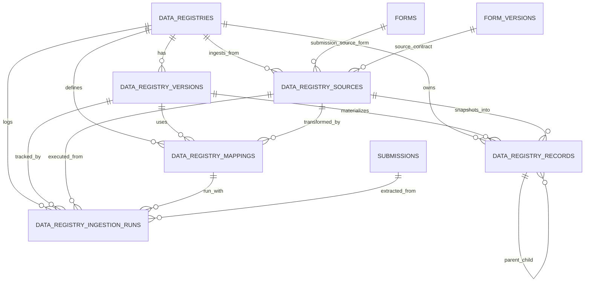
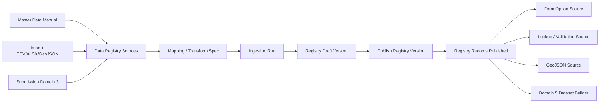

# Domain 4 — Master Data / Data Registry v1

Dokumen kerja lokal untuk mematangkan Domain 4 sebagai fondasi reusable data layer sebelum masuk lebih jauh ke analytics/reporting.

## 1. Posisi Domain 4 di arsitektur enterprise

Domain 4 bukan sekadar tempat CRUD master data dinamis.
Domain 4 diposisikan sebagai:

`canonical reusable data layer`

Artinya Domain 4 bertugas:
- menerima data dari sumber referensial/manual,
- menerima data dari hasil import file,
- menerima data dari submission/domain operasional,
- melakukan kurasi dan transformasi terkontrol,
- mem-publish hasilnya menjadi sumber data reusable untuk domain lain.

Dengan posisi ini, Domain 4 menjadi penghubung antara:
- Domain 2 `Form Registry / Form Builder`
- Domain 3 `Submission / Response Store`
- Domain 5 `Analytics & Visualization`

## 2. Batas Domain 4 vs Domain 5

Batas ini harus tegas sejak awal.

### Domain 4 — Master Data / Data Registry
Fokus pada:
- reusable reference data
- reusable lookup data
- submission-derived reusable records
- source registry untuk form lain
- source registry untuk validasi/lookup
- curated published data contracts

### Domain 5 — Analytics & Visualization
Fokus pada:
- dataset analitik
- agregasi/metric
- chart config
- dashboard
- reporting
- visualization output

Prinsip:
- Domain 4 berhenti di titik "data reusable yang siap dikonsumsi".
- Domain 5 baru mengolah data reusable tersebut menjadi insight, dataset analitik, dan visualisasi.

Jangan biarkan Domain 5 query raw `submissions` JSONB secara liar bila use case tersebut sebenarnya bisa distabilkan dulu di Domain 4.

## 3. Masalah bisnis yang harus diselesaikan Domain 4

Domain 4 harus mampu menangani minimal masalah berikut:

1. Master data referensial reusable
- contoh: provinsi, kabupaten/kota, kategori, unit kerja, daftar pegawai, lookup statis lain.

2. Field/data source reusable lintas form
- contoh: komponen select pada Form A mengambil data kabupaten/kota dari registry wilayah.

3. Submission sebagai source data reusable
- contoh: hasil submission Form X dipakai sebagai sumber option atau referensi untuk Form Y.

4. Jalur ETL ringan dan terkontrol
- source data tidak langsung dipakai mentah,
- ada tahap extract -> transform -> publish.

5. Kesiapan ke hilir untuk reporting
- output Domain 4 harus cukup stabil untuk dijadikan bahan dataset analitik di Domain 5.

## 4. Prinsip desain inti

### 4.0. Period-aware by design
Domain 4 harus siap mengikuti konteks `active_year` sejak awal, bukan ditambal belakangan.

Prinsipnya:
- registry tertentu bisa bersifat lintas tahun (`year_agnostic`),
- registry tertentu bersifat period-scoped (`year_scoped`),
- consumer boleh meminta data berdasarkan `active_year` actor secara default,
- tetapi service tetap harus bisa override ke tahun/periode lain untuk kebutuhan komparatif, audit, dan backdate.

Konsekuensinya:
- `reporting_year` diperlakukan sebagai kolom relasional/indexed pada record yang memang period-scoped,
- bila nanti perlu granularitas lebih detail, `reporting_period_id` bisa ditambahkan sebagai relasi opsional,
- query consumer tidak boleh menganggap semua registry berlaku global sepanjang masa.

### 4.1. JSONB strategis, bukan segalanya
Gunakan JSONB untuk:
- payload atribut dinamis
- geojson/properties
- mapping spec
- transform spec
- ingestion context
- metadata tambahan
- snapshot asal data

Jangan gunakan JSONB sebagai satu-satunya tempat untuk field yang sering dipakai filter/list/join.

Field berikut sebaiknya tetap relasional/indexed bila relevan:
- `registry_id`
- `registry_version_id`
- `source_id`
- `source_type`
- `record_key`
- `record_code`
- `status`
- `is_active`
- `reporting_year`
- `scope_code`
- `parent_record_id`
- `published_at`
- `form_id`
- `form_version_id`
- `submission_id`
- `freshness_status`
- `last_synced_at`
- `source_updated_at`

### 4.2. Versioning adalah fitur inti
Perubahan schema/mapping/shape registry tidak boleh merusak consumer lama.

Karena itu:
- definisi registry harus versioned,
- publish registry harus eksplisit,
- consumer sebaiknya membaca versi published aktif atau versi tertentu yang dibekukan.

### 4.3. Submission bukan live source liar
Submission boleh menjadi source, tetapi bukan berarti semua consumer langsung query tabel `submissions`.

Gunakan pola:
- submission sebagai source,
- snapshot extract,
- transform,
- curate,
- publish ke registry.

### 4.4. Serving contract harus sederhana di awal
V1 sebaiknya fokus pada kontrak konsumsi sederhana:
- option list `label/value`
- lookup record by key/code
- hierarchical tree ringan
- geojson feature collection
- filtered registry records

Registry/version yang sudah dipublish boleh diekspos sebagai resource API dinamis untuk consumer seperti Form Builder dan Form Runtime, selama kontraknya tetap terkurasi dan stabil. Artinya yang dipublikasikan adalah published registry contract, bukan draft version, bukan raw source, dan bukan query builder bebas.

Pola publish consumer-friendly yang direkomendasikan di v1:
- option source untuk select/autocomplete/dependent select
- lookup endpoint by key/code
- tree endpoint berdasarkan parent/level
- feature collection endpoint untuk peta ringan
- filtered listing dengan parameter terbatas yang sudah didefinisikan

Jangan langsung membangun query builder yang terlalu generik.

### 4.5. CRUD dinamis tetap butuh governance
Karena ada JSONB dan schema dinamis, tetap perlu:
- status draft/published/archived
- audit trail actor
- ingestion run log
- source tracking
- mapping spec tracking

### 4.6. Freshness harus bisa diverifikasi, bukan sekadar diasumsikan realtime
Kebutuhan bisnis yang mulai terlihat adalah ilusi "realtime yang bertanggung jawab":
- submission Domain 3 terus masuk,
- Domain 4 perlu tahu apakah published registry yang dikonsumsi masih selaras dengan sumber terakhir,
- UI/consumer perlu bisa melihat kapan registry terakhir disegarkan dan apakah ada source baru yang belum diserap.

Karena itu Domain 4 sebaiknya punya konsep:
- `source_watermark` — penanda perubahan terakhir dari sumber,
- `materialized_watermark` — penanda perubahan terakhir yang sudah masuk ke registry published,
- `freshness_status` — mis. `fresh`, `stale`, `refreshing`, `failed`,
- `freshness_signature` — hash deterministik dari kombinasi watermark + identitas source + konteks periodenya.

Hash ini bukan gimmick keamanan, tetapi checksum ringan untuk menjawab:
- apakah source yang dipakai consumer sama dengan source terbaru?
- apakah refresh terakhir masih relevan untuk `active_year` tertentu?
- apakah ada perubahan source yang belum dimaterialisasi ke Domain 4?

## 5. Use case v1 yang direkomendasikan

Agar Domain 4 tidak melebar liar, v1 disarankan fokus ke tiga use case konkret.

### Use case 1 — Registry wilayah referensial
Contoh:
- provinsi
- kabupaten/kota
- kecamatan
- kelurahan bila nanti perlu

Kebutuhan:
- bisa simpan atribut relasional dasar
- bisa simpan `properties` dinamis
- bisa simpan `geometry` / GeoJSON
- bisa serve untuk select/autocomplete/peta

Dokumen turunan yang mematangkan use case ini:
- `docs/architecture/domain-4-wilayah-blueprint-v1.md`
- `docs/architecture/domain-4-wilayah-schema-contract-v1.md`
- `docs/architecture/domain-4-wilayah-migration-schema-plan-v1.md`
- `docs/architecture/domain-4-wilayah-implementation-plan-v1.md`

### Use case 2 — Registry organisasi/pegawai ringan
Contoh:
- unit kerja
- scope organisasi
- pegawai referensial ringan

Kebutuhan:
- bisa jadi dasar source select/lookup internal
- bisa menjembatani bootstrap scope registry saat migrasi ke registry resmi database

### Use case 3 — Submission-derived registry
Contoh:
- hasil submission form tertentu dipublish menjadi daftar entitas reusable untuk form lain

Kebutuhan:
- source berasal dari submission/form version tertentu
- ada transform rule
- ada published registry records
- tidak query raw submissions secara liar di runtime consumer
- freshness dapat dibandingkan terhadap submission terakhir per `reporting_year`/periode

## 6. Komponen arsitektur Domain 4 v1

Domain 4 v1 disarankan dibagi menjadi 4 lapisan.

### 6.1. Registry Catalog
Menjelaskan apa itu registry, untuk apa, dan shape-nya seperti apa.

Entitas konseptual:
- `data_registries`
- `data_registry_versions`

Tanggung jawab:
- identitas registry
- jenis registry
- lifecycle registry
- schema contract
- publish version
- metadata distribusi/konsumsi

### 6.2. Record Store
Menyimpan record reusable aktual dari registry published atau draft tertentu.

Entitas konseptual:
- `data_registry_records`

Tanggung jawab:
- penyimpanan record reusable
- hierarchical relation bila perlu
- key/code uniqueness per registry version
- active/inactive state
- source snapshot per record

### 6.3. Ingestion / ETL Layer
Mencatat dari mana data datang, bagaimana dipetakan, dan bagaimana proses ingest dijalankan.

Entitas konseptual:
- `data_registry_sources`
- `data_registry_mappings`
- `data_registry_ingestion_runs`

Tanggung jawab:
- source catalog
- mapping/transform spec
- refresh/import/publish run log
- audit dan troubleshooting

Di dalam lapisan ini, v1.5/v2 juga cocok menaruh service worker ringan untuk sinkronisasi sumber-ke-registry.

### 6.3.1. Worker / Sync Orchestrator
Belum harus berupa sistem async berat. Pada tahap awal cukup ada service worker domain yang bisa dipanggil:
- manual dari admin,
- on-demand dari UI,
- by cron/scheduler ringan,
- nanti bisa berevolusi ke queue/worker terpisah.

Service kandidat:
- `DataRegistryFreshnessService`
- `DataRegistrySyncService`
- `DataRegistryWorker`

Tanggung jawab worker:
- membaca status freshness per registry/version/source,
- menghitung `source_watermark` dari sumber aktif,
- membandingkan dengan `materialized_watermark` terakhir,
- memutuskan perlu refresh atau tidak,
- menjalankan extract -> transform -> upsert draft records,
- mem-publish versi baru atau meng-update draft aktif sesuai policy,
- menyimpan run log dan hasil signature.

### 6.4. Serving / Consumption Layer
Belum perlu tabel yang terlalu banyak pada v1, tetapi contract-nya harus dipikirkan.

Bisa diwujudkan pada service/API lebih dulu untuk:
- option source endpoint
- lookup endpoint
- geojson endpoint
- submission-derived feed endpoint

Kalau nanti perlu persist view/contract, baru pertimbangkan entitas tambahan seperti:
- `data_registry_exports`
- `data_registry_views`

## 7. Entity candidate v1

Naming berikut adalah kandidat yang lebih future-proof dibanding sekadar `master_data_types` / `master_data_records`, tetapi tetap sejalan dengan arah AGENTS.

### 7.1. `data_registries`
Definisi registry induk.

Kolom relasional yang direkomendasikan:
- `id`
- `uuid`
- `key` — identifier stabil, mis. `wilayah.kabupaten_kota`
- `name`
- `slug`
- `description`
- `registry_type` — `reference`, `geo`, `lookup`, `submission_derived`, `master`, `hybrid`
- `status` — `draft`, `published`, `archived`
- `current_version_id` nullable
- `owner_scope_type`
- `owner_scope_code`
- `owner_scope_name`
- `access_policy_key`
- `meta` JSONB
- audit fields standar

### 7.2. `data_registry_versions`
Versi schema/kontrak registry.

Kolom relasional yang direkomendasikan:
- `id`
- `uuid`
- `registry_id`
- `version_number`
- `status` — `draft`, `published`, `archived`
- `is_published`
- `published_at`
- `published_by`
- `record_count`
- `schema_hash`
- `source_mode` — `manual`, `import`, `submission`, `hybrid`
- `reporting_year` nullable
- `freshness_status` — `fresh`, `stale`, `refreshing`, `failed`, `unknown`
- `source_watermark` nullable
- `materialized_watermark` nullable
- `freshness_signature` nullable
- `last_synced_at` nullable
- `last_sync_run_id` nullable
- `meta` JSONB
- `schema_definition` JSONB
- `serving_contract` JSONB
- `transform_contract` JSONB
- audit fields standar

### 7.3. `data_registry_records`
Record reusable aktual.

Kolom relasional yang direkomendasikan:
- `id`
- `uuid`
- `registry_id`
- `registry_version_id`
- `parent_record_id` nullable
- `source_id` nullable
- `record_key`
- `record_code` nullable
- `record_label`
- `status` — `draft`, `published`, `inactive`, `archived`
- `sort_order`
- `is_active`
- `reporting_year` nullable
- `reporting_period_id` nullable
- `scope_code` nullable
- `effective_from` nullable
- `effective_until` nullable
- `source_updated_at` nullable
- `materialized_at` nullable
- `meta` JSONB
- `data` JSONB
- `geometry` JSONB nullable
- `source_snapshot` JSONB
- audit fields standar

Catatan:
- `data` berisi payload atribut dinamis.
- `geometry` dipisahkan bila ingin eksplisit untuk registry geospasial.
- `record_key` harus jadi identifier stabil untuk consumer.

### 7.4. `data_registry_sources`
Catalog sumber data.

Kolom relasional yang direkomendasikan:
- `id`
- `uuid`
- `registry_id`
- `source_type` — `manual`, `file_import`, `submission_query`, `registry_copy`, `api_pull`
- `name`
- `status`
- `form_id` nullable
- `form_version_id` nullable
- `submission_filter_key` nullable
- `upstream_registry_id` nullable
- `refresh_mode` — `manual`, `scheduled`, `on_publish`
- `period_mode` — `year_agnostic`, `year_scoped`, `period_scoped`
- `meta` JSONB
- `connection_config` JSONB
- `extract_spec` JSONB
- audit fields standar

### 7.5. `data_registry_mappings`
Rule mapping/transform source ke target registry.

Kolom relasional yang direkomendasikan:
- `id`
- `uuid`
- `registry_id`
- `registry_version_id`
- `source_id`
- `name`
- `status`
- `mapping_type` — `column_map`, `json_path_map`, `submission_projection`, `geojson_projection`
- `meta` JSONB
- `mapping_spec` JSONB
- `transform_spec` JSONB
- `validation_spec` JSONB
- audit fields standar

### 7.6. `data_registry_ingestion_runs`
Log proses ingest/refresh/publish.

Kolom relasional yang direkomendasikan:
- `id`
- `uuid`
- `registry_id`
- `registry_version_id` nullable
- `source_id` nullable
- `mapping_id` nullable
- `run_type` — `preview`, `import`, `refresh`, `publish`, `rebuild`
- `trigger_context` JSONB
- `reporting_year` nullable
- `reporting_period_id` nullable
- `status` — `queued`, `running`, `completed`, `completed_with_errors`, `failed`, `cancelled`
- `source_watermark` nullable
- `materialized_watermark` nullable
- `freshness_signature` nullable
- `started_at`
- `finished_at`
- `total_rows`
- `success_rows`
- `error_rows`
- `skipped_rows`
- `meta` JSONB
- `input_snapshot` JSONB
- `result_summary` JSONB
- `error_details` JSONB
- audit fields standar

## 8. Entity map dan relasi konseptual

## 9. Diagram alir data lintas domain

## 10. Relasi konseptual yang penting

### 10.1. Registry ke Version
- satu registry memiliki banyak version
- satu version published aktif bisa ditandai sebagai current version pada registry

### 10.2. Version ke Records
- record reusable dipublikasikan dalam konteks version tertentu
- consumer sebaiknya mengkonsumsi record dari version published yang jelas

### 10.3. Source ke Mapping ke Ingestion Run
- source mendefinisikan asal data
- mapping menjelaskan cara transform
- ingestion run merekam satu eksekusi nyata

### 10.4. Record ke Source Snapshot
- setiap record penting sebaiknya dapat ditelusuri asalnya
- tidak harus 100% normalized sampai row source mentah, tetapi minimal ada `source_snapshot`

### 10.5. Domain 3 ke Domain 4
- submission dapat menjadi source Domain 4,
- tetapi Domain 4 menyimpan hasil kurasi/publish-nya sendiri,
- consumer lain tidak perlu selalu query submission mentah.

## 11. Batas relasional vs JSONB

### Simpan sebagai kolom relasional/indexed
Gunakan bila field:
- sering dipakai filter/list
- perlu join/FK
- identifier stabil
- diperlukan untuk authorization/scope
- dipakai oleh consumer rutin

Contoh:
- `registry_type`
- `status`
- `record_key`
- `record_label`
- `reporting_year`
- `scope_code`
- `source_type`
- `form_id`
- `submission_id` bila kelak ada row lineage eksplisit
- `freshness_status`
- `last_synced_at`
- `source_updated_at`

### Simpan di JSONB
Gunakan bila field:
- shape-nya dinamis
- bervariasi antar registry
- sifatnya config/spec/payload
- tidak selalu jadi hot filter

Contoh:
- `schema_definition`
- `serving_contract`
- `transform_contract`
- `mapping_spec`
- `validation_spec`
- `data`
- `geometry`
- `source_snapshot`
- `result_summary`

## 12. Lifecycle data yang direkomendasikan

### Lifecycle registry
- `draft`
- `published`
- `archived`

### Lifecycle registry version
- `draft`
- `published`
- `archived`

### Lifecycle record
- `draft`
- `published`
- `inactive`
- `archived`

### Lifecycle ingestion run
- `queued`
- `running`
- `completed`
- `completed_with_errors`
- `failed`
- `cancelled`

### Lifecycle freshness materialization
1. baca source terakhir untuk konteks `reporting_year` tertentu
2. hitung `source_watermark`
3. bentuk `freshness_signature`
4. bandingkan dengan materialisasi terakhir
5. bila berubah, jalankan sync worker
6. simpan hasil ke draft/materialized records
7. publish atau aktifkan hasil sinkronisasi
8. expose status freshness ke consumer/UI

## 13. Serving contract v1 yang direkomendasikan

V1 jangan terlalu generik. Cukup siapkan tiga mode konsumsi.

### 13.1. Option source
Output standar:
- `value`
- `label`
- `meta` optional

Contoh consumer:
- select di form builder / form preview

### 13.2. Lookup source
Output standar:
- lookup by `record_key` atau `record_code`
- bisa pakai filter dasar seperti `scope_code`, `is_active`, `reporting_year`

Contoh consumer:
- validasi referensi
- autofill ringan

### 13.3. Geo source
Output standar:
- GeoJSON Feature Collection

Contoh consumer:
- peta wilayah
- visual boundary reference

### 13.4. Metadata freshness
Setiap response konsumsi sebaiknya bisa membawa metadata berikut:
- `freshness_status`
- `last_synced_at`
- `source_watermark`
- `materialized_watermark`
- `freshness_signature`
- `reporting_year`

Dengan ini UI bisa menampilkan kesan realtime yang jujur: bukan query langsung ke source mentah, tetapi query ke materialized registry yang freshness-nya dapat diverifikasi.

## 14. Risiko arsitektur yang harus dihindari

1. Menjadikan Domain 4 sebagai ETL engine generik penuh sejak v1.
2. Menaruh hampir semua atribut di JSONB tanpa kolom hot-filter.
3. Membiarkan consumer query `submissions` langsung untuk data reusable.
4. Tidak memberi versioning pada registry/mapping.
5. Mencampur Domain 4 dengan Domain 5 terlalu awal.
6. Menjadikan registry manual, import, dan submission-derived semua memakai lifecycle yang ambigu.

## 15. Keputusan desain v1 yang direkomendasikan

1. Pakai nomenklatur `data_registry_*` sebagai payung utama.
2. Perlakukan Domain 4 sebagai curated reusable data layer.
3. Wajib versioning untuk registry definition.
4. Pisahkan source, mapping, dan ingestion run.
5. Fokus v1 ke tiga use case:
   - wilayah referensial/geo
   - organisasi/pegawai ringan
   - submission-derived registry
6. Tahan dulu kebutuhan reporting penuh ke Domain 5.
7. Perlakukan `active_year` sebagai konteks query default untuk registry yang period-scoped.
8. Gunakan pendekatan watermark + freshness signature, bukan hanya `updated_at` tunggal.
9. Mulai worker sinkronisasi dari service orchestrator ringan dulu; tidak perlu langsung antrean async kompleks.

## 16. Langkah berikutnya setelah draft ini

Setelah draft ini disetujui, langkah implementasi yang paling sehat adalah:
1. finalisasi entity candidate v1,
2. finalisasi field relasional vs JSONB,
3. susun service contract Domain 4,
4. pilih satu use case pertama untuk TDD,
5. baru masuk model + migration + service + API.
