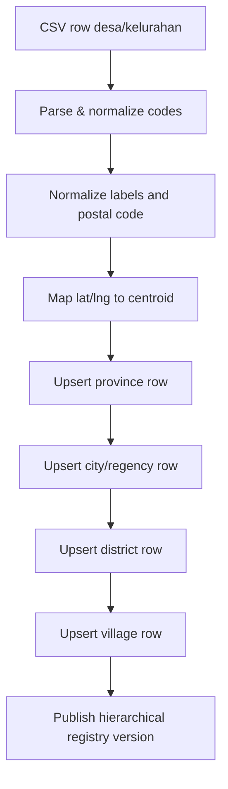
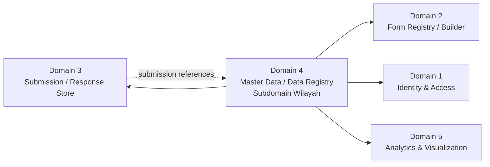
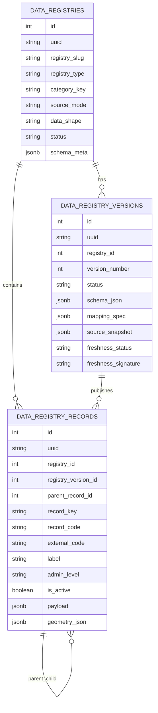
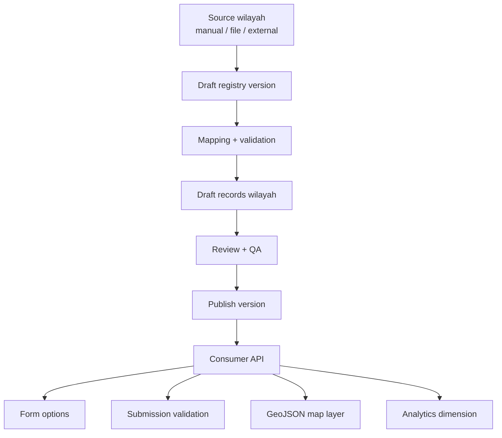

# Domain 4 — Blueprint Subdomain Wilayah Administratif v1

Dokumen ini adalah blueprint konseptual untuk subdomain wilayah administratif di Domain 4 `Master Data / Data Registry`.

Dokumen turunan yang menajamkan kontrak tabel/field:
- `docs/architecture/domain-4-wilayah-schema-contract-v1.md`

Fokus v1:
- menstabilkan kontrak arsitektur,
- memutuskan model data inti,
- menyiapkan data wilayah sebagai reusable registry source,
- tetap source-agnostic sampai sumber data yang kuat secara hukum benar-benar dipilih.

Dokumen ini sengaja belum mengikat ke satu sumber kode wilayah eksternal tertentu.

---

## 1. Tujuan subdomain wilayah

Subdomain wilayah bertugas menyediakan representasi wilayah administratif yang reusable untuk:
- option list form,
- validasi referensial submission,
- pemetaan scope organisasi/otorisasi,
- visualisasi peta,
- pengelompokan analytics berdasarkan wilayah,
- integrasi lintas domain yang memerlukan referensi lokasi administratif.

Target level administratif minimal yang harus siap didukung:
- provinsi,
- kabupaten/kota,
- kecamatan,
- kelurahan/desa.

Walaupun kebutuhan awal praktis mungkin dimulai dari kab/kota atau kecamatan, desain v1 sebaiknya tidak menutup jalan ke hierarki penuh.

---

## 2. Boundary tanggung jawab

### 2.1. Yang termasuk subdomain wilayah
- penyimpanan entitas wilayah administratif referensial,
- hierarki parent-child antar wilayah,
- atribut relasional penting wilayah,
- atribut dinamis tambahan di payload,
- polygon/geometry/GeoJSON untuk kebutuhan spasial ringan,
- source metadata dan lineage data wilayah,
- publish lifecycle untuk versi data wilayah,
- serving contract untuk lookup, option list, tree, dan feature collection.

### 2.2. Yang tidak termasuk subdomain wilayah
- perhitungan analytics agregatif final,
- dashboard dan chart insight,
- engine GIS berat dan analisis spasial kompleks,
- workflow domain bisnis lain yang hanya kebetulan punya field wilayah,
- query builder bebas lintas semua dimensi bisnis.

### 2.3. Posisi terhadap domain lain
- Domain 2 memakai subdomain wilayah sebagai source select/lookup.
- Domain 3 menyimpan referensi wilayah yang dipilih saat submission.
- Domain 1 dapat memakai registry wilayah sebagai salah satu sumber atribut ABAC/resource scope.
- Domain 5 mengonsumsi wilayah sebagai dimensi analitik, bukan sebagai tempat mendefinisikan wilayah.

---

## 3. Prinsip desain inti

1. Source-agnostic by design
- Karena sumber data wilayah resmi belum diputuskan, desain tidak boleh mengunci diri ke satu kode eksternal tak resmi.
- Sistem harus punya canonical key internal yang stabil walaupun external code berubah.

2. Satu sumber reusable, banyak consumer
- Wilayah harus didefinisikan sekali di Domain 4 lalu dipakai ulang oleh form, submission, auth, dan analytics.

3. Relasional untuk field panas, JSONB untuk fleksibilitas
- Field yang sering difilter/join harus tetap kolom relasional.
- JSONB dipakai untuk atribut tambahan dan representasi geometry/properties.

4. Versioned and publish-driven
- Consumer default membaca versi published.
- Draft dipakai untuk import, revisi, validasi, dan preview.

5. Spatial-light first
- v1 fokus ke render/serve/filter ringan.
- Analisis spasial berat nanti bisa di-upgrade ke PostGIS tanpa memaksa redesign total.

6. Audit and lineage ready
- Asal-usul data wilayah harus bisa ditelusuri.

---

## 4. Keputusan konseptual v1

### 4.1. Model yang dipilih untuk v1
Untuk fase awal, blueprint ini merekomendasikan:
- satu registry hierarkis untuk wilayah administratif,
- dengan `parent_record_id` untuk relasi antar level,
- dengan `admin_level` sebagai penanda level wilayah,
- dengan `geometry_json`/`geojson` JSONB untuk geometri v1.

### 4.2. Kenapa satu registry hierarkis dulu
Keuntungan:
- lebih sederhana untuk CRUD dan import awal,
- lebih mudah menjaga satu kontrak canonical wilayah,
- lebih mudah melayani tree dan cascaded option,
- lebih mudah menyiapkan migrasi source karena semua level berada di payung registry yang sama.

Trade-off:
- validasi per level harus lebih disiplin,
- uniqueness key/code harus mempertimbangkan level dan parent context,
- tree query perlu desain indeks yang baik.

### 4.3. Kapan multi-registry layak dipertimbangkan
Pisah registry per level baru layak jika:
- governance tiap level sangat berbeda,
- source tiap level berbeda drastis,
- lifecycle/publish tiap level perlu independen penuh,
- volume dan pola query membuat satu registry terlalu berat.

Untuk saat ini, belum ada sinyal kuat ke sana.

---

## 5. Entitas konseptual

Subdomain wilayah memakai fondasi umum Domain 4:
- `data_registries`
- `data_registry_versions`
- `data_registry_records`

Dan nantinya dapat diperluas dengan:
- `data_registry_sources`
- `data_registry_mappings`
- `data_registry_ingestion_runs`

### 5.1. Registry utama yang direkomendasikan
Registry kandidat awal:
- `registry_slug = wilayah.administratif`
- `registry_type = geo`
- `category_key = wilayah`
- `data_shape = geojson`

Registry ini memayungi seluruh level administratif.

---

## 6. Kontrak data per entitas

## 6.1. `data_registries`
Tujuan:
- mendefinisikan identitas dan governance registry wilayah.

Field konseptual penting:
- `id`, `uuid`
- `registry_slug`
- `registry_code`
- `name`
- `description`
- `registry_type` = `geo`
- `category_key` = `wilayah`
- `source_mode` = `manual` | `import_file` | `sync_external`
- `data_shape` = `geojson`
- `is_year_scoped` = `false` secara default untuk wilayah administratif umum
- `status` = `draft` | `published` | `archived`
- `schema_meta` JSONB
- audit fields + timestamps + soft delete

Catatan:
- Secara default wilayah administratif umum sebaiknya `year_agnostic`.
- Jika nanti ada kebutuhan boundary per tahun/periode, itu ditangani di level version atau validity window, bukan menjadikan seluruh desain wajib year-scoped.

## 6.2. `data_registry_versions`
Tujuan:
- mengunci kontrak schema, struktur payload, dan snapshot publish.

Field konseptual penting:
- `id`, `uuid`
- `registry_id`
- `version_number`
- `status` = `draft` | `published` | `archived`
- `schema_json` JSONB
- `mapping_spec` JSONB
- `publish_notes`
- `source_snapshot` JSONB
- `published_at`
- `source_watermark`
- `materialized_watermark`
- `freshness_status`
- `freshness_signature`
- audit fields + timestamps

Catatan:
- Untuk wilayah, perubahan polygon massal atau pergantian source sebaiknya menghasilkan version yang jelas.

## 6.3. `data_registry_records`
Tujuan:
- menyimpan record wilayah aktual.

Field konseptual penting:
- `id`, `uuid`
- `registry_id`
- `registry_version_id`
- `parent_record_id` nullable
- `record_key`
- `record_code`
- `external_code` nullable
- `label`
- `normalized_label`
- `admin_level`
- `admin_level_code`
- `province_code` nullable
- `city_regency_code` nullable
- `district_code` nullable
- `village_code` nullable
- `sort_order`
- `is_active`
- `valid_from` nullable
- `valid_to` nullable
- `centroid_lat` nullable
- `centroid_lng` nullable
- `bbox_min_lat` nullable
- `bbox_min_lng` nullable
- `bbox_max_lat` nullable
- `bbox_max_lng` nullable
- `payload` JSONB
- `geometry_json` JSONB nullable
- `source_snapshot` JSONB
- audit fields + timestamps + soft delete

### 6.3.1. Makna field penting
- `record_key`
  - canonical internal identifier stabil.
  - tidak wajib sama dengan kode wilayah eksternal.
- `record_code`
  - business code utama yang dipakai aplikasi saat ini.
  - bisa mengikuti source resmi yang dipilih, tetapi jangan diperlakukan sebagai satu-satunya anchor arsitektur.
- `external_code`
  - menyimpan kode dari sumber tertentu bila berbeda dari `record_code`.
- `admin_level`
  - nilai bisnis seperti `province`, `city_regency`, `district`, `village`.
- `admin_level_code`
  - kode teknis singkat bila perlu, misalnya `1`, `2`, `3`, `4` atau `PROV`, `KABKOT`, `KEC`, `KEL`.
- `parent_record_id`
  - menghubungkan record ke induk administratif.
- `geometry_json`
  - penyimpanan geometri v1 dalam format GeoJSON geometry atau feature fragment.
- `payload`
  - atribut tambahan yang belum pantas dijadikan kolom relasional.

---

## 7. Identitas canonical wilayah

Karena source resmi masih dicari, ini rekomendasi penting:

### 7.1. Pisahkan 3 lapis identitas
1. Internal canonical identity
- `uuid`
- `record_key`

2. Business/application identity
- `record_code`
- `label`

3. External/source identity
- `external_code`
- `source_snapshot.source_name`
- `source_snapshot.source_version`

### 7.2. Prinsip canonical key
Canonical key internal harus:
- stabil lintas perubahan source,
- tidak bergantung penuh pada integer PK,
- cukup deterministik untuk trace lintas sistem.

Contoh pendekatan awal:
- `jabar:kabkota:bandung-kota`
- `jabar:kecamatan:coblong`
- `jabar:kelurahan:dago`

Atau pendekatan yang lebih netral:
- `idn:jbr:city:bandung-kota`
- `idn:jbr:district:coblong`

Catatan:
- Format final belum perlu dikunci hari ini, tetapi prinsip pemisahan internal key vs external code harus dikunci sekarang.

---

## 8. Model hierarki wilayah

### 8.1. Struktur hierarki v1
- province
  - city_regency
    - district
      - village

### 8.2. Aturan parent-child
- `city_regency.parent` harus province
- `district.parent` harus city_regency
- `village.parent` harus district
- tidak boleh lompat level
- parent-child harus berada di registry dan version yang konsisten sesuai aturan publish yang dipilih

### 8.3. Aturan uniqueness minimum
Minimal perlu constraint konseptual:
- unique (`registry_version_id`, `record_key`)
- unique (`registry_version_id`, `record_code`) bila business code memang dijamin unik
- untuk label, jangan asumsi unik global
- untuk level yang rawan label duplikat, uniqueness sebaiknya berbasis parent context + normalized label bila dibutuhkan di service layer

---

## 9. Model spasial v1

### 9.1. Apa yang cukup di v1
V1 cukup mendukung:
- simpan polygon/multipolygon di `geometry_json`,
- simpan centroid dan bounding box ringan sebagai kolom relasional,
- serve feature collection ke frontend,
- filter berdasarkan level, parent, kode, status aktif.

### 9.2. Kenapa simpan centroid dan bbox juga
Walaupun geometry utama disimpan di JSONB, centroid dan bbox relasional berguna untuk:
- preview cepat,
- indexing ringan,
- filtering sederhana,
- mempermudah migrasi menuju PostGIS nanti.

### 9.3. Kapan naik ke PostGIS
Naik ke PostGIS bila kebutuhan berikut muncul nyata:
- point-in-polygon,
- intersects/within/contains,
- nearest/adjacency,
- clipping dan dissolve geometry,
- spatial index serius,
- validasi topologi yang konsisten.

### 9.4. Prinsip migrasi ke PostGIS
Jika upgrade dilakukan nanti:
- jangan ubah `record_key`, `record_code`, dan kontrak consumer dasar,
- tambahkan representation baru yang kompatibel,
- migrasi bertahap dari `geometry_json` ke geometry column native bila perlu,
- pertahankan source lineage dan version history.

---

## 10. Source, ingestion, dan lineage

Karena source resmi belum final, arsitektur harus siap untuk beberapa mode masuk data:

### 10.1. Mode source awal
- `manual`
- `import_file`
- `sync_external`

### 10.2. Artefak lineage yang harus ada
- source name
- source type
- source file / endpoint / dokumen referensi
- source version / tanggal rilis bila ada
- ingestion run id
- imported_at / synced_at
- imported_by / synced_by
- mapping spec version

### 10.3. Prinsip publish
- ingest tidak otomatis overwrite versi published lama,
- hasil ingest masuk ke draft version atau preview area,
- publish adalah langkah eksplisit,
- rollback versi published harus dimungkinkan secara governance.

## 10.4. Refinement dari sumber CSV acuan awal

Sumber acuan sementara yang sudah dibaca:
- `/home/user/projects/dasborkanwil/instance/diskominfo-od_kode_wilayah_dan_nama_wilayah_desa_kelurahan_data.csv`

Karakter sumber saat ini:
- berisi 5957 row level desa/kelurahan untuk Jawa Barat;
- membawa dua keluarga kode sekaligus: `kemendagri_*` dan `bps_*`;
- struktur source masih `flat-per-village-row`, belum berbentuk tree eksplisit;
- `latitude` dan `longitude` lebih cocok dibaca sebagai titik centroid/label point, bukan polygon boundary;
- `status_adm` kosong untuk seluruh row pada sample saat ini, sehingga tidak bisa dijadikan source of truth langsung;
- `kode_pos` dan banyak kolom `bps_*` terbaca seperti desimal string (`16913.0`, `3201210008.0`) sehingga perlu normalisasi string saat ingest.

Konsekuensi arsitektur dari temuan ini:
1. Source ini cocok sebagai seed/reference awal, tetapi belum cukup untuk menjadi model final spasial polygon.
2. Karena row source berada di level desa/kelurahan, proses ingest ke single hierarchical registry harus melakukan ekspansi parent otomatis:
   - buat atau upsert row province,
   - buat atau upsert row city/regency,
   - buat atau upsert row district,
   - buat atau upsert row village.
3. `latitude` dan `longitude` pada source awal dipetakan ke `centroid_lat` dan `centroid_lng`, bukan ke `geometry_json` polygon.
4. `geometry_json` tetap disiapkan nullable untuk fase berikutnya saat sumber polygon sudah tersedia.
5. Keluarga kode Kemendagri dan BPS sebaiknya sama-sama disimpan, tetapi perannya dipisah dengan jelas.

### 10.5. Keputusan mapping awal dari CSV ke model registry

#### 10.5.1. Kode referensi
Rekomendasi kerja sementara:
- `record_code` default mengikuti kode `kemendagri_*` karena format hierarkinya eksplisit dan mudah dibaca manusia;
- `external_code` dapat dipakai untuk menyimpan pasangan kode BPS utama pada level terkait;
- seluruh pasangan kode lain yang tidak dijadikan primary business code tetap disimpan di `payload.codes` atau `source_snapshot.codes`.

Contoh per level:
- province row
  - `record_code = kemendagri_provinsi_kode`
  - `external_code = bps_provinsi_kode` yang sudah dinormalisasi
- city/regency row
  - `record_code = kemendagri_kota_kode`
  - `external_code = bps_kota_kode`
- district row
  - `record_code = kemendagri_kecamatan_kode`
  - `external_code = bps_kecamatan_kode`
- village row
  - `record_code = kemendagri_kelurahan_kode`
  - `external_code = bps_kelurahan_kode`

Catatan penting:
- karena user sudah menegaskan bahwa kode BPS pada dasarnya hampir sama tetapi beda separator, blueprint ini tidak memperlakukan perbedaan separator sebagai alasan untuk membuat model kode terpisah terlalu kompleks;
- namun penyimpanan kedua versi kode tetap disarankan agar integrasi ke depan tidak kehilangan compatibility.

#### 10.5.2. Nama wilayah
Karena source membawa nama versi Kemendagri dan BPS sekaligus, rekomendasi awal:
- `label` memakai nama Kemendagri sebagai display label utama bila itu yang paling dekat dengan kode utama yang dipilih;
- nama alternatif BPS disimpan di `payload.alt_labels` atau `payload.source_labels`;
- `normalized_label` dihasilkan dari label utama setelah normalisasi kapitalisasi/spasi.

Ini penting karena ada perbedaan kecil seperti:
- `HARAPANJAYA` vs `HARAPAN JAYA`
- `KAB. BOGOR` vs `KABUPATEN BOGOR`

#### 10.5.3. Kode pos
Rekomendasi:
- `kode_pos` diperlakukan sebagai string, bukan numerik;
- saat ingest, nilai seperti `16913.0` harus dinormalisasi menjadi `16913`;
- simpan sebagai field relasional ringan bila nanti sering difilter, atau minimal di `payload.postal_code` bila masih sekadar atribut tambahan.

#### 10.5.4. Status administrasi desa/kelurahan
Karena `status_adm` kosong pada source sekarang, blueprint merekomendasikan:
- jangan menjadikan `status_adm` source of truth saat ini;
- sediakan field turunan seperti `village_adm_status` atau simpan di `payload.administrative_status`;
- untuk bootstrap awal, status dapat diinfer sementara dari segmen akhir kode Kemendagri:
  - awalan `1xxx` -> indikasi `kelurahan`
  - awalan `2xxx` -> indikasi `desa`
- inference ini harus diberi status `derived`, bukan `authoritative`.

#### 10.5.5. Titik koordinat
Rekomendasi:
- `latitude` -> `centroid_lat`
- `longitude` -> `centroid_lng`
- jangan treat titik ini sebagai polygon geometry
- bila polygon belum ada, frontend map masih bisa memakai point layer dulu sebagai fallback visual

### 10.6. Bentuk row registry hasil ekspansi dari source flat

Walaupun source saat ini hanya membawa row desa/kelurahan, registry final tetap direkomendasikan berbentuk tree tunggal dengan empat level row:
- province
- city_regency
- district
- village

Artinya satu row source dapat menghasilkan atau mereferensikan empat row registry:
1. province row `32`
2. city/regency row `32.01`
3. district row `32.01.01`
4. village row `32.01.01.1001`

Service ingest harus melakukan deduplikasi parent berdasarkan kombinasi level + code, bukan membuat parent baru di setiap row CSV.

### 10.7. Kontrak payload minimum yang direkomendasikan dari source CSV ini

Untuk menjaga model inti tetap bersih, atribut source-spesifik berikut cocok ditaruh di `payload` atau `source_snapshot`:
- `codes.kemendagri.province`
- `codes.kemendagri.city_regency`
- `codes.kemendagri.district`
- `codes.kemendagri.village`
- `codes.bps.province`
- `codes.bps.city_regency`
- `codes.bps.district`
- `codes.bps.village`
- `source_labels.kemendagri.*`
- `source_labels.bps.*`
- `postal_code`
- `administrative_status`
- `import_row_id`

### 10.8. Dampak ke desain `data_registry_records`

Berdasarkan CSV acuan ini, blueprint menyarankan penajaman field konseptual berikut pada `data_registry_records`:
- pertahankan:
  - `record_code`
  - `external_code`
  - `province_code`
  - `city_regency_code`
  - `district_code`
  - `village_code`
  - `centroid_lat`
  - `centroid_lng`
  - `payload`
  - `geometry_json`
- tambahkan/tegaskan:
  - `source_row_hash` nullable untuk idempotent import detection
  - `source_row_number` nullable untuk trace ke baris file asal
  - `display_label` bila nanti ingin memisahkan label kanonik vs label presentasi
  - `village_adm_status` nullable untuk desa/kelurahan jika dianggap sering dipakai filter

### 10.9. Mermaid alur transform source flat ke tree tunggal

---

## 11. Integrasi ke Form, Submission, ABAC, dan Analytics

### 11.1. Form Builder / Form Runtime
Subdomain wilayah harus bisa melayani:
- option list bertingkat,
- autocomplete wilayah,
- dependent select (kab/kota -> kecamatan -> kelurahan),
- map picker bila nanti dibutuhkan.

### 11.2. Submission
Submission idealnya menyimpan referensi wilayah secara eksplisit, misalnya:
- `selected_record_uuid`
- `selected_record_key`
- `selected_record_code`
- snapshot label minimal bila dibutuhkan untuk histori

Prinsipnya:
- submission tidak hanya menyimpan teks label mentah,
- harus tetap bisa ditelusuri ke registry version yang relevan bila diperlukan.

### 11.3. ABAC / scope
Wilayah dapat menjadi bagian dari atribut resource atau actor context.
Karena itu atribut berikut sebaiknya mudah di-resolve:
- `admin_level`
- `province_code`
- `city_regency_code`
- `district_code`
- `village_code`
- `record_key`

### 11.4. Analytics
Domain 5 dapat memakai wilayah sebagai:
- dimensi grouping,
- dimensi filter dashboard,
- dimensi peta.

Tapi Domain 5 tidak boleh menjadi tempat mendefinisikan kebenaran wilayah administratif.

---

## 12. Serving contract v1

Agar konsisten dan tidak over-engineered, kontrak konsumsi awal sebaiknya dibatasi pada:

1. Option list
- output `label/value`
- bisa difilter per `admin_level` dan `parent_record_id` atau `parent_record_key`

2. Lookup by key/code
- ambil satu record wilayah berdasarkan `record_key` atau `record_code`

3. Hierarchical tree ringan
- baca children per parent
- atau baca subtree terbatas

4. Filtered records
- filter berdasarkan level, parent, status aktif, kata kunci

5. GeoJSON feature collection
- output feature collection untuk level atau parent tertentu

Belum perlu di v1:
- query DSL generik,
- spatial analysis API berat,
- filter bebas semua kombinasi payload dinamis.

---

## 13. Governance dan data quality

Hal-hal yang harus dipikirkan sejak awal:

1. Duplicate handling
- label sama bisa muncul di parent berbeda
- jangan dedupe hanya berdasarkan nama tampilan

2. Active/inactive state
- wilayah bisa nonaktif atau diganti tanpa dihapus total dari histori

3. Validity window
- `valid_from` / `valid_to` berguna bila nanti terjadi perubahan administratif resmi

4. Parent-child validation
- struktur level harus valid dan tidak boleh membentuk siklus

5. Geometry validation
- minimal cek shape JSON valid
- bila belum ada PostGIS, validasi topologi bisa ringan dulu

6. Audit trail
- siapa yang import, edit, publish, archive
- dari source mana perubahan berasal

---

## 14. Mermaid

## 14.1. Context diagram

## 14.2. Entity relationship konseptual

## 14.3. Flow ingestion sampai konsumsi

---

## 15. Rekomendasi langkah berikutnya

Agar blueprint ini bisa diturunkan menjadi implementasi yang rapi, urutan berikut paling aman:

1. Kunci dulu vocabulary subdomain wilayah
- finalkan istilah `admin_level`, `record_key`, `record_code`, `external_code`, `geometry_json`

2. Finalkan field minimal tiga tabel inti untuk use case wilayah
- khususnya field relasional panas yang harus diindex

3. Finalkan schema contract wilayah v1
- field wajib per level
- aturan parent-child
- aturan geometry minimal

4. Finalkan serving contract v1
- option list
- lookup
- children list
- feature collection

5. Baru turun ke plan implementasi schema/service/test

---

## 16. Keputusan kerja sementara

Sampai ada keputusan baru, anggap keputusan kerja saat ini adalah:
- Domain 4 tetap memakai pendekatan `Master Data / Data Registry`.
- Subdomain wilayah diprioritaskan lebih dulu dibanding registry lain.
- Model v1 memakai satu registry hierarkis.
- Geometry v1 disimpan di JSONB.
- Desain harus source-agnostic sampai sumber wilayah yang kuat secara hukum dipilih.
- Jalur evolusi ke PostGIS harus tetap terbuka.

---

## 17. Next step yang direkomendasikan

Next step paling tepat setelah blueprint ini:
- menyusun `field-by-field contract` untuk `data_registries`, `data_registry_versions`, dan `data_registry_records` khusus use case wilayah,
- lalu menurunkannya menjadi draft migration/schema plan.
