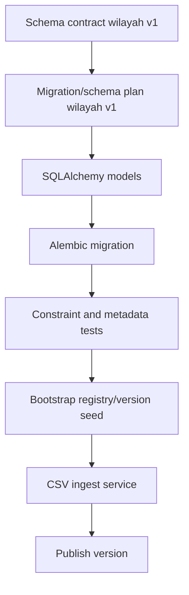

# Domain 4 — Migration / Schema Plan Wilayah v1

Dokumen ini menurunkan schema contract wilayah v1 menjadi rencana migration/schema implementation yang siap dibawa ke tahap model, Alembic migration, dan contract test.

Dokumen terkait:
- `docs/architecture/domain-4-master-data-registry-v1.md`
- `docs/architecture/domain-4-master-data-registry-v1-plan.md`
- `docs/architecture/domain-4-wilayah-blueprint-v1.md`
- `docs/architecture/domain-4-wilayah-schema-contract-v1.md`
- `docs/architecture/domain-4-wilayah-implementation-plan-v1.md`

Tujuan dokumen ini:
- mengunci bentuk migration awal yang aman,
- menentukan urutan pembuatan tabel/index/constraint,
- membedakan mana yang wajib masuk migration pertama dan mana yang boleh ditunda,
- menyiapkan jembatan ke contract test dan implementasi service ingest.

Dokumen ini belum berisi kode migration final, tetapi sudah cukup teknis untuk diturunkan langsung ke Alembic plan.

---

## 1. Tujuan migration v1

Migration wilayah v1 bertujuan membangun fondasi tiga tabel inti Domain 4 untuk use case wilayah administratif:
- `data_registries`
- `data_registry_versions`
- `data_registry_records`

Kemampuan minimal yang harus langsung didukung setelah migration pertama:
1. buat registry wilayah draft,
2. buat draft version awal,
3. simpan row hierarchy wilayah di satu tabel tunggal,
4. simpan ancestry code dan centroid,
5. publish satu version aktif,
6. lookup record berdasarkan code/key,
7. query children berdasarkan parent,
8. siap menerima ingest dari source CSV flat.

---

## 2. Prinsip desain migration

1. Migration pertama harus cukup tipis untuk stabil, tetapi tidak terlalu tipis sampai perlu refactor mahal.
2. Constraint inti yang menjaga integritas domain sebaiknya masuk sejak migration awal.
3. Validasi logika parent-child lintas level tidak perlu semua dipaksa di database bila implementasinya rumit; sebagian boleh dijaga di service layer.
4. Enum SQL native tidak wajib pada v1; `varchar + check constraint` lebih fleksibel untuk iterasi awal Alembic.
5. Polygon native/PostGIS tidak masuk migration v1.
6. Tabel source/mapping/ingestion run belum masuk migration pertama kecuali nanti diputuskan sangat perlu.

---

## 3. Scope migration pertama vs ditunda

## 3.1. Masuk migration pertama

### `data_registries`
- identitas registry
- lifecycle status
- shape/type/source mode
- `schema_meta`
- audit field standar

### `data_registry_versions`
- relasi ke registry
- version number
- lifecycle status
- `schema_json`
- `mapping_spec`
- `source_snapshot`
- publish/freshness metadata dasar
- audit field standar

### `data_registry_records`
- identity dan self-parent relation
- record code/key/external_code
- hierarchy level fields
- ancestry code fields
- `city_regency_kind`
- `village_adm_status`
- `is_active`
- `valid_from` / `valid_to`
- centroid + bbox fields
- `geometry_json` nullable
- `payload`
- `source_snapshot`
- `source_row_number`
- `source_row_hash`
- audit field standar

### Index & constraint inti
- unique key utama
- partial unique published version
- index hierarchy/filter minimal
- check enum dasar
- check range koordinat

## 3.2. Ditunda ke migration berikutnya
- `data_registry_sources`
- `data_registry_mappings`
- `data_registry_ingestion_runs`
- native PostGIS geometry column
- GIN index untuk JSONB bila nyata dibutuhkan
- full text search khusus label
- materialized path / nested set / ltree
- advanced validity period policy

---

## 4. Nama tabel dan urutan migration yang direkomendasikan

Urutan aman:
1. buat `data_registries`
2. buat `data_registry_versions`
3. buat `data_registry_records`
4. tambah unique constraints dan check constraints
5. tambah indexes
6. opsional seed awal registry `wilayah.administratif` via data migration terpisah

Catatan:
- seed data sebaiknya jangan dicampur ke schema migration utama bila ingin rollback lebih bersih.
- lebih sehat pisahkan antara schema migration dan bootstrap data migration.

---

## 5. Rekomendasi tipe kolom SQL v1

## 5.1. `data_registries`

- `id` -> `BigInteger`/`Integer` PK mengikuti standar repo saat ini
- `uuid` -> `UUID` not null unique
- `registry_slug` -> `String(191)` not null unique
- `registry_code` -> `String(100)` nullable unique
- `name` -> `String(255)` not null
- `description` -> `Text` nullable
- `registry_type` -> `String(50)` not null
- `category_key` -> `String(100)` not null
- `source_mode` -> `String(50)` not null
- `data_shape` -> `String(50)` not null
- `is_year_scoped` -> `Boolean` not null default `false`
- `status` -> `String(50)` not null
- `schema_meta` -> `JSONB` not null default `'{}'`
- `created_at` -> `DateTime(timezone=True)` not null
- `updated_at` -> `DateTime(timezone=True)` not null
- `deleted_at` -> `DateTime(timezone=True)` nullable
- `created_by` -> FK nullable ke `users.id`
- `created_by_uuid` -> `UUID` nullable
- `updated_by` -> FK nullable ke `users.id`
- `updated_by_uuid` -> `UUID` nullable
- `deleted_by` -> FK nullable ke `users.id`
- `deleted_by_uuid` -> `UUID` nullable

## 5.2. `data_registry_versions`

- `id` -> `BigInteger`/`Integer` PK
- `uuid` -> `UUID` not null unique
- `registry_id` -> FK not null ke `data_registries.id`
- `version_number` -> `Integer` not null
- `status` -> `String(50)` not null
- `schema_json` -> `JSONB` not null default `'{}'`
- `mapping_spec` -> `JSONB` not null default `'{}'`
- `source_snapshot` -> `JSONB` not null default `'{}'`
- `publish_notes` -> `Text` nullable
- `published_at` -> `DateTime(timezone=True)` nullable
- `source_watermark` -> `String(255)` nullable
- `materialized_watermark` -> `String(255)` nullable
- `freshness_status` -> `String(50)` not null default `'unknown'`
- `freshness_signature` -> `String(255)` nullable
- `created_at` -> `DateTime(timezone=True)` not null
- `updated_at` -> `DateTime(timezone=True)` not null
- `created_by` -> FK nullable ke `users.id`
- `created_by_uuid` -> `UUID` nullable
- `updated_by` -> FK nullable ke `users.id`
- `updated_by_uuid` -> `UUID` nullable

## 5.3. `data_registry_records`

### Identity & relationship
- `id` -> `BigInteger`/`Integer` PK
- `uuid` -> `UUID` not null unique
- `registry_id` -> FK not null ke `data_registries.id`
- `registry_version_id` -> FK not null ke `data_registry_versions.id`
- `parent_record_id` -> FK self nullable ke `data_registry_records.id`

### Identity/business fields
- `record_key` -> `String(255)` not null
- `record_code` -> `String(100)` not null
- `external_code` -> `String(100)` nullable
- `label` -> `String(255)` not null
- `display_label` -> `String(255)` nullable
- `normalized_label` -> `String(255)` not null

### Hierarchy fields
- `admin_level` -> `String(50)` not null
- `admin_level_code` -> `String(20)` not null
- `city_regency_kind` -> `String(50)` nullable
- `province_code` -> `String(100)` nullable
- `city_regency_code` -> `String(100)` nullable
- `district_code` -> `String(100)` nullable
- `village_code` -> `String(100)` nullable
- `village_adm_status` -> `String(50)` nullable

### State fields
- `sort_order` -> `Integer` nullable
- `is_active` -> `Boolean` not null default `true`
- `valid_from` -> `Date` nullable
- `valid_to` -> `Date` nullable

### Spatial-light fields
- `centroid_lat` -> `Numeric(10, 6)` nullable
- `centroid_lng` -> `Numeric(10, 6)` nullable
- `bbox_min_lat` -> `Numeric(10, 6)` nullable
- `bbox_min_lng` -> `Numeric(10, 6)` nullable
- `bbox_max_lat` -> `Numeric(10, 6)` nullable
- `bbox_max_lng` -> `Numeric(10, 6)` nullable
- `geometry_json` -> `JSONB` nullable

### Source lineage
- `source_row_number` -> `Integer` nullable
- `source_row_hash` -> `String(255)` nullable
- `source_snapshot` -> `JSONB` not null default `'{}'`

### Flexible attributes
- `payload` -> `JSONB` not null default `'{}'`

### Audit
- `created_at` -> `DateTime(timezone=True)` not null
- `updated_at` -> `DateTime(timezone=True)` not null
- `deleted_at` -> `DateTime(timezone=True)` nullable
- `created_by` -> FK nullable ke `users.id`
- `created_by_uuid` -> `UUID` nullable
- `updated_by` -> FK nullable ke `users.id`
- `updated_by_uuid` -> `UUID` nullable
- `deleted_by` -> FK nullable ke `users.id`
- `deleted_by_uuid` -> `UUID` nullable

---

## 6. Constraint plan detail

## 6.1. `data_registries`
- unique constraint: `uuid`
- unique constraint: `registry_slug`
- unique constraint optional: `registry_code`
- check constraint: `status in ('draft','published','archived')`
- check constraint: `registry_type in ('geo')`
- check constraint: `source_mode in ('manual','import_file','sync_external')`
- check constraint: `data_shape in ('hierarchical_geo','geojson')`

## 6.2. `data_registry_versions`
- unique constraint: `uuid`
- unique constraint: (`registry_id`, `version_number`)
- check constraint: `status in ('draft','published','archived')`
- check constraint: `freshness_status in ('unknown','fresh','stale','refreshing','failed')`
- partial unique index: satu `published` aktif per `registry_id`

## 6.3. `data_registry_records`
- unique constraint: `uuid`
- unique constraint: (`registry_version_id`, `record_key`)
- unique constraint: (`registry_version_id`, `record_code`)
- unique partial index optional: (`registry_version_id`, `external_code`) where `external_code is not null`
- check constraint: `admin_level in ('province','city_regency','district','village')`
- check constraint: `admin_level_code in ('PROV','CITY','DIST','VILL')`
- check constraint: `city_regency_kind in ('kabupaten','kota','unknown') or city_regency_kind is null`
- check constraint: `village_adm_status in ('desa','kelurahan','unknown') or village_adm_status is null`
- check constraint: `valid_to >= valid_from` or one side null
- check constraint: latitude valid range
- check constraint: longitude valid range

Catatan:
- rule parent-child level belum perlu dipaksa dengan database trigger di migration pertama;
- integrity ini lebih realistis dijaga oleh service layer + contract test terlebih dahulu.

---

## 7. Index plan detail

## 7.1. `data_registries`
- index `ix_data_registries_status`
- index `ix_data_registries_registry_type`
- index `ix_data_registries_category_key`
- index `ix_data_registries_source_mode`
- partial index aktif `deleted_at is null`

## 7.2. `data_registry_versions`
- index `ix_drv_registry_id`
- index `ix_drv_registry_id_status`
- index `ix_drv_published_at`
- index `ix_drv_freshness_status`
- unique partial index published per registry

## 7.3. `data_registry_records`

### Identity lookup
- unique index `ux_drr_version_record_key`
- unique index `ux_drr_version_record_code`
- index `ix_drr_version_external_code`

### Hierarchy query
- index `ix_drr_version_parent`
- index `ix_drr_version_admin_level`
- index `ix_drr_version_admin_level_parent`

### Filter query
- index `ix_drr_version_province_code`
- index `ix_drr_version_city_regency_code`
- index `ix_drr_version_city_regency_kind`
- index `ix_drr_version_district_code`
- index `ix_drr_version_village_code`
- index `ix_drr_version_is_active`
- index `ix_drr_version_village_adm_status`

### Search/display
- index `ix_drr_normalized_label`
- optional composite index `ix_drr_version_level_normalized_label`

### Active row
- partial index `deleted_at is null`

Catatan:
- untuk v1, cukup prioritaskan index yang benar-benar dipakai lookup/hierarchy/filter dasar;
- optional index search dapat diputuskan saat implementasi jika khawatir migration terlalu berat.

---

## 8. Foreign key plan

## 8.1. `data_registries`
- `created_by` -> `users.id`
- `updated_by` -> `users.id`
- `deleted_by` -> `users.id`

## 8.2. `data_registry_versions`
- `registry_id` -> `data_registries.id`
- `created_by` -> `users.id`
- `updated_by` -> `users.id`

## 8.3. `data_registry_records`
- `registry_id` -> `data_registries.id`
- `registry_version_id` -> `data_registry_versions.id`
- `parent_record_id` -> `data_registry_records.id`
- `created_by` -> `users.id`
- `updated_by` -> `users.id`
- `deleted_by` -> `users.id`

## 8.4. Rekomendasi `ondelete`
- FK audit ke `users.id`: `SET NULL`
- `data_registry_versions.registry_id`: `CASCADE` atau `RESTRICT` tergantung kebijakan penghapusan registry
- `data_registry_records.registry_id`: `CASCADE` atau `RESTRICT`
- `data_registry_records.registry_version_id`: `CASCADE` atau `RESTRICT`
- `parent_record_id`: `SET NULL` lebih aman untuk operasi administratif, tetapi secara domain delete parent sebenarnya sebaiknya dicegah pada layer service bila masih punya child aktif

Rekomendasi praktis v1:
- soft delete sebagai pola utama,
- schema-level delete fisik antartabel tidak menjadi jalur operasional harian,
- karena itu `RESTRICT` pada relasi inti sering lebih aman daripada terlalu permisif.

---

## 9. Nullability decision matrix per level

## 9.1. Province row
- `parent_record_id` null
- `province_code` not null = `record_code`
- `city_regency_code` null
- `district_code` null
- `village_code` null
- `city_regency_kind` null
- `village_adm_status` null

## 9.2. City/regency row
- `parent_record_id` not null
- `province_code` not null
- `city_regency_code` not null = `record_code`
- `district_code` null
- `village_code` null
- `city_regency_kind` recommended not null in seeded/imported data, tetapi kolom tetap nullable di schema awal agar migrasi source lebih fleksibel

## 9.3. District row
- `parent_record_id` not null
- `province_code` not null
- `city_regency_code` not null
- `district_code` not null = `record_code`
- `village_code` null
- `city_regency_kind` null

## 9.4. Village row
- `parent_record_id` not null
- `province_code` not null
- `city_regency_code` not null
- `district_code` not null
- `village_code` not null = `record_code`
- `village_adm_status` recommended not null pada hasil ingest bila rule derivasi dipakai, tetapi kolom tetap nullable di schema awal

---

## 10. Seed/bootstrap data plan

Migration schema utama tidak perlu langsung mengisi seluruh data wilayah.

Strategi lebih aman:
1. schema migration dulu,
2. bootstrap registry row `wilayah.administratif`,
3. bootstrap draft version awal,
4. baru jalankan ingest CSV sebagai data migration terpisah atau command/service admin.

### Seed minimum yang layak dipertimbangkan
- satu row `data_registries` untuk `wilayah.administratif`
- satu row `data_registry_versions` draft versi `1`

Keuntungan:
- schema migration tetap bersih,
- rollback schema tidak terikat data besar,
- ingest CSV 5957 row + ekspansi parent bisa dijalankan dan diuji terpisah.

---

## 11. Strategy ingest terkait migration

Karena source flat belum langsung masuk migration, plan implementasi setelah schema:
1. parsing CSV,
2. normalisasi kode BPS dan `kode_pos`,
3. derivasi `city_regency_kind`,
4. derivasi `village_adm_status`,
5. pembentukan canonical `record_key` ancestry-aware,
6. upsert province rows,
7. upsert city/regency rows,
8. upsert district rows,
9. upsert village rows,
10. publish version setelah validasi.

Catatan:
- logic ingest jangan ditanam ke Alembic migration schema utama;
- lebih baik jadi service/command terpisah agar re-runnable dan mudah dites.

---

## 12. Test plan yang harus mengikuti migration

Setelah migration/schema plan ini diterjemahkan ke kode, minimal test yang harus ada:

### Model/metadata tests
- ketiga tabel terdaftar di metadata
- foreign key utama benar
- self relation record parent-child benar

### Constraint tests
- duplicate `registry_slug` ditolak
- duplicate `version_number` dalam satu registry ditolak
- duplicate `record_code` dalam satu version ditolak
- published version ganda dalam satu registry ditolak

### Query/index-oriented behavior tests
- children record dapat dibaca per `parent_record_id`
- lookup per `record_code` bekerja
- filter per `admin_level` bekerja
- filter per `city_regency_kind` dan `village_adm_status` bekerja

### Ingest normalization tests
- `3201210008.0` dinormalisasi menjadi `3201210008`
- `16913.0` dinormalisasi menjadi `16913`
- `KAB. BOGOR` menghasilkan `city_regency_kind = kabupaten`
- kode `32.01.01.1001` menghasilkan `village_adm_status = kelurahan`

---

## 13. Risiko implementasi dan mitigasi

1. Over-constraining sejak migration pertama
- mitigasi: enum via varchar + check constraint, bukan native enum SQL dulu

2. Parent-child logic terlalu dipaksa di DB
- mitigasi: simpan integrity dasar di FK, rules level kompleks di service/test

3. Index terlalu banyak pada migration awal
- mitigasi: prioritaskan lookup/hierarchy/filter inti, sisanya optional

4. Source resmi berubah
- mitigasi: pertahankan `record_key` internal, `record_code` business-facing, dan `external_code`/payload untuk compatibility

5. Polygon datang belakangan
- mitigasi: `geometry_json` nullable dari awal, centroid tetap berguna, PostGIS ditunda

---

## 14. Deliverable teknis setelah plan ini

Jika plan ini disetujui, deliverable coding berikutnya seharusnya:
1. model SQLAlchemy untuk 3 tabel inti,
2. Alembic migration schema foundation wilayah,
3. model/constraint tests,
4. service contract minimal create/publish/list/lookup,
5. ingest normalization tests untuk source CSV wilayah.

---

## 15. Mermaid urutan implementasi

---

## 16. Verdict plan

Verdict arsitektural saat ini:
- schema contract sudah cukup matang,
- migration pertama sebaiknya fokus pada tiga tabel inti,
- ingest source CSV dilakukan di luar schema migration utama,
- dan jalur menuju implementation/testing sudah cukup jelas.

---

## 17. Next step yang direkomendasikan

Setelah dokumen ini, langkah paling tepat adalah:
1. menulis `implementation plan` atau langsung `model + migration plan` yang lebih operasional per file,
2. lalu turun ke contract test dan Alembic migration.

Kalau ingin tetap aman dan bertahap, langkah sesudah ini yang paling pas adalah:
- buat plan implementasi file-by-file untuk:
  - model SQLAlchemy,
  - migration Alembic,
  - test metadata/constraint,
  - service normalisasi ingest awal.
