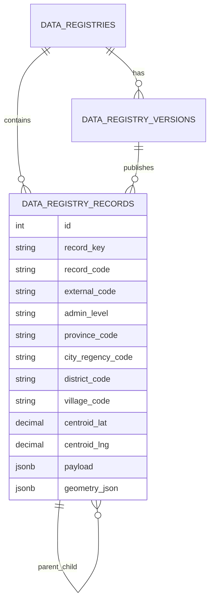

# Domain 4 — Schema Contract Wilayah v1

Dokumen ini menurunkan blueprint subdomain wilayah menjadi kontrak schema yang lebih konkret untuk implementasi v1.

Dokumen induk terkait:
- `docs/architecture/domain-4-master-data-registry-v1.md`
- `docs/architecture/domain-4-wilayah-blueprint-v1.md`

Fokus dokumen ini:
- field wajib per tabel,
- pemisahan kolom relasional vs JSONB,
- enum dan status yang direkomendasikan,
- constraint dan uniqueness rule,
- index yang perlu disiapkan,
- rule normalisasi ingest dari source CSV awal,
- contoh row per level hierarki.

Dokumen ini masih bersifat contract arsitektural, belum migration final.

Dokumen turunan untuk rencana migration/schema implementation:
- `docs/architecture/domain-4-wilayah-migration-schema-plan-v1.md`
- `docs/architecture/domain-4-wilayah-implementation-plan-v1.md`

---

## 1. Prinsip kontrak schema

1. Single hierarchical registry
- v1 tetap memakai satu registry wilayah administratif.
- level disimpan sebagai row berbeda dalam `data_registry_records`.

2. Relasional untuk field panas
- field yang sering dipakai filter, join, authorization, dan consumer API harus jadi kolom relasional.

3. JSONB untuk atribut fleksibel dan source-specific
- pasangan kode tambahan, label alternatif, metadata source, dan geometri fleksibel disimpan di JSONB.

4. Source-agnostic but source-aware
- model tidak mengunci ke satu instansi referensi permanen,
- tetapi cukup kaya untuk menyimpan padanan kode/nama dari beberapa source.

5. Polygon-ready, polygon-optional
- `geometry_json` tersedia sejak v1,
- tetapi nullable karena source awal baru menyediakan titik centroid.

---

## 2. Registry yang diasumsikan untuk v1

Registry utama yang dipakai schema contract ini:
- `registry_slug = wilayah.administratif`
- `registry_type = geo`
- `category_key = wilayah`
- `data_shape = hierarchical_geo`

Catatan:
- walaupun source awal fokus Jawa Barat, contract schema tidak boleh hardcoded hanya untuk Jawa Barat.
- kode dan key boleh mengandung konteks Jawa Barat pada data awal, tetapi tabel tetap reusable untuk provinsi lain.

---

## 3. Enum yang direkomendasikan

### 3.1. `registry_type`
Nilai awal yang relevan:
- `geo`

### 3.2. `data_shape`
Nilai awal yang relevan:
- `hierarchical_geo`
- `geojson`

Rekomendasi v1:
- isi `hierarchical_geo` untuk registry wilayah administratif.

### 3.3. `registry_status`
Untuk `data_registries.status`:
- `draft`
- `published`
- `archived`

### 3.4. `registry_version_status`
Untuk `data_registry_versions.status`:
- `draft`
- `published`
- `archived`

### 3.5. `source_mode`
Untuk `data_registries.source_mode`:
- `manual`
- `import_file`
- `sync_external`

### 3.6. `freshness_status`
Untuk `data_registry_versions.freshness_status`:
- `unknown`
- `fresh`
- `stale`
- `refreshing`
- `failed`

### 3.7. `admin_level`
Untuk `data_registry_records.admin_level`:
- `province`
- `city_regency`
- `district`
- `village`

### 3.8. `admin_level_code`
Untuk `data_registry_records.admin_level_code`:
- `PROV`
- `CITY`
- `DIST`
- `VILL`

### 3.9. `city_regency_kind`
Khusus level `city_regency` bila dibutuhkan untuk filter dan analytics:
- `kabupaten`
- `kota`
- `unknown`

Catatan:
- field ini berguna karena `admin_level = city_regency` sengaja menyatukan dua bentuk administrasi dalam satu level hirarki;
- source awal memungkinkan derivasi awal dari label seperti `KAB.` atau `KOTA`, tetapi bila nanti ada source lebih authoritative maka nilainya harus bisa diperbarui.

### 3.10. `village_adm_status`
Khusus level village bila memang diperlukan untuk filter bisnis:
- `desa`
- `kelurahan`
- `unknown`

Catatan:
- pada source awal, field ini belum authoritative;
- nilai dapat diisi `unknown` atau hasil derivasi sementara.

---

## 4. Kontrak tabel `data_registries`

## 4.1. Tujuan
Menyimpan identitas registry dan governance umum untuk wilayah administratif.

## 4.2. Field contract

### Wajib
- `id` bigint/integer PK
- `uuid` uuid unique not null
- `registry_slug` varchar unique not null
- `registry_code` varchar nullable unique bila dipakai
- `name` varchar not null
- `description` text nullable
- `registry_type` varchar not null
- `category_key` varchar not null
- `source_mode` varchar not null
- `data_shape` varchar not null
- `is_year_scoped` boolean not null default false
- `status` varchar not null
- `schema_meta` jsonb not null default '{}'
- `created_at` timestamp not null
- `updated_at` timestamp not null
- `deleted_at` timestamp nullable
- `created_by` fk nullable
- `created_by_uuid` uuid nullable
- `updated_by` fk nullable
- `updated_by_uuid` uuid nullable
- `deleted_by` fk nullable
- `deleted_by_uuid` uuid nullable

## 4.3. Kolom relasional vs JSONB

Relasional:
- `registry_slug`
- `registry_type`
- `category_key`
- `source_mode`
- `data_shape`
- `is_year_scoped`
- `status`

JSONB:
- `schema_meta`

## 4.4. Constraint minimum
- unique `uuid`
- unique `registry_slug`
- optional unique `registry_code` bila dipakai
- check `status` in allowed enum
- check `registry_type` in allowed enum
- check `source_mode` in allowed enum

## 4.5. Index minimum
- index on `status`
- index on `registry_type`
- index on `category_key`
- index on `source_mode`
- partial index on `deleted_at is null`

---

## 5. Kontrak tabel `data_registry_versions`

## 5.1. Tujuan
Menyimpan contract version, metadata publish, snapshot source, dan freshness state.

## 5.2. Field contract

### Wajib
- `id` bigint/integer PK
- `uuid` uuid unique not null
- `registry_id` fk not null
- `version_number` integer not null
- `status` varchar not null
- `schema_json` jsonb not null default '{}'
- `mapping_spec` jsonb not null default '{}'
- `source_snapshot` jsonb not null default '{}'
- `publish_notes` text nullable
- `published_at` timestamp nullable
- `source_watermark` varchar nullable
- `materialized_watermark` varchar nullable
- `freshness_status` varchar not null default 'unknown'
- `freshness_signature` varchar nullable
- `created_at` timestamp not null
- `updated_at` timestamp not null
- `created_by` fk nullable
- `created_by_uuid` uuid nullable
- `updated_by` fk nullable
- `updated_by_uuid` uuid nullable

## 5.3. Isi minimum `schema_json`
Minimal memuat:
- field wajib per `admin_level`
- aturan parent-child
- uniqueness rule logis
- shape payload minimum
- shape geometry minimum
- policy normalisasi source

## 5.4. Isi minimum `mapping_spec`
Minimal memuat:
- source field -> target field
- rule normalisasi kode BPS
- rule normalisasi `kode_pos`
- rule derivasi `village_adm_status`
- rule pembentukan parent row dari source flat

## 5.5. Isi minimum `source_snapshot`
Minimal memuat:
- `source_name`
- `source_type`
- `source_uri` atau `source_file`
- `source_version`
- `source_notes`
- `imported_at`
- `imported_by`
- `source_hash` bila tersedia

## 5.6. Constraint minimum
- unique `uuid`
- unique (`registry_id`, `version_number`)
- check `status` in allowed enum
- check `freshness_status` in allowed enum
- hanya satu published version aktif per `registry_id`
  - implementasi bisa lewat partial unique index pada `registry_id` where `status = 'published'`

## 5.7. Index minimum
- index on `registry_id`
- index on (`registry_id`, `status`)
- index on `published_at`
- index on `freshness_status`

---

## 6. Kontrak tabel `data_registry_records`

## 6.1. Tujuan
Menyimpan row wilayah pada seluruh level hierarki dalam satu tabel tunggal.

## 6.2. Field contract inti

### Identity & relationship
- `id` bigint/integer PK
- `uuid` uuid unique not null
- `registry_id` fk not null
- `registry_version_id` fk not null
- `parent_record_id` fk self nullable

### Canonical & business identity
- `record_key` varchar not null
- `record_code` varchar not null
- `external_code` varchar nullable
- `label` varchar not null
- `display_label` varchar nullable
- `normalized_label` varchar not null

### Hierarchy & administrative classification
- `admin_level` varchar not null
- `admin_level_code` varchar not null
- `city_regency_kind` varchar nullable
- `province_code` varchar nullable
- `city_regency_code` varchar nullable
- `district_code` varchar nullable
- `village_code` varchar nullable
- `village_adm_status` varchar nullable

### Operational state
- `sort_order` integer nullable
- `is_active` boolean not null default true
- `valid_from` date nullable
- `valid_to` date nullable

### Coordinate & geometry
- `centroid_lat` numeric(10,6) nullable
- `centroid_lng` numeric(10,6) nullable
- `bbox_min_lat` numeric(10,6) nullable
- `bbox_min_lng` numeric(10,6) nullable
- `bbox_max_lat` numeric(10,6) nullable
- `bbox_max_lng` numeric(10,6) nullable
- `geometry_json` jsonb nullable

### Source lineage & import trace
- `source_row_number` integer nullable
- `source_row_hash` varchar nullable
- `source_snapshot` jsonb not null default '{}'

### Flexible attributes
- `payload` jsonb not null default '{}'

### Audit
- `created_at` timestamp not null
- `updated_at` timestamp not null
- `deleted_at` timestamp nullable
- `created_by` fk nullable
- `created_by_uuid` uuid nullable
- `updated_by` fk nullable
- `updated_by_uuid` uuid nullable
- `deleted_by` fk nullable
- `deleted_by_uuid` uuid nullable

## 6.3. Kolom relasional yang wajib dipertahankan
Kolom ini jangan dipindah ke JSONB karena akan sering dipakai filter/join:
- `registry_id`
- `registry_version_id`
- `parent_record_id`
- `record_key`
- `record_code`
- `external_code`
- `label`
- `normalized_label`
- `admin_level`
- `admin_level_code`
- `city_regency_kind`
- `province_code`
- `city_regency_code`
- `district_code`
- `village_code`
- `village_adm_status`
- `is_active`
- `centroid_lat`
- `centroid_lng`
- `valid_from`
- `valid_to`

## 6.4. Atribut yang cocok di `payload`
Atribut berikut cocok masuk `payload`:
- `codes.kemendagri.*`
- `codes.bps.*`
- `source_labels.kemendagri.*`
- `source_labels.bps.*`
- `postal_code`
- `administrative_status_raw`
- atribut tampilan tambahan
- metadata non-filter utama lain

## 6.5. Atribut yang cocok di `source_snapshot`
- `source_name`
- `source_type`
- `source_file`
- `source_version`
- `source_row_id`
- `source_import_batch`
- `row_original_values` terbatas bila perlu

## 6.6. Rule nullable per level

### Province
- `parent_record_id` = null
- `province_code` = `record_code`
- `city_regency_code` = null
- `district_code` = null
- `village_code` = null
- `village_adm_status` = null

### City/Regency
- `parent_record_id` = province row
- `city_regency_kind` recommended terisi (`kabupaten`/`kota`/`unknown`)
- `province_code` not null
- `city_regency_code` = `record_code`
- `district_code` = null
- `village_code` = null

### District
- `parent_record_id` = city/regency row
- `province_code` not null
- `city_regency_code` not null
- `district_code` = `record_code`
- `village_code` = null

### Village
- `parent_record_id` = district row
- `province_code` not null
- `city_regency_code` not null
- `district_code` not null
- `village_code` = `record_code`
- `village_adm_status` nullable but recommended terisi jika rule derivasi diaktifkan

## 6.7. Constraint minimum
- unique `uuid`
- unique (`registry_version_id`, `record_key`)
- unique (`registry_version_id`, `record_code`)
- optional unique (`registry_version_id`, `external_code`) where `external_code is not null`
- check `admin_level` in allowed enum
- check `admin_level_code` in allowed enum
- check `city_regency_kind` in allowed enum when not null
- check `village_adm_status` in allowed enum when not null
- check `valid_to >= valid_from` when both exist
- check `centroid_lat between -90 and 90` when not null
- check `centroid_lng between -180 and 180` when not null

## 6.8. Parent-child integrity rules
At service layer minimum:
- `province` tidak boleh punya parent
- `city_regency.parent.admin_level` harus `province`
- `district.parent.admin_level` harus `city_regency`
- `village.parent.admin_level` harus `district`
- child dan parent harus berada dalam `registry_version_id` yang sama
- kode ancestry harus konsisten:
  - district harus membawa `province_code` dan `city_regency_code` sesuai parent chain
  - village harus membawa `province_code`, `city_regency_code`, `district_code` sesuai parent chain

## 6.9. Index minimum

### Identity lookup
- unique index on (`registry_version_id`, `record_key`)
- unique index on (`registry_version_id`, `record_code`)
- index on (`registry_version_id`, `external_code`)

### Hierarchy query
- index on (`registry_version_id`, `parent_record_id`)
- index on (`registry_version_id`, `admin_level`)
- index on (`registry_version_id`, `admin_level`, `parent_record_id`)

### Filter query
- index on (`registry_version_id`, `province_code`)
- index on (`registry_version_id`, `city_regency_code`)
- index on (`registry_version_id`, `city_regency_kind`)
- index on (`registry_version_id`, `district_code`)
- index on (`registry_version_id`, `village_code`)
- index on (`registry_version_id`, `is_active`)
- index on (`registry_version_id`, `village_adm_status`)

### Search/display
- index on `normalized_label`
- optional composite index on (`registry_version_id`, `admin_level`, `normalized_label`)

### Soft delete
- partial index where `deleted_at is null`

---

## 7. Rule normalisasi ingest dari CSV acuan awal

Sumber acuan:
- `/home/user/projects/dasborkanwil/instance/diskominfo-od_kode_wilayah_dan_nama_wilayah_desa_kelurahan_data.csv`

## 7.1. Mapping level

### Province row
- `record_code = kemendagri_provinsi_kode`
- `external_code = normalized(bps_provinsi_kode)`
- `label = kemendagri_provinsi_nama`
- `admin_level = province`
- `admin_level_code = PROV`
- `province_code = record_code`

### City/Regency row
- `record_code = kemendagri_kota_kode`
- `external_code = normalized(bps_kota_kode)`
- `label = kemendagri_kota_nama`
- `admin_level = city_regency`
- `admin_level_code = CITY`
- `city_regency_kind = derived_city_regency_kind(label)`
- `province_code = kemendagri_provinsi_kode`
- `city_regency_code = record_code`

### District row
- `record_code = kemendagri_kecamatan_kode`
- `external_code = normalized(bps_kecamatan_kode)`
- `label = kemendagri_kecamatan_nama`
- `admin_level = district`
- `admin_level_code = DIST`
- `province_code = kemendagri_provinsi_kode`
- `city_regency_code = kemendagri_kota_kode`
- `district_code = record_code`

### Village row
- `record_code = kemendagri_kelurahan_kode`
- `external_code = normalized(bps_kelurahan_kode)`
- `label = kemendagri_kelurahan_nama`
- `admin_level = village`
- `admin_level_code = VILL`
- `province_code = kemendagri_provinsi_kode`
- `city_regency_code = kemendagri_kota_kode`
- `district_code = kemendagri_kecamatan_kode`
- `village_code = record_code`
- `centroid_lat = latitude`
- `centroid_lng = longitude`

## 7.2. Rule normalisasi kode numerik-string

### BPS code normalization
Nilai seperti:
- `32.0` -> `32`
- `3201.0` -> `3201`
- `3201210008.0` -> `3201210008`

Rule:
- baca sebagai string
- trim whitespace
- jika suffix persis `.0`, hapus suffix itu
- jangan cast ke float lebih dulu saat implementasi agar tidak merusak digit panjang

### Postal code normalization
Nilai seperti:
- `16913.0` -> `16913`

Rule:
- perlakukan sebagai string
- hapus suffix `.0` bila ada
- simpan hasil akhir sebagai string

## 7.3. Rule normalisasi label dan canonical key
- trim leading/trailing space
- collapse multi-space menjadi satu space
- `normalized_label` dibuat dari uppercase + trim + collapse spaces
- `display_label` opsional dapat diisi dengan format presentasi yang lebih rapi di masa depan
- `record_key` jangan dibentuk hanya dari slug nama wilayah tunggal, karena nama yang sama bisa muncul di parent berbeda
- generator `record_key` minimal harus memasukkan konteks ancestry + level, misalnya:
  - province: `idn:jbr:province:jawa-barat`
  - city/regency: `idn:jbr:city:kab-bogor`
  - district: `idn:jbr:district:kab-bogor:cibinong`
  - village: `idn:jbr:village:kab-bogor:cibinong:pondok-rajeg`

## 7.4. Rule derivasi `city_regency_kind`
Jika source belum punya field eksplisit:
- label diawali `KAB.` atau `KABUPATEN` -> `kabupaten`
- label diawali `KOTA` -> `kota`
- selain itu -> `unknown`

Catatan:
- seperti `village_adm_status`, nilai ini sebaiknya ditandai sebagai hasil derivasi bila belum berasal dari source authoritative.

## 7.5. Rule derivasi `village_adm_status`
Jika `status_adm` kosong:
- suffix terakhir kode Kemendagri village dimisalkan `1001`, `2001`, dst
- prefix `1` -> `kelurahan`
- prefix `2` -> `desa`
- selain itu -> `unknown`

Catatan:
- simpan juga penanda bahwa nilai ini hasil derivasi, misalnya di `payload.administrative_status_source = "derived_from_kemendagri_code"`

## 7.6. Rule geometry
- `geometry_json` = null untuk source CSV ini
- `centroid_lat/lng` diisi jika tersedia
- bbox = null sampai source polygon tersedia

## 7.6. Rule idempotensi import
Rekomendasi:
- hitung `source_row_hash` dari gabungan field source utama
- simpan `source_row_number`
- gunakan kombinasi `registry_version_id + record_code` sebagai anchor upsert utama per level

---

## 8. Contoh row konseptual per level

## 8.1. Province
```json
{
  "record_key": "idn:jbr:province:jawa-barat",
  "record_code": "32",
  "external_code": "32",
  "label": "JAWA BARAT",
  "normalized_label": "JAWA BARAT",
  "admin_level": "province",
  "admin_level_code": "PROV",
  "province_code": "32",
  "city_regency_code": null,
  "district_code": null,
  "village_code": null,
  "centroid_lat": null,
  "centroid_lng": null,
  "geometry_json": null,
  "payload": {
    "codes": {
      "kemendagri": {"province": "32"},
      "bps": {"province": "32"}
    },
    "source_labels": {
      "kemendagri": {"province": "JAWA BARAT"},
      "bps": {"province": "JAWA BARAT"}
    }
  }
}
```

## 8.2. City/Regency
```json
{
  "record_key": "idn:jbr:city:kab-bogor",
  "record_code": "32.01",
  "external_code": "3201",
  "label": "KAB. BOGOR",
  "normalized_label": "KAB. BOGOR",
  "admin_level": "city_regency",
  "admin_level_code": "CITY",
  "city_regency_kind": "kabupaten",
  "province_code": "32",
  "city_regency_code": "32.01",
  "district_code": null,
  "village_code": null,
  "payload": {
    "codes": {
      "kemendagri": {"province": "32", "city_regency": "32.01"},
      "bps": {"province": "32", "city_regency": "3201"}
    },
    "source_labels": {
      "kemendagri": {"city_regency": "KAB. BOGOR"},
      "bps": {"city_regency": "KABUPATEN BOGOR"}
    }
  }
}
```

## 8.3. District
```json
{
  "record_key": "idn:jbr:district:cibinong",
  "record_code": "32.01.01",
  "external_code": "3201210",
  "label": "CIBINONG",
  "normalized_label": "CIBINONG",
  "admin_level": "district",
  "admin_level_code": "DIST",
  "province_code": "32",
  "city_regency_code": "32.01",
  "district_code": "32.01.01",
  "village_code": null,
  "payload": {
    "codes": {
      "kemendagri": {
        "province": "32",
        "city_regency": "32.01",
        "district": "32.01.01"
      },
      "bps": {
        "province": "32",
        "city_regency": "3201",
        "district": "3201210"
      }
    }
  }
}
```

## 8.4. Village
```json
{
  "record_key": "idn:jbr:village:pondok-rajeg",
  "record_code": "32.01.01.1001",
  "external_code": "3201210008",
  "label": "PONDOK RAJEG",
  "normalized_label": "PONDOK RAJEG",
  "admin_level": "village",
  "admin_level_code": "VILL",
  "province_code": "32",
  "city_regency_code": "32.01",
  "district_code": "32.01.01",
  "village_code": "32.01.01.1001",
  "village_adm_status": "kelurahan",
  "centroid_lat": -6.44385,
  "centroid_lng": 106.82049,
  "payload": {
    "codes": {
      "kemendagri": {
        "province": "32",
        "city_regency": "32.01",
        "district": "32.01.01",
        "village": "32.01.01.1001"
      },
      "bps": {
        "province": "32",
        "city_regency": "3201",
        "district": "3201210",
        "village": "3201210008"
      }
    },
    "postal_code": "16913",
    "administrative_status_source": "derived_from_kemendagri_code",
    "source_labels": {
      "kemendagri": {"village": "PONDOK RAJEG"},
      "bps": {"village": "PONDOK RAJEG"}
    }
  }
}
```

---

## 9. Mermaid ringkas



---

## 10. Definition of done untuk schema contract ini

Schema contract wilayah v1 dianggap cukup matang bila tim menyepakati:
- enum final yang dipakai,
- field wajib tiga tabel inti,
- relasional vs JSONB split,
- uniqueness dan index minimum,
- rule transform source CSV ke tree tunggal,
- dan contoh row per level sebagai acuan implementasi.

---

## 11. Next step yang direkomendasikan

Setelah dokumen ini, langkah paling pas adalah:
1. buat dokumen `migration/schema plan` untuk tiga tabel inti,
2. turunkan ke contract test model/repository/service,
3. implementasi schema foundation dulu,
4. baru lanjut service ingest untuk ekspansi source flat menjadi tree tunggal.
