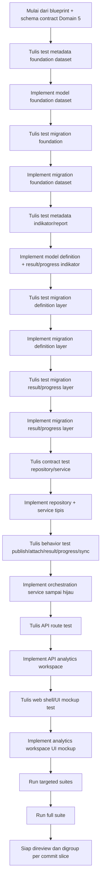
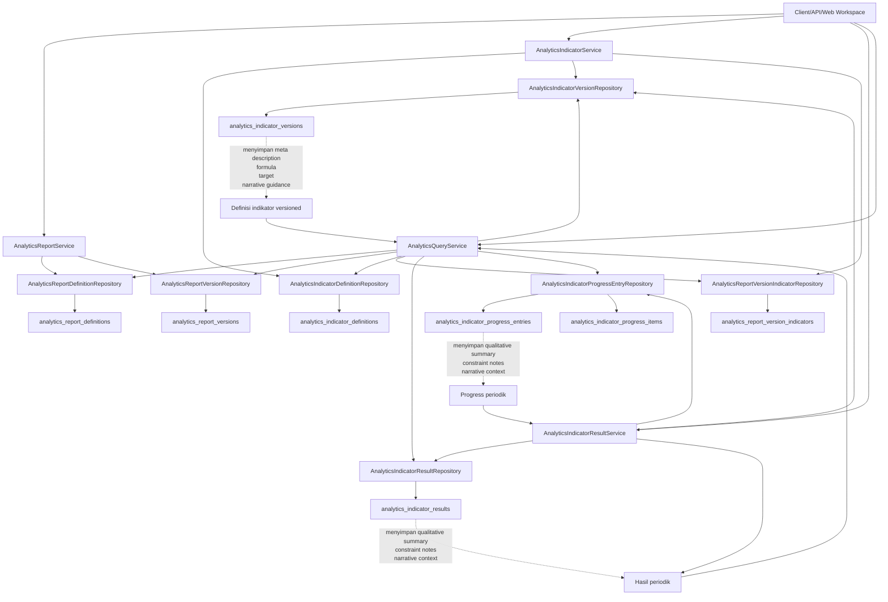

# Domain 5 — Analytics Indicators Implementation Plan v1

> **Untuk Hermes:** gunakan skill `subagent-driven-development` bila nanti plan ini dieksekusi task-by-task.

**Goal:** membangun fondasi implementasi layer `analytics_report_*` dan `analytics_indicator_*` sampai level model SQLAlchemy, Alembic migration, contract tests, dan service tipis agar Domain 5 bisa menyimpan definisi report, versi indikator, hasil periodik, progres manual, dan narasi kualitatif secara versioned di atas foundation dataset.

**Architecture:** implementasi mengikuti pola repo saat ini: model SQLAlchemy sebagai sumber metadata, Alembic migration yang eksplisit dan reviewable, repository untuk query/persistence, service untuk rule lifecycle dan validasi kombinasi, serta test dipisah menjadi metadata/migration/contract/behavior. V1 sengaja memisahkan definition layer dari result/progress layer supaya RED/GREEN frontier jelas dan rollback lebih aman.

**Tech Stack:** Flask, Flask-SQLAlchemy, Alembic, PostgreSQL JSONB, pytest, pola service-repository existing project.

---

## 1. Naming final v1 yang dikunci sebelum coding

### 1.1. Foundation yang sudah ada
- `analytics_datasets`
- `analytics_dataset_versions`
- `analytics_dataset_runs`

### 1.2. Tabel baru yang harus dipakai
- `analytics_report_definitions`
- `analytics_report_versions`
- `analytics_indicator_definitions`
- `analytics_indicator_versions`
- `analytics_report_version_indicators`
- `analytics_indicator_results`
- `analytics_indicator_progress_entries`
- `analytics_indicator_progress_items`

### 1.3. Class model Python yang direkomendasikan
- `AnalyticsReportDefinition`
- `AnalyticsReportVersion`
- `AnalyticsIndicatorDefinition`
- `AnalyticsIndicatorVersion`
- `AnalyticsReportVersionIndicator`
- `AnalyticsIndicatorResult`
- `AnalyticsIndicatorProgressEntry`
- `AnalyticsIndicatorProgressItem`

### 1.4. Kenapa tidak pakai `performance_*`
1. foundation Domain 5 sudah lebih dulu memakai prefix `analytics_*`
2. objek ini berada di bounded context analytics, bukan modul bisnis PK/Renaksi yang terpisah
3. istilah `indicator` lebih tepat daripada `metric` karena row ini membawa target, formula, period mode, status publish, dan narrative context

---

## 2. Scope implementasi v1 yang dikerjakan sekarang

Masuk scope:
1. model SQLAlchemy untuk 8 tabel baru
2. migration A untuk definition layer
3. migration B untuk result/progress layer
4. metadata tests + migration tests
5. repository/service contracts tipis
6. service behavior dasar untuk create/publish/reporting result/manual progress

Belum wajib masuk scope:
1. API web/UI penuh
2. formula engine bebas
3. async compute runner
4. dashboard final
5. approval workflow kompleks multi-level
6. attachment storage final

---

## 3. Mermaid — alur uji coba / RED-GREEN frontier

Diagram ini dipakai supaya review implementasi tetap disiplin.
Intinya: jangan langsung loncat ke UI atau API sebelum fondasi model, migration, dan service sudah terkunci.

Checklist maknanya:
- layer schema/model diverifikasi dulu sebelum route
- layer service diverifikasi dulu sebelum UI
- UI mockup datang paling akhir agar tidak menyamarkan bug fondasi

---

## 4. Mermaid — alur cara kerja service layer

Diagram ini merangkum orchestration service yang sekarang sudah hidup di repo.
Tujuannya supaya nanti saat review code, kita bisa cepat melihat siapa memanggil siapa dan narasi/meta description berada di titik mana.

Ringkasan behavior:
1. `AnalyticsReportService` fokus ke create/publish report definition + version.
2. `AnalyticsIndicatorService` fokus ke create/publish indicator version dan attach ke report version.
3. `AnalyticsIndicatorResultService` fokus ke result periodik, progress manual, dan sinkronisasi progress -> result.
4. `AnalyticsQueryService` fokus ke materialisasi payload workspace untuk API/UI.
5. Narasi definisional hidup di `analytics_indicator_versions`, sedangkan narasi operasional hidup di `analytics_indicator_results` dan `analytics_indicator_progress_entries`.

---

## 5. Audit grouping commit yang direkomendasikan

Supaya working tree besar ini tetap mudah direview, grouping commit yang paling sehat untuk kondisi repo sekarang adalah tiga slice berikut.

### Slice A — foundation dataset analytics

Tujuan:
- mengunci fondasi Domain 5 yang benar-benar menjadi parent semua kerja berikutnya

File utama:
- `app/modules/analytics/models.py`
- `migrations/versions/a1b2c3d4e5f6_add_analytics_dataset_foundation_v1.py`
- `tests/test_analytics_foundation_models.py`
- `docs/architecture/domain-5-blueprint-v1.md`
- `docs/architecture/domain-5-schema-contract-v1.md`
- `docs/architecture/domain-5-migration-schema-plan-v1.md`
- `docs/architecture/domain-5-transition-and-boundary-audit-v1.md`

Karakter slice:
- belum bicara report/indicator dinamis
- fokus ke `analytics_datasets`, `analytics_dataset_versions`, `analytics_dataset_runs`
- aman direview sebagai "foundation-only"

Commit message contoh:
- `feat: add analytics dataset foundation v1`

### Slice B — definition layer indikator/report + contract/service foundation

Tujuan:
- mengunci engine CMS-like untuk report/indicator versioned sebelum hasil periodik dan UI masuk

File utama:
- `app/modules/analytics/models.py`
- `app/modules/analytics/repositories.py`
- `app/modules/analytics/services.py`
- `app/modules/analytics/__init__.py`
- `migrations/versions/b7e1c2d3f4a5_add_analytics_indicator_definition_layer_v1.py`
- `tests/test_analytics_indicator_models.py`
- `tests/test_analytics_indicator_definition_migration.py`
- `tests/test_analytics_indicator_service_contracts.py`
- `tests/test_analytics_indicator_service_behaviors.py` untuk skenario create/publish/attach yang murni definition layer
- `docs/architecture/domain-5-dynamic-performance-indicators-blueprint-v1.md`
- `docs/architecture/domain-5-dynamic-performance-indicators-schema-contract-v1.md`
- `docs/architecture/domain-5-dynamic-performance-indicators-migration-schema-plan-v1.md`
- `docs/architecture/domain-5-analytics-indicators-implementation-plan-v1.md`

Karakter slice:
- sudah membawa `meta_description` dan narrative guidance versioned
- sudah membawa orchestration service inti
- belum perlu mencampur UI mockup

Commit message contoh:
- `feat: add analytics indicator definition layer and service contracts`

### Slice C — result/progress execution layer + API workspace + web mockup

Tujuan:
- membuka vertical slice yang bisa dicoba user dari workspace analytics

File utama:
- `app/__init__.py`
- `app/api/v1/analytics/__init__.py`
- `app/api/v1/analytics/routes.py`
- `app/modules/analytics/routes_web.py`
- `app/modules/analytics/services.py`
- `migrations/versions/c8f2d3e4a5b6_add_analytics_indicator_results_and_progress_v1.py`
- `tests/test_analytics_indicator_result_migration.py`
- `tests/test_api_analytics_routes.py`
- `tests/test_analytics_web_routes.py`
- `app/templates/pages/analytics/workspace.html`
- `app/src/js/pages/analytics-workspace.js`

Karakter slice:
- result/progress manual sudah hidup
- API payload workspace sudah bisa dibaca UI
- mockup tabs definition/formula/target/narrative/history sudah bisa dicoba

Commit message contoh:
- `feat: add analytics workspace vertical slice for results and progress`

### Catatan audit praktis

- `app/modules/analytics/models.py` dan `app/modules/analytics/services.py` kemungkinan tersentuh lintas slice; kalau mau commit benar-benar terpisah, gunakan `git add -p` atau staging by hunk.
- kalau user ingin review paling aman, lakukan urutan commit: Slice A -> Slice B -> Slice C.
- jangan satukan seluruh analytics domain 5 ke satu commit besar, karena review schema, orchestration, dan UI akan bercampur terlalu padat.

---

## 6. File yang akan dibuat / diubah

### 6.1. File baru yang direncanakan

**Analytics module**
- `app/modules/analytics/repositories.py`
- `app/modules/analytics/services.py`

**Tests**
- `tests/test_analytics_indicator_models.py`
- `tests/test_analytics_indicator_definition_migration.py`
- `tests/test_analytics_indicator_result_migration.py`
- `tests/test_analytics_indicator_service_contracts.py`
- `tests/test_analytics_indicator_service_behaviors.py`

**Migration**
- `migrations/versions/<rev_a>_add_analytics_indicator_definition_layer_v1.py`
- `migrations/versions/<rev_b>_add_analytics_indicator_results_and_progress_v1.py`

### 6.2. File existing yang perlu diubah
- `app/modules/analytics/models.py`
  - tambah 8 model baru dan relasi ke `AnalyticsDataset`, `AnalyticsDatasetVersion`, `AnalyticsDatasetRun`, dan `ReportingPeriod`
- `app/modules/analytics/__init__.py`
  - export model/repository/service baru seperlunya
- `app/__init__.py`
  - pastikan model analytics indicator ikut terimport saat app bootstrap
- `docs/architecture/domain-5-dynamic-performance-indicators-blueprint-v1.md`
  - sudah ditajamkan sebagai referensi naming
- `docs/architecture/domain-5-dynamic-performance-indicators-schema-contract-v1.md`
  - sudah menjadi kontrak field utama
- `docs/architecture/domain-5-dynamic-performance-indicators-migration-schema-plan-v1.md`
  - sudah mengunci fase migration

---

## 7. Urutan implementasi yang direkomendasikan

Implementasi paling aman dibagi menjadi 7 task besar.
Urutan ini sengaja dimulai dari test dan migration, lalu model, lalu service tipis.

---

## Task 1: Tambah metadata tests untuk naming dan registrasi model

**Objective:** mengunci nama class, nama tabel, dan relasi dasar sebelum migration ditulis.

**Files:**
- Create: `tests/test_analytics_indicator_models.py`
- Modify: `app/modules/analytics/models.py`

### Step 1: Tulis failing test untuk registrasi tabel baru

Minimal assert bahwa metadata memuat:
- `analytics_report_definitions`
- `analytics_report_versions`
- `analytics_indicator_definitions`
- `analytics_indicator_versions`
- `analytics_report_version_indicators`
- `analytics_indicator_results`
- `analytics_indicator_progress_entries`
- `analytics_indicator_progress_items`

### Step 2: Tulis failing test untuk class name dan tablename

Minimal assert:
- `AnalyticsReportDefinition.__tablename__ == 'analytics_report_definitions'`
- `AnalyticsReportVersion.__tablename__ == 'analytics_report_versions'`
- `AnalyticsIndicatorDefinition.__tablename__ == 'analytics_indicator_definitions'`
- `AnalyticsIndicatorVersion.__tablename__ == 'analytics_indicator_versions'`
- `AnalyticsReportVersionIndicator.__tablename__ == 'analytics_report_version_indicators'`
- `AnalyticsIndicatorResult.__tablename__ == 'analytics_indicator_results'`
- `AnalyticsIndicatorProgressEntry.__tablename__ == 'analytics_indicator_progress_entries'`
- `AnalyticsIndicatorProgressItem.__tablename__ == 'analytics_indicator_progress_items'`

### Step 3: Tulis failing test untuk constraint/high-value columns

Minimal cek:
- unique `(report_definition_id, version_number)` pada `analytics_report_versions`
- unique `(indicator_definition_id, version_number)` pada `analytics_indicator_versions`
- partial unique current draft/current published untuk report version dan indicator version
- FK `dataset_id` dan `dataset_version_id` opsional dari `analytics_indicator_versions`
- FK `dataset_run_id` opsional dari `analytics_indicator_results`
- FK `reporting_period_id` pada result/progress entry
- kolom naratif:
  - `meta_description`
  - `narrative_guidance_json`
  - `qualitative_summary`
  - `constraint_notes`
  - `narrative_context_json`

### Step 4: Run RED test

Run:
`docker exec -w /usr/src/app dasborkanwil_app sh -lc 'PYTHONPATH=/usr/src/app pytest tests/test_analytics_indicator_models.py -q'`

Expected:
- FAIL karena model belum ada.

### Step 5: Commit

Message rekomendasi:
`test: add analytics indicator model metadata expectations`

---

## Task 2: Implement model SQLAlchemy untuk definition layer dulu

**Objective:** membuat model Python untuk 5 tabel definition layer agar metadata stabil sebelum migration A.

**Files:**
- Modify: `app/modules/analytics/models.py`
- Modify: `app/modules/analytics/__init__.py`
- Modify: `app/__init__.py`

### Step 1: Tambah constants enum per model

Minimal constants:
- report type: `pk`, `renaksi`, `scorecard`, `monitoring`, `custom`
- definition status: `draft`, `published`, `archived`
- report/indicator active status: `draft`, `active`, `archived`
- source mode: `dataset_driven`, `manual_input`, `hybrid`
- calculation type: `absolute_count`, `percentage`, `ratio`, `score`, `weighted_score`, `checklist_completion`, `boolean_completion`, `custom_formula`
- target source type: `manual_central_target`, `manual_local_target`, `derived_from_dataset`, `derived_from_manual_input`, `hybrid`
- period mode: `quarterly`, `semester`, `yearly`, `multi_period`
- aggregation strategy: `sum`, `avg`, `last_value`, `max`, `custom_formula`

### Step 2: Tambah 5 model definition layer

Minimal model:
- `AnalyticsReportDefinition`
- `AnalyticsReportVersion`
- `AnalyticsIndicatorDefinition`
- `AnalyticsIndicatorVersion`
- `AnalyticsReportVersionIndicator`

Kolom wajib mengikuti schema contract final.
Gunakan pola yang sama seperti `AnalyticsDataset*`:
- integer PK
- `uuid`
- timestamps
- audit actor fields
- `JSONB` + `server_default`
- `db.Index(...)` untuk `deleted_at`
- partial unique PostgreSQL/SQLite untuk current draft/current published

### Step 3: Hubungkan relasi penting

Minimal relasi:
- report definition -> report versions
- indicator definition -> indicator versions
- report version -> mappings
- indicator version -> mappings
- indicator version -> optional dataset
- indicator version -> optional dataset version

### Step 4: Register import di bootstrap

Pastikan `app/__init__.py` tetap mengimport `app.modules.analytics.models` sehingga metadata terbaca Alembic.
Jika perlu, cukup dengan tetap mengimport class baru dari file yang sama.

### Step 5: Run GREEN metadata test

Run:
`docker exec -w /usr/src/app dasborkanwil_app sh -lc 'PYTHONPATH=/usr/src/app pytest tests/test_analytics_indicator_models.py -q'`

Expected:
- PASS untuk bagian definition layer yang sudah diimplementasi
- jika result/progress belum dibuat, split assert atau mark TODO di test

### Step 6: Commit

Message rekomendasi:
`feat: add analytics indicator definition models`

---

## Task 3: Tulis dan implement migration A

**Objective:** mengunci DDL untuk definition layer dengan check constraints dan partial unique indexes.

**Files:**
- Create: `tests/test_analytics_indicator_definition_migration.py`
- Create: `migrations/versions/<rev_a>_add_analytics_indicator_definition_layer_v1.py`

### Step 1: Tulis failing migration test

Minimal assert:
- file migration ada
- `down_revision == 'a1b2c3d4e5f6'`
- check constant strings memuat enum penting
- nama tabel yang dibuat sesuai final naming v1
- migration memuat partial unique index untuk:
  - satu current draft per report
  - satu current published per report
  - satu current draft per indicator
  - satu current published per indicator
- migration memuat FK dari:
  - `analytics_indicator_versions.dataset_id -> analytics_datasets.id`
  - `analytics_indicator_versions.dataset_version_id -> analytics_dataset_versions.id`

### Step 2: Tulis migration A secara eksplisit

Nama file rekomendasi:
`<rev_a>_add_analytics_indicator_definition_layer_v1.py`

Urutan create table:
1. `analytics_report_definitions`
2. `analytics_report_versions`
3. `analytics_indicator_definitions`
4. `analytics_indicator_versions`
5. `analytics_report_version_indicators`

### Step 3: Jalankan targeted tests

Run:
`docker exec -w /usr/src/app dasborkanwil_app sh -lc 'PYTHONPATH=/usr/src/app pytest tests/test_analytics_indicator_definition_migration.py tests/test_analytics_indicator_models.py -q'`

Expected:
- PASS

### Step 4: Verifikasi head/revision

Run:
`docker exec -w /usr/src/app dasborkanwil_app sh -lc 'flask db heads'`

Expected:
- hanya ada satu head baru untuk migration A di atas `a1b2c3d4e5f6`

### Step 5: Commit

Message rekomendasi:
`feat: add analytics indicator definition migration`

---

## Task 4: Tambah model result/progress layer dan metadata tests lanjutannya

**Objective:** menutup 3 tabel operasional yang menyimpan hasil periodik, progres manual, dan item checklist.

**Files:**
- Modify: `tests/test_analytics_indicator_models.py`
- Modify: `app/modules/analytics/models.py`

### Step 1: Tambah failing assert untuk 3 model operasional

Minimal cek kolom:

`AnalyticsIndicatorResult`
- `indicator_version_id`
- `reporting_year`
- `reporting_period_id`
- `period_mode`
- `status`
- `completion_status`
- `actual_value`
- `target_value`
- `score_value`
- `result_detail_json`
- `source_trace_json`
- `dataset_run_id`
- `qualitative_summary`
- `constraint_notes`
- `narrative_context_json`

`AnalyticsIndicatorProgressEntry`
- `indicator_version_id`
- `reporting_year`
- `reporting_period_id`
- `status`
- `completion_status`
- `progress_summary_json`
- `evidence_summary_json`
- `qualitative_summary`
- `constraint_notes`
- `narrative_context_json`

`AnalyticsIndicatorProgressItem`
- `progress_entry_id`
- `item_key`
- `label`
- `status`
- `is_required`
- `sort_order`
- `payload_json`

### Step 2: Implement 3 model baru

Tambahkan relasi:
- indicator version -> results
- indicator version -> progress entries
- progress entry -> progress items
- result -> optional dataset run
- result/progress entry -> optional reporting period

### Step 3: Run metadata test

Run:
`docker exec -w /usr/src/app dasborkanwil_app sh -lc 'PYTHONPATH=/usr/src/app pytest tests/test_analytics_indicator_models.py -q'`

Expected:
- PASS

### Step 4: Commit

Message rekomendasi:
`feat: add analytics indicator result and progress models`

---

## Task 5: Tulis dan implement migration B

**Objective:** mengunci DDL result/progress layer secara terpisah dari definition layer.

**Files:**
- Create: `tests/test_analytics_indicator_result_migration.py`
- Create: `migrations/versions/<rev_b>_add_analytics_indicator_results_and_progress_v1.py`

### Step 1: Tulis failing migration test

Minimal assert:
- `down_revision == '<rev_a>'`
- migration membuat:
  - `analytics_indicator_results`
  - `analytics_indicator_progress_entries`
  - `analytics_indicator_progress_items`
- check constraint untuk:
  - result status
  - completion status
  - progress entry status
  - progress item status
- index untuk:
  - `reporting_year`
  - `reporting_period_id`
  - `dataset_run_id`
  - `completion_status`
  - `deleted_at`

### Step 2: Implement migration B

Nama file rekomendasi:
`<rev_b>_add_analytics_indicator_results_and_progress_v1.py`

Urutan create table:
1. `analytics_indicator_results`
2. `analytics_indicator_progress_entries`
3. `analytics_indicator_progress_items`

### Step 3: Jalankan targeted tests

Run:
`docker exec -w /usr/src/app dasborkanwil_app sh -lc 'PYTHONPATH=/usr/src/app pytest tests/test_analytics_indicator_result_migration.py tests/test_analytics_indicator_models.py -q'`

Expected:
- PASS

### Step 4: Commit

Message rekomendasi:
`feat: add analytics indicator result and progress migration`

---

## Task 6: Tambah repository dan service contracts

**Objective:** mengunci boundary Python API internal sebelum behavior kompleks ditulis.

**Files:**
- Create: `app/modules/analytics/repositories.py`
- Create: `app/modules/analytics/services.py`
- Create: `tests/test_analytics_indicator_service_contracts.py`

### Step 1: Tulis failing contract test untuk repository

Minimal kontrak repository:

`AnalyticsReportDefinitionRepository`
- `get_by_key`
- `list_by_status`

`AnalyticsReportVersionRepository`
- `get_draft_version`
- `get_published_version`
- `get_next_version_number`
- `archive_published_others`

`AnalyticsIndicatorDefinitionRepository`
- `get_by_key`
- `list_by_status`

`AnalyticsIndicatorVersionRepository`
- `get_draft_version`
- `get_published_version`
- `get_next_version_number`
- `archive_published_others`

`AnalyticsIndicatorResultRepository`
- `list_by_indicator_version`
- `get_latest_for_period`

`AnalyticsIndicatorProgressEntryRepository`
- `list_by_indicator_version`
- `get_latest_for_period`

### Step 2: Tulis failing contract test untuk service

Minimal service:

`AnalyticsReportService`
- `create_report_definition`
- `create_report_version`
- `publish_report_version`

`AnalyticsIndicatorService`
- `create_indicator_definition`
- `create_indicator_version`
- `publish_indicator_version`
- `attach_indicator_to_report_version`

`AnalyticsIndicatorResultService`
- `record_result`
- `record_progress_entry`
- `sync_result_from_progress`

### Step 3: Implement stub minimal sampai GREEN

Implementasi awal cukup tipis:
- class ada
- method ada
- repository mewarisi pola `BaseRepository` bila sudah tersedia, atau cukup wrapper `db.session`

### Step 4: Run contract test

Run:
`docker exec -w /usr/src/app dasborkanwil_app sh -lc 'PYTHONPATH=/usr/src/app pytest tests/test_analytics_indicator_service_contracts.py -q'`

Expected:
- PASS

### Step 5: Commit

Message rekomendasi:
`feat: add analytics indicator service contracts`

---

## Task 7: Tambah service behavior dasar yang paling evaluable

**Objective:** memberi vertical slice paling tipis yang membuktikan layer ini benar-benar bisa dipakai.

**Files:**
- Create: `tests/test_analytics_indicator_service_behaviors.py`
- Modify: `app/modules/analytics/services.py`
- Modify: `app/modules/analytics/repositories.py`

### Step 1: Tulis failing behavior test untuk create/publish definition

Minimal scenario:
1. create report definition
2. create draft report version
3. create indicator definition
4. create draft indicator version dengan:
   - `source_mode='manual_input'`
   - `calculation_type='checklist_completion'`
   - `meta_description` terisi
5. publish indicator version
6. attach indicator ke report version
7. publish report version

### Step 2: Tulis failing behavior test untuk manual progress + result narrative

Minimal scenario:
1. buat progress entry untuk satu indicator version dan satu periode
2. simpan 2-3 progress items
3. isi `qualitative_summary` dan `constraint_notes`
4. panggil `sync_result_from_progress`
5. assert result menyimpan:
   - `completion_status`
   - `actual_value`
   - `target_value`
   - `qualitative_summary`
   - `constraint_notes`
   - `narrative_context_json`

### Step 3: Tulis failing behavior test untuk dataset-driven trace

Minimal scenario:
1. indicator version mengarah ke `dataset_id` + `dataset_version_id`
2. `record_result()` menerima `dataset_run_id`
3. result menyimpan trace ke run tanpa mewajibkan manual progress

### Step 4: Implement minimal code sampai GREEN

Rule dasar yang wajib hidup:
- publish harus mengarsipkan current published lama bila ada
- `meta_description` disimpan di level indicator version
- result dan progress entry wajib period-aware
- `dataset_run_id` nullable untuk manual mode
- `constraint_notes` boleh terisi walau result complete, tetapi service boleh expose warning hook untuk fase berikutnya

### Step 5: Run behavior test

Run:
`docker exec -w /usr/src/app dasborkanwil_app sh -lc 'PYTHONPATH=/usr/src/app pytest tests/test_analytics_indicator_service_behaviors.py -q'`

Expected:
- PASS

### Step 6: Jalankan suite gabungan

Run:
`docker exec -w /usr/src/app dasborkanwil_app sh -lc 'PYTHONPATH=/usr/src/app pytest tests/test_analytics_indicator_models.py tests/test_analytics_indicator_definition_migration.py tests/test_analytics_indicator_result_migration.py tests/test_analytics_indicator_service_contracts.py tests/test_analytics_indicator_service_behaviors.py -q'`

Expected:
- seluruh suite analytics indicator hijau

### Step 7: Commit

Message rekomendasi:
`feat: add analytics indicator foundation services`

---

## 8. RED/GREEN frontier yang disarankan

### Slice A — migration/schema
- RED: metadata + migration tests fail
- GREEN: model registration dan dua migration pass

### Slice B — contract
- RED: repository/service contract tests fail
- GREEN: method surface stabil

### Slice C — thin vertical behavior
- RED: create/publish/result/progress behavior fail
- GREEN: satu alur manual_input dan satu alur dataset_driven terbukti jalan

---

## 9. Verifikasi manual setelah coding

1. cek metadata model:
`docker exec -w /usr/src/app dasborkanwil_app sh -lc 'PYTHONPATH=/usr/src/app pytest tests/test_analytics_indicator_models.py -q'`

2. cek migration tests:
`docker exec -w /usr/src/app dasborkanwil_app sh -lc 'PYTHONPATH=/usr/src/app pytest tests/test_analytics_indicator_definition_migration.py tests/test_analytics_indicator_result_migration.py -q'`

3. cek behavior tests:
`docker exec -w /usr/src/app dasborkanwil_app sh -lc 'PYTHONPATH=/usr/src/app pytest tests/test_analytics_indicator_service_contracts.py tests/test_analytics_indicator_service_behaviors.py -q'`

4. cek full suite project bila slice ini sudah stabil:
`docker exec -w /usr/src/app dasborkanwil_app sh -lc 'PYTHONPATH=/usr/src/app pytest tests/ -q'`

---

## 10. Acceptance criteria v1

Plan ini dianggap selesai bila:
- naming persistence final sudah konsisten `analytics_report_*` dan `analytics_indicator_*`
- 8 tabel baru terdaftar di SQLAlchemy metadata
- migration A dan migration B ada, berantai benar, dan punya check constraints minimum
- field naratif versioned dan periodik tersedia sesuai kontrak
- ada service contract untuk create/publish/report result/progress
- ada minimal satu behavior test manual_input dan satu behavior test dataset_driven
- tidak ada tabel `pk_*`, `renaksi_*`, atau `performance_*` baru yang bocor ke persistence layer

---

## 11. Handoff implementasi paling aman

Kalau mau dieksekusi pelan dan aman, jalankan persis urutan ini:
1. Task 1
2. Task 2
3. Task 3
4. Task 4
5. Task 5
6. Task 6
7. Task 7

Jangan loncat langsung ke service behavior sebelum metadata + migration foundation hijau.

Itu penting supaya kalau ada koreksi naming atau constraint, kita belum keburu menumpuk logic di atas pondasi yang salah.
