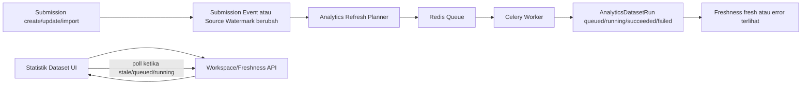

# ADR — Domain 5 Analytics Refresh Architecture v1

## Status

Accepted — 2026-06-25

## Konteks

Domain 5 Analytics sudah memiliki fondasi materialized dataset run:

- `analytics_datasets`
- `analytics_dataset_versions`
- `analytics_dataset_runs`
- source watermark dari `submissions.submitted_at` / `submissions.updated_at`
- workspace/statistik dataset yang dapat menampilkan freshness `fresh`, `stale`, atau `unknown`
- tombol manual `Refresh Dataset dari Source Terbaru`

Masalah yang ingin diselesaikan berikutnya adalah membuat data statistik/report terasa otomatis dan near realtime tanpa membuat request halaman menjadi berat atau rapuh.

Freshness source dan freshness analytics harus tetap dipisahkan:

- source truth berada di domain operasional seperti `submissions` dan `submission_events`;
- analytics membaca hasil materialisasi dataset run;
- `analytics_dataset_runs.source_watermark` menjadi bukti watermark source yang dipakai saat run;
- `analytics_dataset_runs.refreshed_at` / `started_at` / `finished_at` menandai waktu proses analytics, bukan waktu data bisnis berubah.

## Keputusan

Kita memilih arsitektur **near realtime analytics refresh** berbasis background queue, bukan hard realtime langsung.

Keputusan utama:

1. Materialization dataset tidak boleh dijalankan sinkron di page load.
2. Refresh dataset dijalankan oleh background worker melalui Redis-backed queue.
3. Untuk Flask stack proyek ini, default v1 adalah **Celery + Redis**.
4. UI statistik/report memakai polling ringan terlebih dahulu, bukan WebSocket/SSE.
5. Event-triggered refresh dari submission/import akan ditambahkan setelah manual async refresh stabil.
6. WebSocket/SSE baru dipertimbangkan setelah ada kebutuhan live notification/progress lintas session.

## Target arsitektur



## Komponen v1

### 1. Celery app dan worker service

Tambahkan service aplikasi terpisah, misalnya:

- `flask_worker`: menjalankan Celery worker;
- opsional nanti `flask_beat`: menjalankan periodic reconciliation/scheduler.

Redis global proyek (`global_redis:6379` di network `project_network`) dipakai sebagai broker awal.

### 2. Analytics refresh task

Task awal:

```text
analytics.refresh_dataset_version(
    dataset_id,
    dataset_version_id,
    requested_filters=None,
    trigger="manual|auto_on_view|event|reconcile",
    force=False,
)
```

Task hanya menjadi adapter queue. Business logic tetap berada di service layer, terutama `AnalyticsDatasetRunService` dan materialization service yang sudah ada/akan dipisahkan.

### 3. Refresh planner

Tambahkan service kecil, misalnya `AnalyticsRefreshPlanner`, dengan tanggung jawab:

- mengevaluasi source freshness;
- menentukan dataset/version mana yang terdampak oleh perubahan source;
- membuat idempotency key;
- mencegah enqueue job duplikat;
- memilih apakah stale cukup ditandai atau perlu langsung enqueue refresh.

Submission service tidak boleh mengetahui detail materialization analytics. Submission service cukup memancarkan event/domain signal atau memanggil planner lewat boundary kecil.

### 4. Status run/job

Status minimal yang perlu didukung:

- `queued`
- `running`
- `success` / `succeeded` sesuai konvensi existing yang dipakai kode
- `failed`

Run/job perlu menyimpan minimal:

- `source_watermark`
- `requested_filters` / filter hash bila dipakai
- `trigger`
- `started_at`
- `finished_at`
- `error_code`
- `error_message`

Jika status queue terlalu sulit ditampung bersih di `analytics_dataset_runs`, boleh ditambahkan tabel observability kecil seperti `analytics_refresh_jobs`. Namun untuk v1, prefer memakai `analytics_dataset_runs` bila cukup agar scope tetap kecil.

### 5. Locking dan idempotency

Wajib mencegah refresh ganda untuk dataset/version/source yang sama.

Default idempotency key:

```text
analytics_dataset_version_id + source_watermark + filter_hash
```

Aturan:

- jika run/job dengan key sama masih `queued`/`running`, jangan enqueue ulang;
- jika latest run sudah memakai source watermark yang sama dan status sukses, jangan enqueue ulang kecuali `force=True`;
- untuk import besar, gunakan debounce/batching supaya ribuan row tidak menciptakan ribuan job.

### 6. UI polling

UI statistik dataset harus menampilkan state operasional:

- `Sinkron`
- `Perlu Refresh`
- `Sedang Disiapkan` / `Queued`
- `Sedang Disegarkan` / `Running`
- `Refresh Gagal`
- `Belum Diketahui`

Polling hanya aktif saat perlu:

- freshness `stale` dan auto refresh baru dienqueue;
- latest run status `queued`/`running`;
- user baru menekan tombol refresh async.

Interval awal: 5-10 detik. Stop polling ketika status final `succeeded`/`failed`.

## Urutan implementasi yang disepakati

1. Tambahkan/rapikan status observability `queued/running/succeeded/failed` pada run/job.
2. Tambahkan Celery + Redis config dan service `flask_worker`.
3. Bungkus materialization dataset run menjadi Celery task.
4. Ubah tombol manual refresh agar enqueue job, lalu UI polling sampai selesai.
5. Setelah manual async stabil, aktifkan auto-refresh-on-view saat dataset stale.
6. Setelah itu tambahkan event-triggered refresh dari submission create/update/import.
7. Tambahkan periodic reconciliation bila diperlukan untuk recovery job/event yang terlewat.
8. Pertimbangkan SSE/WebSocket hanya bila polling sudah tidak cukup secara UX/operasional.

## Konsekuensi

### Positif

- Page load tetap ringan.
- Materialization berat tidak menyebabkan timeout request web.
- Dataset statistik/report terasa otomatis dan near realtime.
- Run history tetap auditable.
- Arsitektur tetap menjaga boundary `source truth -> dataset contract -> dataset run -> report`.
- Redis global yang sudah ada dapat dimanfaatkan.

### Trade-off

- Perlu tambahan service worker di Docker.
- Perlu observability job/run yang lebih jelas.
- Perlu handling failure/retry/idempotency.
- Perlu test coverage untuk task, planner, dan polling UI.

## Non-goals v1

- Hard realtime dashboard.
- WebSocket/SSE notification.
- Distributed workflow engine kompleks.
- Query langsung chart/report ke raw submissions untuk mengejar realtime.
- Refresh semua dataset setiap ada submission tanpa planner/debounce.

## Verification checklist saat implementasi

- Manual refresh menghasilkan job/run async dan tidak memblokir request.
- UI dapat membedakan stale, queued, running, succeeded, failed.
- Polling berhenti setelah status final.
- Duplicate enqueue dicegah untuk watermark/filter yang sama.
- Import banyak row tidak menciptakan job per row.
- Source freshness dan analytics refresh timestamp tetap terpisah.
- Test suite analytics tetap hijau.
