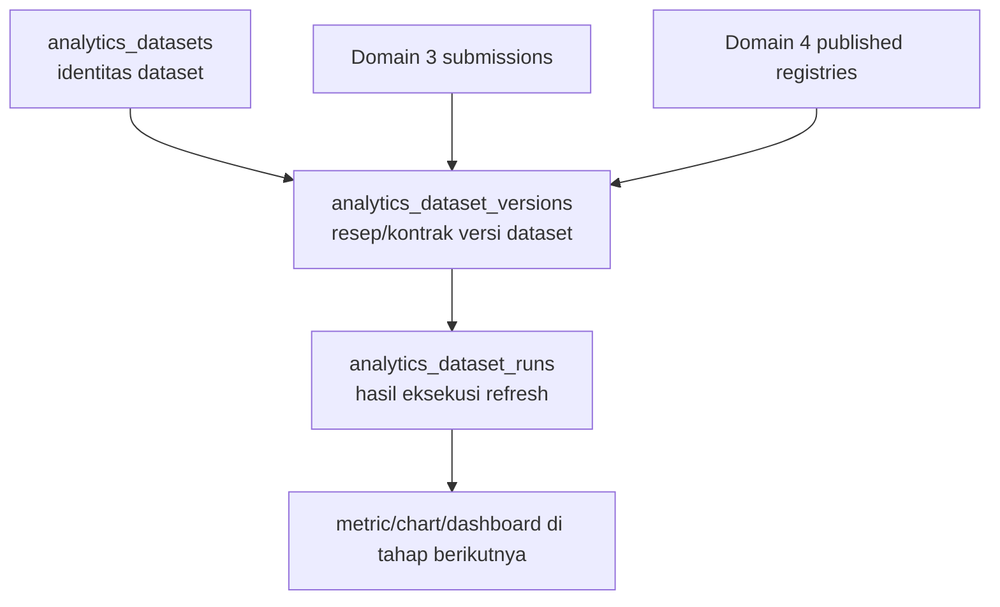
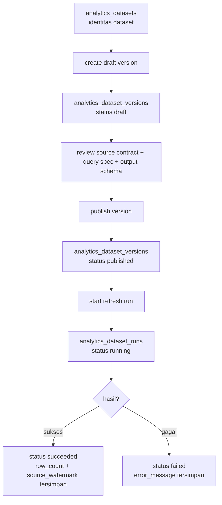

# Domain 5 — Analytics & Visualization Blueprint v1

Dokumen ini adalah blueprint arsitektur tipis untuk memulai Domain 5 secara sehat, pelan-pelan, dan mudah dipahami.

Fokus blueprint v1 ini sengaja dibatasi ke tiga entity fondasi:
- `analytics_datasets`
- `analytics_dataset_versions`
- `analytics_dataset_runs`

Belum masuk detail chart/dashboard builder penuh. Itu sengaja ditunda agar fondasi dataset tidak keropos.

---

## 1. Tujuan Domain 5 dalam bahasa awam

Kalau Domain 4 adalah gudang bahan baku yang sudah dirapikan, maka Domain 5 adalah dapur analitik.

Tugas dapur ini bukan mencari bahan baku mentah dari mana-mana secara liar.
Tugasnya adalah:
1. memilih sumber data resmi,
2. mendefinisikan cara mengolahnya,
3. menyimpan hasil refresh-nya,
4. lalu nanti menyajikannya ke metric/chart/dashboard.

Jadi urutannya begini:
- Domain 3 memberi fakta bisnis utama seperti submission.
- Domain 4 memberi dimensi/lookup published yang sudah dikurasi.
- Domain 5 mengubah dua hal itu menjadi dataset analitik yang stabil.

---

## 2. Boundary Domain 5 yang dikunci di blueprint ini

### Domain 5 menerima dari hulu

Dari Domain 3:
- `submissions`
- `submission_events` bila nanti dibutuhkan untuk event/freshness lanjutan
- `forms` / `form_versions` sebagai konteks sumber

Dari Domain 4:
- published registry records
- published registry version metadata
- freshness metadata registry bila dataset butuh dimensi yang bergantung pada registry tertentu

### Domain 5 tidak mengambil alih kerja hulu

Domain 5 tidak bertugas:
- memvalidasi import row registry
- mengedit master data published
- menyimpan definisi wilayah administratif
- menjadi UI builder form
- menjadi tempat query bebas langsung ke `payload` JSONB tanpa kontrak dataset

Prinsip sederhananya:
- Domain 5 boleh membaca data resmi.
- Domain 5 tidak boleh mengacaukan sumber kebenaran resmi.

---

## 3. Kenapa mulai dari dataset, bukan chart

Ini poin penting untuk orang awam.

Chart itu seperti tampilan speedometer.
Tapi sebelum ada speedometer, kita harus yakin dulu mesinnya benar mengukur kecepatan.

Dalam konteks ini:
- `dataset` = mesin pengukurnya
- `chart/dashboard` = tampilan speedometernya

Kalau chart dibuat duluan tanpa kontrak dataset:
- angka bisa berubah-ubah tanpa jejak
- query jadi liar
- sulit diaudit
- sulit dites
- dashboard terlihat bagus tapi tidak dipercaya

Karena itu v1 kita kunci dulu tiga hal:
1. apa dataset-nya,
2. versi kontraknya apa,
3. kapan terakhir dihitung dan hasilnya apa.

---

## 4. Gambaran tiga tabel fondasi

### 4.1. `analytics_datasets`

Bahasa awam:
- ini adalah kartu identitas dataset.
- mirip seperti cover map proyek analitik.

Dia menjawab:
- dataset ini namanya apa?
- tujuannya apa?
- sumber utamanya domain mana?
- apakah masih aktif?
- apakah dia sensitif terhadap tahun/periode?

### 4.2. `analytics_dataset_versions`

Bahasa awam:
- ini adalah resep resmi untuk menghitung dataset.
- satu dataset bisa punya beberapa versi resep.

Dia menjawab:
- dataset ini dihitung dengan aturan yang mana?
- field output-nya apa?
- grain-nya apa?
- filter default-nya apa?
- versi mana yang draft dan mana yang published?

### 4.3. `analytics_dataset_runs`

Bahasa awam:
- ini adalah log hasil memasak resep tadi.
- setiap kali dataset di-refresh, kita catat hasilnya di sini.

Dia menjawab:
- kapan dataset terakhir dijalankan?
- sukses atau gagal?
- source watermark-nya apa?
- berapa row hasilnya?
- error-nya apa kalau gagal?

---

## 5. Mermaid — relasi sederhana antar tiga entity

---

## 6. Blueprint tabel 1 — `analytics_datasets`

## 6.1. Peran tabel

Tabel ini adalah kepala/induk dataset.

Satu baris di tabel ini mewakili satu dataset bisnis yang dikenali sistem.

Contoh nama dataset:
- `submission_volume_by_form_year`
- `submission_volume_by_wilayah_year`
- `registry_coverage_by_scope_year`

Yang penting dipahami:
- tabel ini belum menyimpan hasil hitung detail
- tabel ini menyimpan identitas dan positioning dataset

## 6.2. Candidate fields v1

### Identity & ownership
- `id`
- `uuid`
- `dataset_key`
- `name`
- `description`

Penjelasan awam:
- `dataset_key` = nama mesin/internal yang stabil, mis. `submission_volume_by_form_year`
- `name` = nama tampilan yang manusiawi
- `description` = penjelasan tujuan dataset

### Klasifikasi sumber
- `source_domain`
- `source_type`
- `primary_source_ref`

Penjelasan awam:
- `source_domain` contoh: `submission`, `data_registry`, `hybrid`
- `source_type` contoh: `submission_fact`, `published_registry_dimension`, `mixed`
- `primary_source_ref` contoh sederhana: `form:*`, `registry:wilayah`, atau identifier sumber utama lain

Kenapa perlu dipisah:
- supaya nanti kita tidak mencampur antara dataset yang murni submission dengan dataset yang terutama bersandar pada registry tertentu

### Konteks bisnis & lifecycle
- `status`
- `is_active`
- `is_year_scoped`
- `default_reporting_year_mode`
- `owner_scope_type`
- `owner_scope_code`
- `owner_scope_name`
- `owner_scope_path`

Penjelasan awam:
- `status` untuk lifecycle sederhana, mis. `draft`, `active`, `archived`
- `is_active` agar mudah menonaktifkan dataset tanpa menghapus histori
- `is_year_scoped` menandakan apakah dataset memang normalnya dibaca per tahun
- `default_reporting_year_mode` contoh: `active_year`, `explicit`, `all_time`
- owner scope dipakai kalau nanti dataset punya kepemilikan atau domain organisasi tertentu

### Metadata ringan
- `settings`
- `tags`

Penjelasan awam:
- `settings` JSONB untuk metadata kecil yang tidak layak jadi kolom satu per satu
- `tags` JSONB/string-array untuk pengelompokan seperti `kpi`, `yearly`, `submission`

### Audit standar
- `created_at`, `updated_at`, `deleted_at`
- `created_by`, `created_by_uuid`
- `updated_by`, `updated_by_uuid`
- `deleted_by`, `deleted_by_uuid`

## 6.3. Kenapa sebagian relasional dan sebagian JSONB

Relasional untuk hal yang sering dipakai filter/list:
- `dataset_key`
- `status`
- `is_active`
- `source_domain`
- `is_year_scoped`
- `owner_scope_*`

JSONB untuk hal yang lebih fleksibel dan tidak selalu difilter:
- `settings`
- `tags`

Aturan gampangnya:
- kalau nanti sering dipakai WHERE/filter/list/index, jadikan kolom biasa
- kalau hanya metadata pelengkap, boleh JSONB

## 6.4. Constraint awal yang disarankan

- `dataset_key` unique
- index pada `status`
- index pada `is_active`
- index pada `source_domain`
- index pada `deleted_at`
- index pada `owner_scope_code` bila dipakai untuk scoping list dataset

## 6.5. Yang sengaja belum dimasukkan ke v1

Belum dulu:
- chart default bawaan dataset
- dashboard binding langsung
- permission matrix yang terlalu detail
- schedule cron native di level dataset table

Kenapa:
- semua itu bisa ditaruh belakangan setelah kontrak dataset benar-benar stabil

---

## 7. Blueprint tabel 2 — `analytics_dataset_versions`

## 7.1. Peran tabel

Kalau `analytics_datasets` adalah identitas produk, maka `analytics_dataset_versions` adalah resep versinya.

Satu dataset bisa punya banyak versi karena:
- formula agregasi bisa berubah
- field output bisa bertambah/berkurang
- filter default bisa berubah
- grain bisa berubah

Dan perubahan itu tidak boleh diam-diam merusak consumer.

## 7.2. Kenapa versioning itu wajib

Penjelasan awam:
Bayangkan ada laporan “jumlah submission per wilayah per tahun”.
Kalau sekarang dihitung berdasarkan `submitted_at`, lalu bulan depan ada keputusan baru menghitung hanya `status=submitted` + scope tertentu, itu artinya rumusnya berubah.

Kalau kita tidak versioned:
- user tidak tahu kenapa angka dashboard berubah
- sulit audit histori
- chart lama bisa tiba-tiba jadi membaca definisi baru

Jadi seperti Domain 2/4, Domain 5 juga wajib punya konsep draft/published.

## 7.3. Candidate fields v1

### Identity & parent relation
- `id`
- `uuid`
- `dataset_id`
- `version_number`

### Lifecycle version
- `status`
- `is_current_draft`
- `is_current_published`
- `published_at`
- `publish_notes`

Penjelasan awam:
- `status` contoh: `draft`, `published`, `archived`
- `is_current_draft` memudahkan autosave/edit blueprint versi aktif
- `is_current_published` menandai resep resmi yang sedang dipakai consumer

### Kontrak source & transform
- `source_contract_json`
- `query_spec_json`
- `transform_spec_json`
- `join_registry_spec_json`

Penjelasan awam:
- `source_contract_json` = dataset ini membaca dari mana dan dengan batas apa
- `query_spec_json` = aturan query/agregasi yang diizinkan
- `transform_spec_json` = aturan transform output
- `join_registry_spec_json` = bila perlu enrichment dari published registry

Catatan penting:
- ini bukan tempat menyimpan SQL liar dari UI
- ini adalah spesifikasi tervalidasi dengan bentuk yang dikontrol backend

### Kontrak output dataset
- `grain_key`
- `output_schema_json`
- `dimension_definitions_json`
- `metric_definitions_json`
- `default_filters_json`
- `sort_spec_json`

Penjelasan awam:
- `grain_key` = 1 row hasil dataset mewakili apa
  - contoh: `per_form_per_year`
- `output_schema_json` = daftar kolom output dan tipenya
- `dimension_definitions_json` = field kategori/pengelompokan
- `metric_definitions_json` = field angka/hasil hitung
- `default_filters_json` = filter default saat preview atau refresh
- `sort_spec_json` = urutan default hasil

### Snapshot freshness policy
- `freshness_source_type`
- `freshness_source_ref`
- `freshness_strategy`
- `freshness_policy_json`

Penjelasan awam:
- `freshness_source_type` mis. `submissions.submitted_at`, `registry.materialized_at`, `hybrid`
- `freshness_strategy` mis. `max_timestamp`, `source_watermark_compare`
- policy JSON dipakai untuk aturan lebih rinci

### Audit standar
- `created_at`, `updated_at`, `deleted_at`
- `created_by`, `created_by_uuid`
- `updated_by`, `updated_by_uuid`
- `deleted_by`, `deleted_by_uuid`

## 7.4. Relasional vs JSONB

Relasional:
- `dataset_id`
- `version_number`
- `status`
- `is_current_draft`
- `is_current_published`
- `published_at`
- `grain_key`
- `freshness_source_type`
- `freshness_strategy`

JSONB:
- `source_contract_json`
- `query_spec_json`
- `transform_spec_json`
- `join_registry_spec_json`
- `output_schema_json`
- `dimension_definitions_json`
- `metric_definitions_json`
- `default_filters_json`
- `sort_spec_json`
- `freshness_policy_json`

Kenapa?
Karena shape spesifikasi transform/output akan berkembang, tapi lifecycle dan kolom filter utamanya perlu stabil dan mudah diindex.

## 7.5. Constraint awal yang disarankan

- unique `(dataset_id, version_number)`
- index pada `(dataset_id, status)`
- index pada `is_current_draft`
- index pada `is_current_published`
- index pada `published_at`
- index pada `grain_key`
- index pada `deleted_at`

## 7.6. Rule bisnis yang harus dikunci sejak blueprint

1. Hanya boleh ada satu `current draft` per dataset.
2. Hanya boleh ada satu `current published` per dataset.
3. Consumer default membaca `current published`, bukan draft.
4. Perubahan formula besar harus membuat versi baru, bukan diam-diam overwrite versi published lama.
5. Preview internal boleh membaca draft, tetapi dashboard produksi tidak.

---

## 8. Blueprint tabel 3 — `analytics_dataset_runs`

## 8.1. Peran tabel

Ini tabel yang sering diremehkan, padahal penting sekali.

Tanpa tabel run:
- kita tidak tahu refresh terakhir sukses atau gagal
- kita tidak tahu dataset saat ini memakai source watermark yang mana
- kita tidak tahu angka dashboard dibentuk kapan

Jadi `analytics_dataset_runs` adalah jejak eksekusi dataset.

## 8.2. Candidate fields v1

### Identity & relation
- `id`
- `uuid`
- `dataset_id`
- `dataset_version_id`
- `run_key`

Penjelasan awam:
- `run_key` adalah identifier unik per eksekusi, berguna untuk tracing/log

### Trigger & execution context
- `trigger_type`
- `trigger_ref`
- `requested_reporting_year`
- `requested_reporting_period_id`
- `requested_filters_json`

Penjelasan awam:
- `trigger_type` mis. `manual`, `preview`, `publish_hook`, `cron`
- `requested_reporting_year` menyimpan konteks run saat itu
- `requested_filters_json` menyimpan override filter saat dijalankan

### Run lifecycle
- `status`
- `started_at`
- `finished_at`
- `duration_ms`

Status awal yang disarankan:
- `queued`
- `running`
- `succeeded`
- `failed`
- `cancelled`

### Freshness & source watermark
- `source_watermark`
- `freshness_status`
- `source_snapshot_json`
- `freshness_evaluated_at`

Penjelasan awam:
- `source_watermark` = penanda “batas terbaru” dari sumber saat run terjadi
  - contoh paling mudah: max `submissions.submitted_at`
- `freshness_status` = apakah hasil run ini fresh/stale/unknown
- `source_snapshot_json` = ringkasan sumber yang dipakai saat run

### Result summary
- `result_row_count`
- `result_schema_json`
- `result_preview_json`
- `materialization_ref`
- `summary_json`

Penjelasan awam:
- `result_row_count` = berapa row hasil dataset
- `result_schema_json` = schema hasil saat run itu
- `result_preview_json` = sample kecil untuk preview/debug, bukan full dataset besar
- `materialization_ref` = pointer bila nanti hasil run disimpan ke tabel/objek materialized tertentu
- `summary_json` = ringkasan tambahan yang fleksibel

### Error observability
- `error_code`
- `error_message`
- `error_detail_json`

Kenapa perlu:
- agar gagal refresh tidak jadi black box

### Audit standar
- `created_at`, `updated_at`, `deleted_at`
- `created_by`, `created_by_uuid`
- `updated_by`, `updated_by_uuid`
- `deleted_by`, `deleted_by_uuid`

## 8.3. Relasional vs JSONB

Relasional:
- `dataset_id`
- `dataset_version_id`
- `run_key`
- `trigger_type`
- `requested_reporting_year`
- `requested_reporting_period_id`
- `status`
- `started_at`
- `finished_at`
- `duration_ms`
- `source_watermark`
- `freshness_status`
- `result_row_count`
- `error_code`

JSONB:
- `requested_filters_json`
- `source_snapshot_json`
- `result_schema_json`
- `result_preview_json`
- `summary_json`
- `error_detail_json`

## 8.4. Constraint awal yang disarankan

- unique `run_key`
- index pada `dataset_id`
- index pada `dataset_version_id`
- index pada `status`
- index pada `started_at`
- index pada `finished_at`
- index pada `requested_reporting_year`
- index pada `freshness_status`
- index pada `deleted_at`

## 8.5. Rule bisnis yang dikunci sejak blueprint

1. Satu run selalu terikat ke satu `dataset_version` tertentu.
2. Hasil dashboard tidak boleh ambigu: harus bisa ditelusuri ke run mana.
3. Run gagal tetap disimpan sebagai histori.
4. `freshness_status` dashboard nanti sebaiknya membaca run terakhir yang relevan, bukan nebak dari cache UI.
5. `source_watermark` harus bersumber dari kontrak freshness versi dataset, bukan angka asal-asalan.

---

## 9. Mermaid — lifecycle draft/published/run

---

## 10. Use case pertama yang dipasang ke blueprint ini

Dataset awal yang disarankan:
- `submission_volume_by_form_year`

### Source contract awal
- source domain: `submission`
- source type: `submission_fact`
- fakta utama: `submissions`
- filter baseline: `status = submitted`
- freshness source: `submissions.submitted_at`

### Grain awal
- `per_form_per_year`

### Output minimum
Dimensi:
- `form_id`
- `form_uuid`
- `form_name`
- `reporting_year`

Metric:
- `submission_count`
- `latest_submitted_at`

### Kenapa ini dipilih
- simpel
- mudah diverifikasi ke DB
- tidak terlalu cepat butuh join rumit
- langsung memvalidasi hubungan Domain 3 -> Domain 5

---

## 11. Ekstensi strategis setelah fondasi v1 — indikator kinerja dinamis / laporan PK

Setelah tiga tabel fondasi sehat, Domain 5 tidak cukup hanya berhenti di `common metrics` statis.
Ada kebutuhan nyata untuk laporan kinerja seperti Perjanjian Kinerja (PK) yang sifatnya:
- sangat spesifik per organisasi,
- bisa berubah tiap tahun,
- bisa punya 11 atau lebih indikator dengan formula berbeda-beda,
- bisa memakai target manual dari pusat atau target yang dihitung dari data masuk,
- bisa dibaca dalam horizon triwulan, semester, dan tahunan.

Artinya, di atas fondasi dataset kita perlu memikirkan satu lapisan tambahan:
- `indicator/reporting layer`
- bukan pengganti dataset foundation,
- tetapi consumer bisnis yang memakai dataset/registry/submission sebagai sumber hitung.

### 11.1. Penjelasan awam

Kalau dataset adalah mesin pengolah bahan baku, maka indikator PK adalah papan nilai kinerja yang membaca hasil mesin itu dengan rumus bisnis tertentu.

Contoh sederhananya:
- dataset memberi tahu jumlah pengaduan AHU masuk dan jumlah pengaduan selesai,
- lalu indikator PK menghitung presentase penyelesaian,
- lalu laporan PK menampilkan capaian triwulan/semester/tahun terhadap target.

Jadi urutannya tidak boleh dibalik:
- source mentah -> dataset/version/run
- dataset/version/run -> indicator definition/version
- indicator result -> laporan/charts/dashboard

### 11.2. Kenapa indikator PK tidak boleh langsung menembak source mentah

Kalau indikator langsung query submission mentah atau registry mentah tanpa kontrak dataset:
- formula sulit diaudit,
- perubahan field form bisa diam-diam merusak angka PK,
- indikator per tahun sulit dibandingkan karena definisinya tidak terversi,
- unit pusat dan unit daerah bisa melihat angka berbeda tanpa jejak.

Karena itu indikator PK sebaiknya membaca:
- dataset published,
- atau kontrak source yang tervalidasi dan dikontrol backend,
- bukan query liar dari UI/admin.

### 11.3. Jenis indikator yang perlu diakomodasi

Blueprint Domain 5 harus siap untuk minimal empat pola indikator:

1. Target manual dari pusat
- contoh: target Pendaftaran IG = 5 pada tahun 2026
- realisasi dihitung dari data masuk
- capaian dibandingkan terhadap target yang sudah ditetapkan dari atas

2. Target berbasis total data masuk
- contoh: total pengaduan AHU masuk = 5430
- persentase kinerja dihitung dari subset status tertentu, mis. `selesai / seluruh pengaduan masuk`

3. Skor/penilaian rubric
- indikator tidak selalu berupa jumlah atau presentase
- bisa berupa skor 1-100, bobot, atau kategori penilaian tertentu

4. Hybrid / local genius
- sebagian target manual
- sebagian numerator/denominator dari data aktual
- sebagian lagi perlu rule khusus yang sangat lokal sesuai kebutuhan Kanwil/unit pusat

### 11.4. Dimensi waktu yang wajib dipikirkan

Untuk kebutuhan PK, dimensi periode tidak cukup hanya `yearly`.
Minimal harus dipikirkan:
- triwulan 1-4,
- semester 1-2,
- tahunan,
- dan kemungkinan override ke periode batch/reporting window tertentu bila kebijakan berubah.

Artinya indikator nanti perlu bisa menyatakan:
- basis periodenya apa,
- cara rollup-nya apa,
- apakah nilai tahunan adalah penjumlahan, rerata, nilai terakhir, atau formula khusus.

### 11.5. Implikasi arsitektur penting

Dari skenario ini, ada keputusan penting yang perlu dicatat di blueprint:

1. Domain 5 harus mendukung dua mode konsumsi analitik
- `common metrics / common charts`
- `dynamic performance indicators / laporan PK`

2. Dynamic indicator bukan sekadar chart config
- karena dia punya identitas bisnis, formula, target, periodisasi, dan versioning sendiri

3. Formula indikator harus bisa berubah antar tahun
- perubahan indikator PK tahun 2026 ke 2027 tidak boleh overwrite definisi lama
- perlu konsep versioning / effective period pada level indikator

4. Target indikator harus mendukung lebih dari satu sumber
- `manual_central_target`
- `derived_from_dataset`
- `hybrid`

5. Indicator definition harus tetap dibatasi backend
- fleksibel iya
- tetapi bukan berarti user bebas menulis SQL/Python liar dari UI
- bentuk formula harus berupa spec yang tervalidasi

### 11.6. Candidate conceptual entities untuk fase setelah fondasi v1

Ini belum masuk migration foundation sekarang, tetapi perlu dicatat sebagai arah blueprint berikutnya:

- `performance_report_definitions`
  - identitas laporan kinerja, mis. PK 2026 Kanwil X
- `performance_report_versions`
  - versi definisi laporan saat indikator berubah
- `performance_indicator_definitions`
  - identitas indikator, nama indikator, jenis perhitungan, bobot, urutan tampil
- `performance_indicator_versions`
  - rumus versi indikator, target source, dataset source, period rules, scoring rules
- `performance_indicator_results`
  - hasil hitung indikator per periode/run

Nama final tabel belum dikunci di blueprint ini.
Yang dikunci baru idenya:
- ada layer indikator/laporan di atas dataset,
- dan layer itu juga harus versioned.

### 11.7. Candidate field/contract yang perlu ada di indikator dinamis nanti

Minimal konsep yang harus didukung:
- `indicator_key`
- `name`
- `description`
- `calculation_type`
- `target_source_type`
- `source_dataset_ref`
- `source_registry_ref` bila perlu enrichment/dimension
- `period_mode`
- `aggregation_strategy`
- `formula_spec_json`
- `target_spec_json`
- `scoring_spec_json`
- `display_config_json`
- `effective_from_year`
- `effective_to_year`
- `status`

Contoh nilai konseptual:
- `calculation_type`
  - `percentage`
  - `score`
  - `absolute_count`
  - `ratio`
  - `weighted_score`
- `target_source_type`
  - `manual_central_target`
  - `derived_from_dataset`
  - `derived_from_registry`
  - `hybrid`
- `period_mode`
  - `quarterly`
  - `semester`
  - `yearly`
  - `multi_period`
- `aggregation_strategy`
  - `sum`
  - `avg`
  - `last_value`
  - `custom_formula`

### 11.8. Contoh mapping dua skenario user ke arah blueprint

Contoh A — target manual dari pusat
- indikator: Pendaftaran Indikasi Geografis
- target_source_type: `manual_central_target`
- target tahunan 2026: `5`
- realisasi: dihitung dari dataset submission/registry yang relevan
- capaian: `realisasi / target * 100`

Contoh B — target berdasarkan data masuk
- indikator: Penyelesaian Pengaduan AHU
- target_source_type: `derived_from_dataset`
- denominator: seluruh pengaduan masuk
- numerator: pengaduan dengan status `selesai`
- capaian: `selesai / total_masuk * 100`

Ini menunjukkan bahwa satu indikator bisa:
- membaca dataset yang sama,
- tetapi memakai numerator/denominator/rule yang berbeda,
- dan karena itu indikator tidak cukup direpresentasikan hanya sebagai chart biasa.

### 11.9. Guardrail fleksibilitas

Karena user menyebut ada unsur `local genius`, blueprint ini perlu mengunci pagar pengamannya juga.

Fleksibel yang diperbolehkan:
- pilih dataset sumber dari daftar yang tervalidasi
- pilih tipe formula dari katalog yang didukung backend
- isi parameter formula/spec numerik/filter yang tervalidasi
- versioning indikator per tahun atau periode kebijakan

Fleksibel yang tidak diperbolehkan langsung di v1:
- SQL mentah bebas dari UI
- script Python bebas di browser/admin form
- indikator yang tidak punya jejak dataset/version/run sumber
- overwrite definisi indikator published tanpa versi baru

### 11.10. Posisi fitur ini terhadap fondasi yang sudah dibuat

Poin pentingnya:
- migration Turn D tetap valid dan tidak perlu dirombak dulu,
- karena tiga tabel fondasi tetap menjadi lapisan dasar yang dibutuhkan,
- fitur indikator PK dinamis adalah layer sesudah fondasi dataset stabil.

Jadi implementasi sehatnya nanti bukan membatalkan foundation v1, tetapi menumbuhkan layer baru di atasnya.

---

## 12. Apa yang sengaja belum dimasukkan ke blueprint v1

Belum dulu:
- `analytics_metrics` sebagai tabel terpisah
- `analytics_chart_configs`
- `analytics_dashboards`
- `analytics_dashboard_widgets`
- scheduler/queue kompleks
- map layer analytics penuh
- materialized table hasil yang terlalu spesifik per dataset
- tabel final indikator/laporan PK dinamis sebagai migration terpisah fase berikutnya

Alasannya sederhana:
- tiga tabel awal ini saja sudah cukup untuk mengunci identitas, resep, dan histori refresh
- indikator/laporan dinamis butuh desain layer berikutnya yang juga versioned
- kalau fondasi ini sudah stabil, turunan di atasnya akan lebih aman dibangun

---

## 13. Keputusan arsitektur tipis yang dikunci di blueprint ini

1. Domain 5 dimulai dari `dataset contract`, bukan chart.
2. Domain 5 v1 foundation terdiri dari tiga tabel:
   - `analytics_datasets`
   - `analytics_dataset_versions`
   - `analytics_dataset_runs`
3. Versioning adalah fitur inti, bukan tambahan.
4. Freshness dataset harus punya kontrak eksplisit.
5. Dashboard nantinya membaca hasil run/version yang jelas, bukan query liar langsung ke source mentah.
6. Published registry dari Domain 4 adalah enrichment/dimension source, bukan tempat perhitungan analytics.
7. `submissions.submitted_at` tetap menjadi sumber kebenaran freshness bisnis awal untuk dataset yang berbasis submission.
8. Domain 5 harus siap melayani dua mode konsumsi:
   - common metrics/chart
   - indikator kinerja dinamis seperti laporan PK
9. Indikator kinerja dinamis harus menjadi layer versioned di atas dataset foundation, bukan shortcut query langsung ke source mentah.
10. Perubahan indikator antar tahun/periode kebijakan tidak boleh overwrite definisi lama tanpa versi baru.

---

## 14. Rekomendasi langkah sesudah blueprint ini

Urutan sehat berikutnya:
1. tulis `schema contract` Domain 5 v1
2. finalkan enum status/source/grain minimum
3. tentukan kolom mana yang benar-benar wajib `NOT NULL`
4. tentukan mana yang unique/indexed
5. baru turunkan ke coding plan Turn C
6. setelah fondasi stabil, buat blueprint lanjutan khusus `dynamic performance indicators / laporan PK`
7. dari blueprint lanjutan itu, turunkan ke schema contract terpisah untuk layer indikator dan hasil per periodenya
8. gunakan `docs/architecture/domain-5-dynamic-performance-indicators-blueprint-v1.md` sebagai dokumen fokus untuk desain PK, Renaksi, dan indikator kinerja dinamis lain dengan mode sumber `dataset_driven`, `manual_input`, atau `hybrid`
9. gunakan `docs/architecture/domain-5-dynamic-performance-indicators-schema-contract-v1.md` untuk mengunci field, enum, constraint, index, dan relasi layer performance indicators sebelum migration
10. gunakan `docs/architecture/domain-5-dynamic-performance-indicators-migration-schema-plan-v1.md` untuk memecah fase migration definition/CMS foundation dan result/manual progress sebelum masuk model + Alembic

---

## 15. Kesimpulan awam

Kalau disederhanakan:
- `analytics_datasets` = kartu identitas dataset
- `analytics_dataset_versions` = resep resmi per versi
- `analytics_dataset_runs` = log hasil memasak resep itu
- layer indikator PK dinamis = papan nilai kinerja yang membaca hasil resep tadi dengan aturan bisnis yang bisa berubah

Kalau tiga fondasi ini sehat, nanti metric, chart, dashboard, dan laporan indikator kinerja bisa tumbuh di atas tanah yang kuat.
Kalau tiga fondasi ini dilewati, dashboard bisa cepat jadi, tapi gampang bikin angka yang tidak dipercaya.