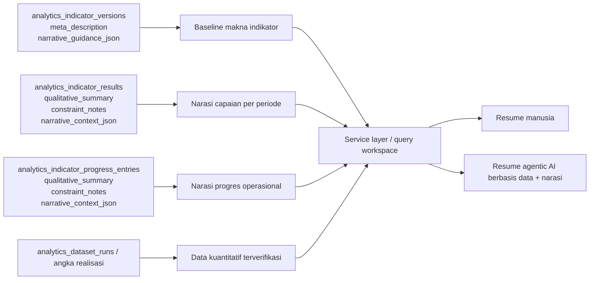
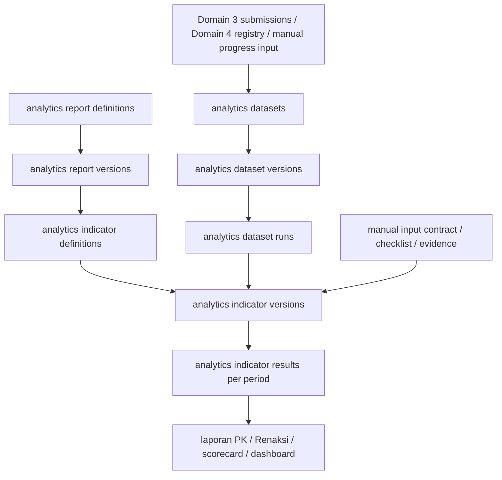

# Domain 5 — Dynamic Analytics Indicators Blueprint v1

Dokumen ini adalah blueprint lanjutan di atas foundation Domain 5 (`analytics_datasets`, `analytics_dataset_versions`, `analytics_dataset_runs`).

Fokusnya bukan lagi dataset umum, tetapi layer indikator dinamis di dalam domain analytics untuk kebutuhan laporan seperti:
- Perjanjian Kinerja (PK)
- Rencana Aksi (Renaksi)
- scorecard
- monitoring
- dan pola evaluasi lain yang bisa berubah tiap tahun/periode kebijakan.

Naming v1 yang dikunci di blueprint ini:
- prefix persistence mengikuti domain induk, yaitu `analytics_*`
- container bisnis memakai `analytics_report_*`
- butir evaluasi/versioned rule memakai `analytics_indicator_*`

Alasannya sederhana:
- `analytics_*` lebih konsisten dengan foundation dataset yang sudah lebih dulu hidup
- `indicator` lebih akurat daripada `metric` untuk objek bisnis yang punya target, formula, periodisasi, narasi, dan lifecycle publish
- istilah bisnis seperti PK/Renaksi tetap aman hidup sebagai kategori konten, bukan sebagai prefix tabel

Dokumen ini sengaja tetap konseptual dan arsitektural dulu.
Belum masuk migration final.

---

## 1. Tujuan dokumen ini

Tujuan blueprint ini ada dua:

1. Menjelaskan bagaimana Domain 5 bisa mendukung indikator dinamis yang formula dan targetnya tidak selalu sama.
2. Memberi saran arsitektur agar kebutuhan yang sederhana seperti Renaksi tidak dipaksa masuk ke model yang terlalu rumit, tetapi tetap seragam dengan kaidah aplikasi.

Jadi semangatnya adalah:
- fleksibel, tapi tetap terkendali
- seragam, tapi tidak overkill
- versioned, tapi tetap pragmatis

---

## 2. Posisi layer ini terhadap foundation Domain 5

Foundation Turn D tetap menjadi dasar:
- `analytics_datasets`
- `analytics_dataset_versions`
- `analytics_dataset_runs`

Layer indikator dinamis ini berada di atas foundation tersebut.

Urutannya:
- source operasional / registry / input manual
- dataset contract / dataset version / dataset run
- indicator/report definition / indicator version
- periodic indicator result
- laporan / dashboard / scorecard

Tidak semua indikator wajib membaca dataset.
Tapi semua indikator tetap harus punya kontrak sumber yang jelas.

Artinya ada tiga mode sumber indikator yang perlu didukung:
1. `dataset_driven`
2. `manual_input`
3. `hybrid`

Ini penting supaya:
- PK yang berbasis submissions tetap kuat secara analytics,
- Renaksi yang sederhana tidak dipaksa jadi query engine,
- dan keduanya tetap hidup dalam arsitektur yang sama.

---

## 3. Penjelasan awam

Kalau disederhanakan:
- dataset adalah mesin pengolah bahan baku
- indikator dinamis adalah rumus penilaian bisnis
- laporan kinerja adalah rapor/scorecard yang menyusun banyak indikator sekaligus

Contoh:
- dataset menghitung jumlah pengaduan masuk dan selesai
- indikator menghitung persentase penyelesaian
- laporan PK menampilkan capaian Triwulan I, II, III, IV dan tahunan

Sementara untuk Renaksi:
- tidak perlu dataset rumit
- cukup ada indikator yang menyatakan target data dukung = 3
- user mengisi atau menandai bahwa 3 data dukung sudah diupload
- sistem menghitung capaian = 3/3 = 100%

Jadi Renaksi itu tetap indikator kinerja,
namun sumbernya bisa sangat sederhana dan tidak harus datang dari form submissions.

---

## 4. Boundary domain yang perlu dikunci

### 4.1. Yang dimiliki layer indikator dinamis

Layer ini memiliki tanggung jawab untuk:
- definisi laporan kinerja
- definisi indikator
- versioning indikator
- target definition
- formula evaluation spec
- period evaluation rule
- hasil indikator per periode
- audit trail perubahan definisi dan hasil

### 4.2. Yang tidak boleh diambil alih layer ini

Layer ini tidak boleh menjadi:
- tempat edit source of truth submission mentah
- tempat edit published registry mentah
- tempat query SQL bebas dari UI
- tempat menyimpan semua workflow operasional yang sebenarnya milik domain lain

### 4.3. Aturan penting boundary

Indikator boleh membaca:
- dataset published
- published registry / curated dimension bila memang dibutuhkan
- manual input contract yang memang didefinisikan backend

Indikator tidak boleh membaca:
- draft registry sembarangan
- raw payload JSON liar tanpa contract
- script/SQL bebas yang dibuat admin dari UI

---

## 5. Dua keluarga besar use case yang harus didukung

## 5.1. Keluarga A — indikator berbasis analytics/dataset

Cocok untuk kasus seperti PK, capaian pelayanan, penyelesaian perkara, volume submission, coverage registry, dan sejenisnya.

Ciri-cirinya:
- numerator / denominator bisa berasal dari data aktual
- ada formula agregasi
- sering butuh per periode
- perubahan definisi antar tahun harus terversi
- perlu trace ke dataset version dan run tertentu

Contoh:
- Penyelesaian Pengaduan AHU
- Pendaftaran Indikasi Geografis
- Presentase layanan selesai tepat waktu

## 5.2. Keluarga B — indikator berbasis manual progress / checklist / evidence

Cocok untuk kasus seperti Renaksi, monitoring kelengkapan data dukung, progres administrasi, self-attestation, dan sejenisnya.

Ciri-cirinya:
- tidak harus menarik data dari submissions
- sumber progres bisa berupa input manual operator
- bisa berupa checklist sederhana
- bisa berbasis jumlah eviden/berkas yang harus lengkap
- tetap punya target, periode, dan status capaian

Contoh:
- Renaksi poin 1.2.A harus upload 3 data dukung
- jika 3 data dukung telah ditandai complete, maka capaian = 100%

Kesimpulan penting:
- keluarga B tidak boleh dipaksa menjadi form-submission analytics bila itu hanya menambah beban tanpa nilai tambah
- tetapi keluarga B juga jangan dibangun liar di luar arsitektur versioning dan periodisasi

---

## 6. Rekomendasi arsitektur inti — satu layer, tiga source mode

Saran terbaikku bro:

Jangan pisahkan Renaksi ke arsitektur liar sendiri.
Tetap masukkan ke layer indikator dinamis yang sama,
tapi beri `source_mode` yang eksplisit.

Minimal ada tiga mode:
- `dataset_driven`
- `manual_input`
- `hybrid`

Makna tiap mode:

### 6.1. `dataset_driven`

Dipakai saat indikator dihitung dari dataset/version/run.

Contoh:
- persentase pengaduan selesai
- jumlah pendaftaran IG
- skor komposit berbasis beberapa metric dataset

### 6.2. `manual_input`

Dipakai saat indikator cukup berasal dari input manual yang dikontrol backend.

Contoh:
- checklist upload data dukung Renaksi
- status penyelesaian administrasi tertentu
- progress item yang tidak punya source transaksi internal yang layak di-query

### 6.3. `hybrid`

Dipakai saat target manual digabung dengan realisasi data aktual,
atau saat ada sebagian nilai dari dataset dan sebagian dari input manusia.

Contoh:
- target pusat tahunan = 5
- realisasi diambil dari dataset
- catatan validasi/adjustment tertentu diinput manual

Keuntungan pendekatan ini:
- seragam secara arsitektur
- tidak overkill untuk use case sederhana
- tidak memaksa semua hal jadi dataset
- tapi tetap versioned, auditable, dan period-aware

### 6.4. Lapisan narasi kualitatif / `meta description`

Ada satu kebutuhan tambahan yang sangat sehat untuk layer ini:
setiap indikator perlu ruang narasi kualitatif,
bukan hanya angka.

Kenapa ini penting:
- capaian indikator sering butuh penjelasan manusiawi, bukan sekadar `actual_value` vs `target_value`
- indikator yang belum tercapai biasanya perlu jejak kendala/hambatan yang tidak bisa ditangkap angka mentah
- saat nanti dipakai agentic AI, sistem perlu konteks naratif yang tertanam rapi, bukan tercecer di chat, file Word, atau kolom bebas yang tidak terversi

Saran arsitekturnya:
1. pisahkan narasi menjadi dua lapisan:
   - lapisan definisional/versioned di level `analytics_indicator_versions`
   - lapisan periodik/operasional di level `analytics_indicator_results` dan, bila relevan, `analytics_indicator_progress_entries`
2. narasi definisional/versioned dipakai untuk menjawab:
   - indikator ini sebenarnya mengukur apa?
   - kenapa indikator ini penting?
   - bagaimana indikator ini dibaca/ditafsirkan?
   - narasi baseline apa yang sebaiknya muncul saat membuat resume?
3. narasi periodik dipakai untuk menjawab:
   - apa capaian periode ini?
   - faktor pendorongnya apa?
   - jika target belum tercapai, kendala dan hambatannya apa?
   - tindak lanjut atau next action yang disarankan apa?

Kalau dibuat analogi sederhana:
- angka = nilai rapor
- `meta description` indikator = penjelasan mata pelajaran dan cara membacanya
- narasi periodik = catatan wali kelas untuk periode tertentu

Konsekuensi desainnya:
- `description` pendek di definition saja tidak cukup
- butuh `meta description` yang lebih panjang dan versioned di level versi indikator
- butuh narasi hasil yang terhubung ke periode/scope tertentu, bukan hanya catatan global yang di-overwrite

Ini akan membuat Domain 5 lebih siap untuk:
- laporan eksekutif
- resume otomatis berbasis data + narasi
- audit kenapa indikator tertentu turun/naik
- knowledge capture saat pergantian periode atau pejabat

### 6.4.a. Mermaid — alur narasi indikator sampai resume AI

Makna diagram ini:
- `meta_description` memberi konteks jangka lebih panjang tentang arti indikator
- result/progress entry memberi konteks periodik tentang capaian, kendala, dan tindak lanjut
- AI tidak hanya membaca angka, tetapi membaca angka + baseline makna + narasi operasional

---

## 7. Enam poin utama blueprint indikator dinamis

Di bawah ini aku susun sesuai 6 poin yang kamu minta.

---

## 7.1. Poin 1 — domain model laporan PK/Renaksi dan sejenisnya

Layer ini sebaiknya dimodelkan dengan dua tingkat:

### Tingkat A — report definition

Ini adalah kepala laporan/scorecard.
Contohnya:
- PK Kanwil 2026
- Renaksi Bidang AHU Semester 1 2026
- Monitoring Kinerja Layanan KI 2026

Candidate conceptual entity:
- `analytics_report_definitions`
- `analytics_report_versions`

Fungsinya:
- menyimpan identitas laporan
- menyimpan grouping indikator
- menyimpan urutan tampil dan metadata governance
- menyimpan versi definisi laporan saat indikator berubah

### Tingkat B — indicator definition

Ini adalah butir indikator di dalam laporan.
Contohnya:
- Pendaftaran Indikasi Geografis
- Penyelesaian Pengaduan AHU
- Renaksi 1.2.A Upload Data Dukung

Candidate conceptual entity:
- `analytics_indicator_definitions`
- `analytics_indicator_versions`

Fungsinya:
- menyimpan identitas indikator
- menyimpan jenis perhitungan
- menyimpan source mode
- menyimpan target dan formula
- menyimpan rule periodisasi

### Kenapa dua tingkat ini penting

Kalau hanya ada indikator tanpa report head:
- sulit mengelompokkan indikator per kebijakan/tahun/program
- sulit membedakan versi laporan PK 2026 dan PK 2027
- sulit reuse satu indikator di lebih dari satu konteks

Jadi saran terbaikku:
- pakai konsep `report` sebagai container bisnis
- pakai konsep `indicator` sebagai item evaluasi

---

## 7.2. Poin 2 — lifecycle versioning indikator

Versioning indikator adalah wajib.
Jangan dianggap optional.

Minimal lifecycle yang perlu ada:
- `draft`
- `published`
- `archived`

Rule penting:
1. Perubahan formula besar harus membuat versi indikator baru.
2. Perubahan target tahunan yang mengubah makna evaluasi tidak boleh overwrite definisi published lama.
3. Hasil periode harus menaut ke versi indikator yang dipakai saat dihitung.
4. Report version juga harus tahu indikator version mana saja yang menjadi anggota saat publish.

### Kenapa ini penting untuk PK

Karena indikator PK bisa berubah setiap tahun:
- nama bisa sama,
- tapi denominator bisa beda,
- target bisa beda,
- scoring bisa beda,
- bobot bisa beda.

Kalau definisi lama dioverwrite:
- histori perbandingan rusak
- audit trail kabur
- user bingung kenapa angka tahun lalu berubah

### Kenapa ini penting untuk Renaksi

Walaupun Renaksi terlihat sederhana, struktur item dan targetnya juga bisa berubah:
- tahun ini butuh 3 eviden
- tahun depan bisa jadi 5 eviden
- kategori evidennya bisa berubah

Jadi Renaksi pun tetap butuh versioning,
meskipun formulanya simple.

---

## 7.3. Poin 3 — tipe formula yang diizinkan backend

Agar fleksibel tapi tidak liar, formula jangan berupa SQL bebas.
Lebih sehat jika backend menyediakan katalog `calculation_type` + `formula_spec_json` tervalidasi.

Minimal tipe formula yang direkomendasikan:
- `absolute_count`
- `percentage`
- `ratio`
- `score`
- `weighted_score`
- `checklist_completion`
- `boolean_completion`
- `custom_formula`

Makna ringkas:

### `absolute_count`
Contoh:
- jumlah IG terdaftar
- jumlah dokumen terupload

### `percentage`
Contoh:
- selesai / total_masuk * 100
- lengkap / target * 100

### `ratio`
Contoh:
- numerator : denominator tanpa selalu ditafsirkan ke persen

### `score`
Contoh:
- nilai rubric 0-100
- skor evaluasi manual dari assessor

### `weighted_score`
Contoh:
- indikator dengan bobot tertentu di dalam scorecard

### `checklist_completion`
Ini sangat cocok untuk Renaksi.
Contoh:
- required_items = 3
- completed_items = 3
- result = 100%

### `boolean_completion`
Contoh:
- satu kewajiban hanya yes/no
- kalau terpenuhi = 100, tidak terpenuhi = 0

### `custom_formula`
Dipakai paling belakang,
bukan default.
Harus tetap tervalidasi lewat grammar/spec backend,
bukan script bebas.

### Rekomendasi penting

Untuk v1 indikator dinamis,
aku sarankan fokus dulu ke formula yang katalog-nya jelas:
- `absolute_count`
- `percentage`
- `score`
- `checklist_completion`
- `weighted_score`

`custom_formula` boleh diakui di blueprint,
tapi implementasinya belakangan supaya tidak terlalu cepat liar.

---

## 7.4. Poin 4 — target source model

Target indikator tidak boleh diasumsikan selalu satu bentuk.
Minimal model target harus mendukung:
- `manual_central_target`
- `manual_local_target`
- `derived_from_dataset`
- `derived_from_manual_input`
- `hybrid`

### `manual_central_target`
Contoh:
- target pusat: IG 2026 = 5

### `manual_local_target`
Contoh:
- target internal bidang: upload 3 data dukung

### `derived_from_dataset`
Contoh:
- denominator = semua pengaduan masuk
- target mengikuti volume aktual yang masuk

### `derived_from_manual_input`
Contoh:
- target mengikuti jumlah item checklist yang didaftarkan di periode itu

### `hybrid`
Contoh:
- target dasar dari pusat
- sebagian threshold dari data aktual
- ada override lokal yang tervalidasi

### Saran implementasi arsitektural

Pisahkan:
- `calculation_type`
- `target_source_type`

Jangan dicampur jadi satu field.

Karena:
- `percentage` bisa memakai target manual atau target derived
- `checklist_completion` bisa target-nya angka tetap atau berasal dari jumlah eviden yang diwajibkan
- `score` bisa tanpa target kuantitatif, tetapi tetap punya threshold kategori
- `meta description` indikator harus hidup di versi indikator, bukan di definition global, karena cara membaca indikator dan narasi baseline bisa berubah antar tahun/periode kebijakan

---

## 7.5. Poin 5 — result per periode

Hasil indikator tidak boleh hanya satu angka global.
Harus ada kontrak hasil per periode.

Minimal period mode yang harus didukung:
- `quarterly`
- `semester`
- `yearly`
- `multi_period`
- opsional nanti: `monthly`, `reporting_batch`

Candidate conceptual entity:
- `analytics_indicator_results`

Satu row hasil idealnya mewakili:
- satu indicator version
- satu report version atau report context
- satu periode evaluasi
- satu hasil hitung final

Candidate field konseptual:
- `indicator_id`
- `indicator_version_id`
- `report_definition_id`
- `report_version_id`
- `reporting_year`
- `reporting_period_id`
- `period_mode`
- `target_value`
- `actual_value`
- `achievement_value`
- `achievement_percent`
- `score_value`
- `completion_status`
- `qualitative_summary`
- `constraint_notes`
- `result_json`
- `source_trace_json`
- `computed_at`
- `status`

### Kenapa `source_trace_json` penting

Agar tiap angka bisa dijelaskan asalnya:
- dataset mana
- dataset version berapa
- run mana
- manual entry mana
- checklist item mana

### Kenapa narasi periodik penting

Karena dua angka yang sama belum tentu punya cerita yang sama.

Contoh:
- capaian 60% bisa berarti tren naik yang sehat karena baseline tahun lalu 20%
- atau justru berarti bottleneck berat karena target seharusnya mudah tercapai

Jadi hasil indikator sebaiknya tidak berhenti di angka.
Perlu ruang untuk:
- ringkasan capaian
- kendala/hambatan
- penjelasan deviasi
- rencana tindak lanjut singkat

### Rule rollup yang harus dipikirkan

Nilai tahunan tidak selalu:
- sum dari triwulan

Bisa juga:
- average dari beberapa periode
- latest value
- max value
- custom formula

Karena itu setiap indikator perlu `aggregation_strategy` yang eksplisit.

---

## 7.6. Poin 6 — relasi ke dataset foundation yang sudah dibuat di Turn D

Ini poin pengunci agar blueprint baru tidak mematahkan foundation lama.

### Untuk indikator `dataset_driven`

Indikator harus bisa menunjuk ke:
- `analytics_datasets`
- `analytics_dataset_versions`
- secara operasional nanti ke `analytics_dataset_runs`

Tujuannya:
- traceability
- auditability
- reproducibility

Artinya hasil indikator idealnya bisa menjawab:
- dibaca dari dataset apa?
- versi kontraknya apa?
- run terakhir yang dipakai yang mana?
- source watermark-nya apa?

### Untuk indikator `manual_input`

Indikator tidak wajib punya FK ke dataset.
Tetapi tetap wajib punya source contract yang jelas.

Contoh source contract manual:
- item checklist Renaksi
- daftar eviden yang harus dipenuhi
- input progress manual operator
- status verifikasi supervisor

### Untuk indikator `hybrid`

Indikator bisa membaca dua sumber sekaligus:
- dataset result
- manual progress/evidence entry

Karena itu blueprint harus mengizinkan `source_trace_json` atau spec yang menyimpan multi-source trace.

### Kesimpulan relasi

Foundation Turn D tetap dipakai sebagai tulang punggung untuk use case analytics-driven.
Tapi blueprint baru juga harus mengakui ada indikator yang sah secara bisnis meskipun tidak bertumpu pada dataset analytics.

Ini bukan inkonsistensi.
Ini justru boundary yang sehat.

---

## 7.7. Poin tambahan durable — AI-ready narrative context

Karena ada kemungkinan integrasi agentic AI di masa depan,
blueprint ini perlu mengunci satu prinsip tambahan:

Agentic AI untuk laporan kinerja tidak boleh hanya membaca angka hasil.
Ia idealnya membaca kombinasi:
- definisi indikator
- `meta description` indikator yang versioned
- trace sumber data
- hasil numerik per periode
- narasi capaian periodik
- kendala/hambatan periodik

Maka desain terbaik v1 bukan membuat modul AI terpisah dulu,
melainkan memastikan layer `analytics_report_*` / `analytics_indicator_*` sudah menyimpan bahan naratif yang rapi dan dapat direferensikan mesin.

Prinsip praktisnya:
- AI adalah consumer lanjutan
- `meta description` dan narasi periodik adalah data domain
- jadi keduanya harus hidup di schema/engine utama, bukan hanya di prompt eksternal

---

## 8. Mermaid — posisi report, indicator, dataset, dan manual input

---

## 9. Saran khusus untuk Renaksi — supaya tidak overkill

Ini bagian penting dari pertanyaanmu bro.

Menurutku, untuk Renaksi jangan dipaksa menjadi:
- form builder penuh,
- dataset analytics penuh,
- atau query submission pipeline kalau memang kebutuhan bisnisnya hanya checklist progres.

Saran terbaikku:

### 9.1. Perlakukan Renaksi sebagai `manual_input` indicator family

Jadi:
- tetap masuk ke layer indikator dinamis
- tapi mode sumbernya `manual_input`
- UI-nya boleh jauh lebih simpel daripada builder analytics umum

### 9.2. Buat input contract sederhana dan terstruktur

Alih-alih form submission generik,
lebih baik Renaksi punya struktur sederhana seperti:
- daftar item/kewajiban
- target jumlah eviden
- status tiap eviden
- tanggal upload/claim
- catatan
- verifikasi oleh atasan bila perlu

### 9.3. Pakai formula bawaan `checklist_completion`

Untuk kasus:
- target eviden = 3
- completed eviden = 3

Maka:
- actual = 3
- target = 3
- achievement_percent = 100
- completion_status = `complete`

Ini sangat simple,
tapi sudah cukup kuat dan tidak perlu dipaksa lewat query analytics rumit.

### 9.4. Jangan paksakan semua eviden jadi attachment domain analytics dulu

Kalau pusat upload-nya terjadi di aplikasi lain,
aplikasi kita cukup menyimpan:
- daftar eviden yang diwajibkan
- status/claim bahwa eviden sudah diupload
- optional bukti lokal seperti nomor tiket, tautan, timestamp, atau catatan verifikasi

Jadi sistem lokal kita berperan sebagai:
- tracker/progress monitor
- bukan source of truth file center nasional

### 9.5. Kapan Renaksi perlu naik kelas jadi dataset-driven

Kalau nanti ternyata Renaksi berkembang jadi:
- banyak record operasional,
- butuh rekap lintas wilayah yang kompleks,
- butuh audit agregasi yang berat,
- atau ada integrasi API resmi dengan sistem pusat,

baru sebagian indikator Renaksi bisa dipindah ke `hybrid` atau `dataset_driven`.

Jadi saran pragmatisnya:
- mulai dari `manual_input`
- jangan over-engineer terlalu cepat
- tapi desain entity/versioning/period-nya dari awal tetap rapi

---

## 10. Candidate conceptual entities fase berikutnya

Nama final belum dikunci, tapi arah konseptual yang aku sarankan:

### 10.1. Report layer
- `analytics_report_definitions`
- `analytics_report_versions`

### 10.2. Indicator layer
- `analytics_indicator_definitions`
- `analytics_indicator_versions`

### 10.3. Result layer
- `analytics_indicator_results`

### 10.4. Manual progress layer untuk non-dataset indicators
- `analytics_indicator_progress_entries`
- `analytics_indicator_progress_items`
- atau nama setara yang lebih baik

Catatan penting:
- layer manual progress tidak harus dianggap domain terpisah dulu
- dia bisa menjadi supporting entity untuk indikator `manual_input`

---

## 11. Candidate enum minimum yang perlu dipikirkan nanti

### 11.1. `analytics_report_type`
- `pk`
- `renaksi`
- `scorecard`
- `monitoring`
- `custom`

### 11.2. `analytics_indicator_source_mode`
- `dataset_driven`
- `manual_input`
- `hybrid`

### 11.3. `analytics_indicator_calculation_type`
- `absolute_count`
- `percentage`
- `ratio`
- `score`
- `weighted_score`
- `checklist_completion`
- `boolean_completion`
- `custom_formula`

### 11.4. `analytics_indicator_target_source_type`
- `manual_central_target`
- `manual_local_target`
- `derived_from_dataset`
- `derived_from_manual_input`
- `hybrid`

### 11.5. `analytics_period_mode`
- `quarterly`
- `semester`
- `yearly`
- `multi_period`

### 11.6. `analytics_definition_status`
- `draft`
- `published`
- `archived`

### 11.7. `analytics_indicator_result_status`
- `draft`
- `computed`
- `verified`
- `published`
- `failed`

---

## 12. Guardrail agar fleksibel tapi tidak liar

Fleksibilitas yang diperbolehkan:
- admin memilih source mode indikator
- admin memilih calculation type dari katalog backend
- admin mengisi parameter formula yang tervalidasi
- admin memilih target source type
- admin memilih period mode
- admin publish versi indikator baru saat kebijakan berubah

Fleksibilitas yang tidak boleh dibuka di awal:
- SQL bebas di UI
- Python bebas di UI
- formula tanpa jejak source
- indikator tanpa versioning
- overwrite definisi published tanpa versi baru
- penyimpanan periode hanya di JSONB padahal sering difilter

---

## 13. Keputusan arsitektur yang aku rekomendasikan

1. Layer indikator dinamis diposisikan di atas foundation dataset Domain 5.
2. Satu arsitektur yang sama harus mendukung tiga source mode:
   - `dataset_driven`
   - `manual_input`
   - `hybrid`
3. PK adalah contoh utama indikator `dataset_driven` atau `hybrid`.
4. Renaksi adalah contoh valid untuk indikator `manual_input`.
5. Renaksi tidak perlu dipaksa lewat form submissions bila kebutuhan bisnisnya hanya checklist/evidence progress.
6. Meski sederhana, indikator Renaksi tetap harus:
   - versioned
   - period-aware
   - auditable
   - punya target yang eksplisit
7. Formula indikator harus dibatasi lewat katalog backend, bukan query/script bebas.
8. Result indikator per periode harus bisa menelusuri source yang dipakai.
9. Perubahan definisi indikator antar tahun tidak boleh overwrite histori lama.
10. Manual progress tracking yang sederhana lebih baik daripada memaksa analytics pipeline kompleks untuk use case yang sebenarnya checklist.

---

## 14. Rekomendasi langkah sesudah blueprint ini

Urutan sehat berikutnya menurutku:

1. review dulu blueprint ini pelan-pelan dengan skenario nyata PK dan Renaksi
2. finalkan nama subdomain:
   - tetap di Domain 5 sebagai `dynamic performance indicators`
   - atau diberi nama yang lebih bisnis seperti `performance reporting`
   - apa pun namanya, treat layer ini sebagai engine konten terkelola/CMS-like untuk berbagai istilah bisnis seperti PK, Renaksi, indikator kinerja, target kinerja, dan keluarga sejenis; jangan pecah menjadi subsistem tabel berbeda hanya karena label bisnisnya berbeda
3. tulis schema contract khusus layer ini
   - gunakan `docs/architecture/domain-5-dynamic-performance-indicators-schema-contract-v1.md`
4. putuskan entity mana yang benar-benar wajib di fase 1
5. tentukan apakah fase 1 cukup:
   - report definitions
   - indicator definitions
   - indicator results
   - manual progress supporting tables
6. baru turunkan ke migration plan dan TDD implementation plan
   - gunakan `docs/architecture/domain-5-dynamic-performance-indicators-migration-schema-plan-v1.md`

### Saran fase implementasi v1 paling aman

Kalau mau pragmatis, aku sarankan fase 1 indikator dinamis hanya mendukung:
- `manual_central_target`
- `manual_local_target`
- `dataset_driven`
- `manual_input`
- formula:
  - `absolute_count`
  - `percentage`
  - `checklist_completion`
  - `score`

Kenapa?
- sudah cukup untuk banyak use case nyata
- tidak terlalu liar
- cukup untuk PK dasar dan Renaksi dasar

---

## 15. Kesimpulan awam

Kalau disederhanakan:
- foundation Domain 5 = dapur data
- indikator dinamis = rumus penilaian bisnis
- laporan PK/Renaksi = rapor yang membaca banyak indikator

PK butuh kekuatan analytics karena banyak indikatornya membaca data aktual.
Renaksi tidak selalu butuh analytics berat karena kadang cukup checklist progres.

Saran terbaikku adalah:
- pakai satu arsitektur indikator dinamis yang seragam
- treat layer ini sebagai engine `performance reporting` yang CMS-like
- dukung tiga source mode: dataset, manual, hybrid
- jangan paksa Renaksi menjadi submission analytics kalau memang tidak perlu
- jangan pecah istilah bisnis seperti PK/Renaksi/indikator kinerja/target kinerja menjadi struktur tabel yang berbeda hanya karena nama UI-nya berbeda
- tapi tetap jaga versioning, periode, target, dan audit trail

Dengan begitu:
- arsitektur tetap rapi
- implementasi tetap pragmatis
- dan kita tidak overkill untuk use case yang sebenarnya sederhana
