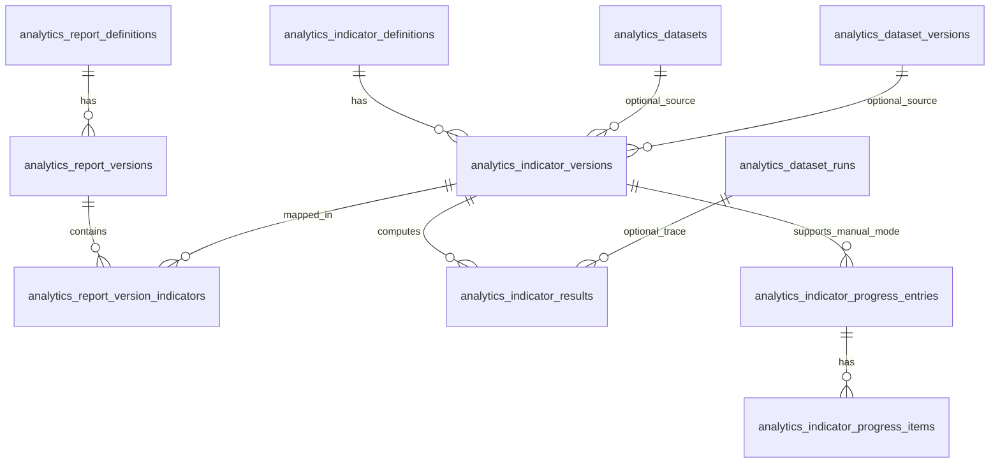

# Domain 5 — Dynamic Analytics Indicators Schema Contract v1

Dokumen ini menurunkan blueprint indikator dinamis Domain 5 menjadi kontrak schema yang lebih konkret.

Dokumen induk terkait:
- `docs/architecture/domain-5-blueprint-v1.md`
- `docs/architecture/domain-5-dynamic-performance-indicators-blueprint-v1.md`
- `docs/architecture/domain-5-schema-contract-v1.md`

Fokus dokumen ini:
- finalisasi kontrak schema untuk layer `analytics indicators`
- field wajib vs nullable
- enum minimum
- uniqueness rule
- index minimum
- pemisahan kolom relasional vs JSONB
- relasi ke foundation dataset Domain 5
- dukungan source mode `dataset_driven`, `manual_input`, dan `hybrid`
- dukungan use case sederhana seperti Renaksi tanpa memaksa pipeline analytics berat

Naming v1 yang dikunci di dokumen ini:
- `analytics_report_*` = container/report/scorecard level
- `analytics_indicator_*` = definisi, versi, hasil, dan progres indikator
- istilah PK/Renaksi tetap hidup sebagai `report_type`, kategori, template, atau metadata bisnis; bukan sebagai prefix tabel

Dokumen ini masih berupa kontrak arsitektural, belum migration final.

---

## 1. Penjelasan awam dulu

Kalau disederhanakan:
- `analytics_report_definitions` = kepala laporan/rapor
- `analytics_report_versions` = versi resmi susunan laporan
- `analytics_indicator_definitions` = kartu identitas indikator
- `analytics_indicator_versions` = rumus resmi indikator per versi
- `analytics_indicator_results` = hasil nilai indikator per periode
- `analytics_indicator_progress_*` = dukungan input sederhana untuk indikator manual seperti Renaksi

Tujuan schema contract ini adalah supaya nanti saat coding:
- kita tahu tabel apa saja yang benar-benar dibutuhkan
- kita tahu kapan harus pakai FK relasional
- kita tahu kapan cukup pakai JSONB
- kita tahu bagaimana menjaga fleksibilitas tanpa membuka query/script liar

---

## 2. Prinsip kontrak schema

### 2.1. Layer ini berada di atas foundation dataset

Foundation dataset Domain 5 tetap menjadi dasar untuk indikator `dataset_driven` dan `hybrid`:
- `analytics_datasets`
- `analytics_dataset_versions`
- `analytics_dataset_runs`

Namun layer ini juga harus mendukung indikator `manual_input` yang tidak wajib tergantung dataset.

### 2.2. Versioning adalah fitur inti

Perubahan pada:
- formula
- target source
- target value semantics
- period mode
- scoring rule
- checklist/evidence requirement

harus diperlakukan sebagai perubahan versi, bukan overwrite diam-diam.

### 2.3. Report dan indicator dipisah

`report` adalah container bisnis.
`indicator` adalah item evaluasi bisnis.

Pemisahan ini penting agar:
- satu indikator bisa dipakai ulang
- satu laporan bisa punya banyak indikator
- perubahan susunan indikator dalam laporan bisa terversi terpisah dari definisi indikator itu sendiri

### 2.4. Relasional untuk field panas

Field yang sering dipakai untuk:
- filter/listing
- lifecycle status
- tahun/periode
- source mode
- calculation type
- target source type
- join ke dataset/report/indicator
- current draft/current published

harus jadi kolom relasional biasa.

### 2.5. JSONB untuk spec yang berkembang

Field seperti:
- formula spec
- target spec
- scoring spec
- display config
- source trace
- manual evidence metadata
- summary/result detail
- narrative guidance

boleh memakai JSONB karena sifatnya fleksibel.

### 2.5.a. Narasi kualitatif adalah first-class companion, bukan tempelan

Selain angka dan spec teknis, layer ini juga perlu menampung konteks naratif.
Supaya sehat, narasi dibagi dua:
- `meta description` versioned di level `analytics_indicator_versions`
- narasi periodik di level `analytics_indicator_results` / `analytics_indicator_progress_entries`

Rule desainnya:
- teks naratif panjang yang dibaca manusia/AI boleh berupa `text`
- bila butuh struktur bantu seperti `achievement_summary`, `obstacles`, `next_actions`, atau `narrative_tags`, boleh ditambah JSONB pendamping
- jangan paksa semua narasi ke JSONB saja bila kebutuhan utamanya adalah authoring teks panjang

### 2.6. Periode harus tetap first-class

Karena use case bisnis sangat period-aware, hasil indikator tidak boleh hanya mengandalkan JSONB.
Kolom relasional yang harus dianggap first-class antara lain:
- `reporting_year`
- `reporting_period_id`
- `period_mode`

### 2.7. Use case sederhana tidak boleh dipaksa jadi rumit

Renaksi dan keluarga use case checklist/evidence tidak perlu dipaksa menjadi dataset analytics penuh.
Tapi mereka tetap harus:
- versioned
- period-aware
- auditable
- punya target dan source contract jelas

---

## 3. Scope schema v1

Schema contract ini mengunci delapan tabel konseptual:

1. `analytics_report_definitions`
2. `analytics_report_versions`
3. `analytics_indicator_definitions`
4. `analytics_indicator_versions`
5. `analytics_report_version_indicators`
6. `analytics_indicator_results`
7. `analytics_indicator_progress_entries`
8. `analytics_indicator_progress_items`

Alasan delapan tabel ini:
- 1-6 adalah inti layer indicator/reporting
- 7-8 adalah pendukung pragmatis untuk `manual_input` agar Renaksi tidak dipaksa masuk ke dataset pipeline

Belum masuk dulu:
- approval workflow yang sangat kompleks
- attachment storage final yang kaya fitur
- formula engine bebas seperti expression compiler penuh
- job scheduler khusus performance layer
- tabel aggregate scorecard lintas report yang terlalu spesifik

---

## 4. Mermaid — relasi inti schema contract v1



---

## 5. Enum minimum yang direkomendasikan

### 5.1. `analytics_report_type`
Untuk `analytics_report_definitions.report_type`:
- `pk`
- `renaksi`
- `scorecard`
- `monitoring`
- `custom`

### 5.2. `analytics_definition_status`
Untuk lifecycle definition/version:
- `draft`
- `published`
- `archived`

Dipakai pada:
- `analytics_report_versions.status`
- `analytics_indicator_versions.status`

### 5.3. `analytics_report_status`
Untuk `analytics_report_definitions.status`:
- `draft`
- `active`
- `archived`

### 5.4. `analytics_indicator_status`
Untuk `analytics_indicator_definitions.status`:
- `draft`
- `active`
- `archived`

### 5.5. `analytics_indicator_source_mode`
Untuk `analytics_indicator_versions.source_mode`:
- `dataset_driven`
- `manual_input`
- `hybrid`

### 5.6. `analytics_indicator_calculation_type`
Untuk `analytics_indicator_versions.calculation_type`:
- `absolute_count`
- `percentage`
- `ratio`
- `score`
- `weighted_score`
- `checklist_completion`
- `boolean_completion`
- `custom_formula`

### 5.7. `analytics_indicator_target_source_type`
Untuk `analytics_indicator_versions.target_source_type`:
- `manual_central_target`
- `manual_local_target`
- `derived_from_dataset`
- `derived_from_manual_input`
- `hybrid`

### 5.8. `analytics_period_mode`
Untuk `analytics_indicator_versions.period_mode` dan `analytics_indicator_results.period_mode`:
- `quarterly`
- `semester`
- `yearly`
- `multi_period`

Opsional fase berikutnya:
- `monthly`
- `reporting_batch`

### 5.9. `analytics_aggregation_strategy`
Untuk `analytics_indicator_versions.aggregation_strategy`:
- `sum`
- `avg`
- `last_value`
- `max`
- `custom_formula`

### 5.10. `analytics_indicator_result_status`
Untuk `analytics_indicator_results.status`:
- `draft`
- `computed`
- `verified`
- `published`
- `failed`

### 5.11. `analytics_completion_status`
Untuk `analytics_indicator_results.completion_status` dan `analytics_indicator_progress_entries.completion_status`:
- `not_started`
- `in_progress`
- `complete`
- `overdue`
- `not_applicable`

### 5.12. `analytics_progress_entry_status`
Untuk `analytics_indicator_progress_entries.status`:
- `draft`
- `submitted`
- `verified`
- `rejected`
- `archived`

### 5.13. `analytics_progress_item_status`
Untuk `analytics_indicator_progress_items.status`:
- `pending`
- `completed`
- `rejected`
- `not_required`

---

## 6. Kontrak tabel `analytics_report_definitions`

## 6.1. Tujuan

Menyimpan identitas bisnis laporan/scorecard.

Satu row = satu kepala laporan.
Contoh:
- PK Kanwil 2026
- Renaksi Bidang AHU
- Monitoring Kinerja KI

## 6.2. Field contract

### Wajib
- `id` bigint/integer PK
- `uuid` uuid unique not null
- `report_key` varchar unique not null
- `name` varchar not null
- `description` text nullable
- `report_type` varchar not null
- `status` varchar not null default `draft`
- `is_active` boolean not null default `true`
- `default_reporting_year_mode` varchar not null default `active_year`
- `owner_scope_type` varchar nullable
- `owner_scope_code` varchar nullable
- `owner_scope_name` varchar nullable
- `owner_scope_path` jsonb not null default `'[]'`
- `settings_json` jsonb not null default `'{}'`
- `tags_json` jsonb not null default `'[]'`
- `created_at` timestamp not null
- `updated_at` timestamp not null
- `deleted_at` timestamp nullable
- `created_by` fk nullable
- `created_by_uuid` uuid nullable
- `updated_by` fk nullable
- `updated_by_uuid` uuid nullable
- `deleted_by` fk nullable
- `deleted_by_uuid` uuid nullable

### Catatan penting
- `report_key` adalah identifier teknis stabil
- `report_type` membedakan keluarga report seperti PK atau Renaksi
- istilah bisnis seperti PK, Renaksi, indikator kinerja, target kinerja, dan label sejenis diperlakukan sebagai kategori/keluarga konten di atas satu engine `performance reporting`, bukan alasan membuat tabel khusus per istilah
- `default_reporting_year_mode` mengikuti pola foundation dataset agar konsisten

## 6.3. Kolom relasional vs JSONB

### Relasional
- `report_key`
- `name`
- `report_type`
- `status`
- `is_active`
- `default_reporting_year_mode`
- `owner_scope_type`
- `owner_scope_code`
- `owner_scope_name`

### JSONB
- `owner_scope_path`
- `settings_json`
- `tags_json`

## 6.4. Constraint minimum
- unique `uuid`
- unique `report_key`
- check `report_type` in allowed enum
- check `status` in allowed enum
- check `default_reporting_year_mode` in allowed enum dataset foundation (`active_year`, `explicit`, `all_time`)

## 6.5. Index minimum
- index on `report_type`
- index on `status`
- index on `is_active`
- index on `owner_scope_code`
- index on `deleted_at`

## 6.6. Rule bisnis v1
1. `report_key` tidak boleh berubah sembarangan setelah dipakai consumer.
2. Report `archived` tidak boleh menerima publish version baru tanpa proses reactivation eksplisit.
3. `is_active=false` hanya menonaktifkan konsumsi default, bukan menghapus histori.

---

## 7. Kontrak tabel `analytics_report_versions`

## 7.1. Tujuan

Menyimpan versi definisi resmi dari satu report.

Satu row = satu versi susunan report.

## 7.2. Field contract

### Wajib
- `id` bigint/integer PK
- `uuid` uuid unique not null
- `report_definition_id` fk not null
- `version_number` integer not null
- `status` varchar not null default `draft`
- `is_current_draft` boolean not null default `true`
- `is_current_published` boolean not null default `false`
- `published_at` timestamp nullable
- `publish_notes` text nullable
- `title_snapshot` varchar not null
- `description_snapshot` text nullable
- `reporting_year` integer nullable
- `period_mode` varchar not null
- `layout_spec_json` jsonb not null default `'{}'`
- `display_config_json` jsonb not null default `'{}'`
- `scope_snapshot_json` jsonb not null default `'{}'`
- `settings_json` jsonb not null default `'{}'`
- `created_at` timestamp not null
- `updated_at` timestamp not null
- `deleted_at` timestamp nullable
- `created_by` fk nullable
- `created_by_uuid` uuid nullable
- `updated_by` fk nullable
- `updated_by_uuid` uuid nullable
- `deleted_by` fk nullable
- `deleted_by_uuid` uuid nullable

## 7.3. Kolom relasional vs JSONB

### Relasional
- `report_definition_id`
- `version_number`
- `status`
- `is_current_draft`
- `is_current_published`
- `published_at`
- `title_snapshot`
- `reporting_year`
- `period_mode`

### JSONB
- `layout_spec_json`
- `display_config_json`
- `scope_snapshot_json`
- `settings_json`

## 7.4. Constraint minimum
- unique `uuid`
- unique (`report_definition_id`, `version_number`)
- partial unique satu `current draft` per report_definition
- partial unique satu `current published` per report_definition
- check `status` in allowed enum
- check `period_mode` in allowed enum

## 7.5. Index minimum
- index on (`report_definition_id`, `status`)
- index on `is_current_draft`
- index on `is_current_published`
- index on `published_at`
- index on `reporting_year`
- index on `period_mode`
- index on `deleted_at`

## 7.6. Rule bisnis v1
1. Consumer default membaca `current published`.
2. Draft boleh berubah selama belum publish.
3. Perubahan susunan indikator setelah publish harus membuat version baru.

---

## 8. Kontrak tabel `analytics_indicator_definitions`

## 8.1. Tujuan

Menyimpan identitas bisnis indikator.

Satu row = satu indikator yang dikenali sistem.
Contoh:
- Pendaftaran Indikasi Geografis
- Penyelesaian Pengaduan AHU
- Renaksi 1.2.A Upload Data Dukung

## 8.2. Field contract

### Wajib
- `id` bigint/integer PK
- `uuid` uuid unique not null
- `indicator_key` varchar unique not null
- `code` varchar nullable
- `name` varchar not null
- `description` text nullable
- `status` varchar not null default `draft`
- `is_active` boolean not null default `true`
- `owner_scope_type` varchar nullable
- `owner_scope_code` varchar nullable
- `owner_scope_name` varchar nullable
- `owner_scope_path` jsonb not null default `'[]'`
- `category_key` varchar nullable
- `display_order` integer nullable
- `settings_json` jsonb not null default `'{}'`
- `tags_json` jsonb not null default `'[]'`
- `created_at` timestamp not null
- `updated_at` timestamp not null
- `deleted_at` timestamp nullable
- `created_by` fk nullable
- `created_by_uuid` uuid nullable
- `updated_by` fk nullable
- `updated_by_uuid` uuid nullable
- `deleted_by` fk nullable
- `deleted_by_uuid` uuid nullable

## 8.3. Kolom relasional vs JSONB

### Relasional
- `indicator_key`
- `code`
- `name`
- `status`
- `is_active`
- `owner_scope_type`
- `owner_scope_code`
- `owner_scope_name`
- `category_key`
- `display_order`

### JSONB
- `owner_scope_path`
- `settings_json`
- `tags_json`

## 8.4. Constraint minimum
- unique `uuid`
- unique `indicator_key`
- check `status` in allowed enum indicator definition

## 8.5. Index minimum
- index on `code`
- index on `status`
- index on `is_active`
- index on `owner_scope_code`
- index on `category_key`
- index on `display_order`
- index on `deleted_at`

## 8.6. Rule bisnis v1
1. `indicator_key` harus stabil lintas versi.
2. `code` boleh dipakai untuk kode bisnis seperti `1.2.A`, tapi tidak wajib unik global bila nanti satu kode hidup di report berbeda.
3. Definisi indikator tidak menyimpan formula final; formula hidup di level version.

---

## 9. Kontrak tabel `analytics_indicator_versions`

## 9.1. Tujuan

Menyimpan rumus resmi indikator per versi.

Satu row = satu versi evaluable dari indikator.

## 9.2. Field contract

### Wajib
- `id` bigint/integer PK
- `uuid` uuid unique not null
- `indicator_definition_id` fk not null
- `version_number` integer not null
- `status` varchar not null default `draft`
- `is_current_draft` boolean not null default `true`
- `is_current_published` boolean not null default `false`
- `published_at` timestamp nullable
- `publish_notes` text nullable
- `source_mode` varchar not null
- `calculation_type` varchar not null
- `target_source_type` varchar not null
- `period_mode` varchar not null
- `aggregation_strategy` varchar not null
- `effective_from_year` integer nullable
- `effective_to_year` integer nullable
- `default_reporting_period_id` fk nullable
- `dataset_id` fk nullable -> `analytics_datasets.id`
- `dataset_version_id` fk nullable -> `analytics_dataset_versions.id`
- `dataset_filter_spec_json` jsonb not null default `'{}'`
- `manual_contract_spec_json` jsonb not null default `'{}'`
- `formula_spec_json` jsonb not null default `'{}'`
- `target_spec_json` jsonb not null default `'{}'`
- `scoring_spec_json` jsonb not null default `'{}'`
- `display_config_json` jsonb not null default `'{}'`
- `source_trace_policy_json` jsonb not null default `'{}'`
- `meta_description` text nullable
- `narrative_guidance_json` jsonb not null default `'{}'`
- `notes_json` jsonb not null default `'{}'`
- `created_at` timestamp not null
- `updated_at` timestamp not null
- `deleted_at` timestamp nullable
- `created_by` fk nullable
- `created_by_uuid` uuid nullable
- `updated_by` fk nullable
- `updated_by_uuid` uuid nullable
- `deleted_by` fk nullable
- `deleted_by_uuid` uuid nullable

## 9.3. Kolom relasional vs JSONB

### Relasional
- `indicator_definition_id`
- `version_number`
- `status`
- `is_current_draft`
- `is_current_published`
- `published_at`
- `source_mode`
- `calculation_type`
- `target_source_type`
- `period_mode`
- `aggregation_strategy`
- `effective_from_year`
- `effective_to_year`
- `default_reporting_period_id`
- `dataset_id`
- `dataset_version_id`

### JSONB
- `dataset_filter_spec_json`
- `manual_contract_spec_json`
- `formula_spec_json`
- `target_spec_json`
- `scoring_spec_json`
- `display_config_json`
- `source_trace_policy_json`
- `narrative_guidance_json`
- `notes_json`

### Text naratif
- `meta_description`

## 9.4. Constraint minimum
- unique `uuid`
- unique (`indicator_definition_id`, `version_number`)
- partial unique satu `current draft` per indicator_definition
- partial unique satu `current published` per indicator_definition
- check `status` in allowed enum
- check `source_mode` in allowed enum
- check `calculation_type` in allowed enum
- check `target_source_type` in allowed enum
- check `period_mode` in allowed enum
- check `aggregation_strategy` in allowed enum
- check `effective_to_year >= effective_from_year` bila keduanya tidak null

## 9.5. Index minimum
- index on (`indicator_definition_id`, `status`)
- index on `source_mode`
- index on `calculation_type`
- index on `target_source_type`
- index on `period_mode`
- index on `effective_from_year`
- index on `effective_to_year`
- index on `dataset_id`
- index on `dataset_version_id`
- index on `is_current_draft`
- index on `is_current_published`
- index on `deleted_at`

## 9.6. Rule bisnis v1
1. `dataset_id` dan `dataset_version_id` wajib terisi untuk `dataset_driven`.
2. `dataset_id` boleh null untuk `manual_input`.
3. `manual_contract_spec_json` wajib bermakna untuk `manual_input`.
4. `hybrid` boleh memakai dataset + manual contract sekaligus.
5. `formula_spec_json` bukan script bebas; bentuknya harus tervalidasi oleh backend.
6. `target_spec_json` menyimpan detail target, sedangkan `target_source_type` menyimpan klasifikasi utamanya.
7. `meta_description` menyimpan narasi baseline indikator yang bisa berubah antar versi kebijakan/tahun.
8. `narrative_guidance_json` boleh menyimpan prompt/template ringan seperti fokus interpretasi, dimensi narasi penting, atau label konteks yang akan membantu UI dan AI consumer.

## 9.7. Validasi service-level yang perlu dicatat
Karena tidak semua rule cocok jadi check constraint sederhana, layer service nanti harus menegakkan:
- jika `source_mode='dataset_driven'` maka `dataset_id` dan `dataset_version_id` wajib terisi
- jika `source_mode='manual_input'` maka `manual_contract_spec_json` tidak boleh kosong secara semantik
- jika `calculation_type='checklist_completion'` maka `manual_contract_spec_json` harus mendeklarasikan required item contract
- jika `target_source_type='derived_from_dataset'` maka `target_spec_json` harus menunjuk trace dataset yang tervalidasi
- jika `dataset_version_id` terisi, ia harus memang milik `dataset_id` yang sama

---

## 10. Kontrak tabel `analytics_report_version_indicators`

## 10.1. Tujuan

Menjembatani report version dan indicator version.

Satu row = satu indikator versi tertentu yang menjadi anggota report version tertentu.

Ini penting karena:
- satu report version bisa berisi banyak indicator version
- satu indicator version berpotensi dipakai di lebih dari satu report version

## 10.2. Field contract

### Wajib
- `id` bigint/integer PK
- `uuid` uuid unique not null
- `report_version_id` fk not null
- `indicator_version_id` fk not null
- `display_order` integer not null
- `weight_value` numeric nullable
- `section_key` varchar nullable
- `group_key` varchar nullable
- `visibility_rule_json` jsonb not null default `'{}'`
- `override_display_json` jsonb not null default `'{}'`
- `created_at` timestamp not null
- `updated_at` timestamp not null
- `deleted_at` timestamp nullable
- `created_by` fk nullable
- `created_by_uuid` uuid nullable
- `updated_by` fk nullable
- `updated_by_uuid` uuid nullable
- `deleted_by` fk nullable
- `deleted_by_uuid` uuid nullable

## 10.3. Constraint minimum
- unique `uuid`
- unique (`report_version_id`, `indicator_version_id`)
- unique (`report_version_id`, `display_order`) untuk mencegah bentrok urutan

## 10.4. Index minimum
- index on `report_version_id`
- index on `indicator_version_id`
- index on `display_order`
- index on `section_key`
- index on `group_key`
- index on `deleted_at`

## 10.5. Rule bisnis v1
1. Report published harus mereferensikan indicator version published.
2. Perubahan urutan/bobot indikator pada report harus membuat report version baru bila sudah published.
3. `weight_value` tidak wajib untuk semua report, tetapi siap dipakai untuk scorecard berbobot.

---

## 11. Kontrak tabel `analytics_indicator_results`

## 11.1. Tujuan

Menyimpan hasil evaluasi indikator per periode.

Satu row idealnya mewakili:
- satu indicator version
- satu konteks report version
- satu reporting year
- satu reporting period spesifik atau agregasi tahunan

## 11.2. Field contract

### Wajib
- `id` bigint/integer PK
- `uuid` uuid unique not null
- `indicator_definition_id` fk not null
- `indicator_version_id` fk not null
- `report_definition_id` fk nullable
- `report_version_id` fk nullable
- `report_version_indicator_id` fk nullable
- `reporting_year` integer not null
- `reporting_period_id` fk nullable
- `period_mode` varchar not null
- `dataset_run_id` fk nullable -> `analytics_dataset_runs.id`
- `manual_progress_entry_id` fk nullable -> `analytics_indicator_progress_entries.id`
- `target_value` numeric nullable
- `actual_value` numeric nullable
- `achievement_value` numeric nullable
- `achievement_percent` numeric nullable
- `score_value` numeric nullable
- `completion_status` varchar not null default `not_started`
- `status` varchar not null default `draft`
- `computed_at` timestamp nullable
- `verified_at` timestamp nullable
- `published_at` timestamp nullable
- `qualitative_summary` text nullable
- `constraint_notes` text nullable
- `result_json` jsonb not null default `'{}'`
- `source_trace_json` jsonb not null default `'{}'`
- `narrative_context_json` jsonb not null default `'{}'`
- `summary_json` jsonb not null default `'{}'`
- `error_detail_json` jsonb not null default `'{}'`
- `created_at` timestamp not null
- `updated_at` timestamp not null
- `deleted_at` timestamp nullable
- `created_by` fk nullable
- `created_by_uuid` uuid nullable
- `updated_by` fk nullable
- `updated_by_uuid` uuid nullable
- `deleted_by` fk nullable
- `deleted_by_uuid` uuid nullable

## 11.3. Kolom relasional vs JSONB

### Relasional
- `indicator_definition_id`
- `indicator_version_id`
- `report_definition_id`
- `report_version_id`
- `report_version_indicator_id`
- `reporting_year`
- `reporting_period_id`
- `period_mode`
- `dataset_run_id`
- `manual_progress_entry_id`
- `target_value`
- `actual_value`
- `achievement_value`
- `achievement_percent`
- `score_value`
- `completion_status`
- `status`
- `computed_at`
- `verified_at`
- `published_at`

### JSONB
- `result_json`
- `source_trace_json`
- `narrative_context_json`
- `summary_json`
- `error_detail_json`

### Text naratif
- `qualitative_summary`
- `constraint_notes`

## 11.4. Constraint minimum
- unique `uuid`
- unique (`indicator_version_id`, `reporting_year`, `reporting_period_id`, `report_version_id`) untuk hasil final per konteks report, dengan catatan `reporting_period_id` nullable perlu implementasi DB yang tepat (bisa unique partial atau normalized sentinel policy)
- check `period_mode` in allowed enum
- check `status` in allowed enum
- check `completion_status` in allowed enum

## 11.5. Index minimum
- index on `indicator_definition_id`
- index on `indicator_version_id`
- index on `report_definition_id`
- index on `report_version_id`
- index on `reporting_year`
- index on `reporting_period_id`
- index on `period_mode`
- index on `dataset_run_id`
- index on `manual_progress_entry_id`
- index on `status`
- index on `completion_status`
- index on `published_at`
- index on `deleted_at`

## 11.6. Rule bisnis v1
1. Hasil `dataset_driven` sebaiknya menaut ke `dataset_run_id` bila sumber berasal dari refresh dataset tertentu.
2. Hasil `manual_input` sebaiknya menaut ke `manual_progress_entry_id` bila sumbernya entry manual.
3. `source_trace_json` wajib cukup informatif untuk menjelaskan asal nilai.
4. Nilai tahunan tidak selalu sum; perilaku rollup harus mengikuti `aggregation_strategy` dari indicator version.
5. `qualitative_summary` dipakai untuk narasi capaian periode berjalan.
6. `constraint_notes` dipakai untuk mencatat kendala/hambatan periodik tanpa mencampuradukkan dengan definisi indikator.
7. `narrative_context_json` boleh menyimpan struktur tambahan seperti `drivers`, `obstacles`, `next_actions`, `confidence_level`, atau `narrative_tags`.

---

## 12. Kontrak tabel `analytics_indicator_progress_entries`

## 12.1. Tujuan

Menyimpan satu entri progres manual per indikator/periode.

Tabel ini adalah jembatan pragmatis untuk use case seperti Renaksi.

Satu row = satu header progres manual untuk satu indicator version pada satu periode tertentu.

## 12.2. Field contract

### Wajib
- `id` bigint/integer PK
- `uuid` uuid unique not null
- `indicator_definition_id` fk not null
- `indicator_version_id` fk not null
- `report_definition_id` fk nullable
- `report_version_id` fk nullable
- `reporting_year` integer not null
- `reporting_period_id` fk nullable
- `period_mode` varchar not null
- `target_item_count` integer nullable
- `completed_item_count` integer not null default `0`
- `completion_status` varchar not null default `not_started`
- `status` varchar not null default `draft`
- `submitted_at` timestamp nullable
- `verified_at` timestamp nullable
- `qualitative_summary` text nullable
- `constraint_notes` text nullable
- `narrative_context_json` jsonb not null default `'{}'`
- `summary_json` jsonb not null default `'{}'`
- `evidence_meta_json` jsonb not null default `'{}'`
- `notes_json` jsonb not null default `'{}'`
- `created_at` timestamp not null
- `updated_at` timestamp not null
- `deleted_at` timestamp nullable
- `created_by` fk nullable
- `created_by_uuid` uuid nullable
- `updated_by` fk nullable
- `updated_by_uuid` uuid nullable
- `deleted_by` fk nullable
- `deleted_by_uuid` uuid nullable

## 12.3. Constraint minimum
- unique `uuid`
- unique (`indicator_version_id`, `reporting_year`, `reporting_period_id`) untuk satu entri aktif per periode, dengan pendekatan nullable period yang konsisten seperti di results
- check `period_mode` in allowed enum
- check `completion_status` in allowed enum
- check `status` in allowed enum manual entry
- check `completed_item_count >= 0`
- check `target_item_count is null or target_item_count >= 0`

## 12.4. Index minimum
- index on `indicator_definition_id`
- index on `indicator_version_id`
- index on `reporting_year`
- index on `reporting_period_id`
- index on `period_mode`
- index on `status`
- index on `completion_status`
- index on `verified_at`
- index on `deleted_at`

### JSONB
- `narrative_context_json`
- `summary_json`
- `evidence_meta_json`
- `notes_json`

### Text naratif
- `qualitative_summary`
- `constraint_notes`

## 12.5. Rule bisnis v1
1. Tabel ini terutama dipakai untuk indikator `manual_input` dan `hybrid`.
2. `target_item_count` boleh datang dari target spec atau dihitung dari item requirement.
3. `completed_item_count` sebaiknya konsisten dengan item child yang statusnya `completed`.
4. Entry ini bukan pengganti indicator result; dia adalah sumber/jejak progres manual yang bisa dipakai menghitung result.
5. `qualitative_summary` dan `constraint_notes` di level manual entry penting untuk menangkap cerita progres sebelum/selama hasil indikator dibentuk.

---

## 13. Kontrak tabel `analytics_indicator_progress_items`

## 13.1. Tujuan

Menyimpan item checklist/evidence detail di bawah satu manual progress entry.

Satu row = satu item kewajiban/evidence.
Contoh:
- data dukung A
- data dukung B
- data dukung C

## 13.2. Field contract

### Wajib
- `id` bigint/integer PK
- `uuid` uuid unique not null
- `manual_progress_entry_id` fk not null
- `item_key` varchar not null
- `item_label` varchar not null
- `display_order` integer not null default `1`
- `is_required` boolean not null default `true`
- `status` varchar not null default `pending`
- `completed_at` timestamp nullable
- `verified_at` timestamp nullable
- `external_ref` varchar nullable
- `evidence_url` varchar nullable
- `evidence_meta_json` jsonb not null default `'{}'`
- `notes_json` jsonb not null default `'{}'`
- `created_at` timestamp not null
- `updated_at` timestamp not null
- `deleted_at` timestamp nullable
- `created_by` fk nullable
- `created_by_uuid` uuid nullable
- `updated_by` fk nullable
- `updated_by_uuid` uuid nullable
- `deleted_by` fk nullable
- `deleted_by_uuid` uuid nullable

## 13.3. Constraint minimum
- unique `uuid`
- unique (`manual_progress_entry_id`, `item_key`)
- unique (`manual_progress_entry_id`, `display_order`)
- check `status` in allowed enum manual item

## 13.4. Index minimum
- index on `manual_progress_entry_id`
- index on `item_key`
- index on `display_order`
- index on `status`
- index on `completed_at`
- index on `deleted_at`

## 13.5. Rule bisnis v1
1. `item_key` harus stabil di dalam satu entry.
2. Jika `is_required=true`, item ikut dihitung dalam completion formula.
3. `completed_at` tidak wajib untuk semua use case, tapi sangat berguna untuk audit dan SLA sederhana.
4. `external_ref` boleh dipakai untuk nomor tiket / nomor upload / tautan referensi sistem pusat.

---

## 14. Relasi ke foundation dataset Domain 5

### 14.1. Di level indicator version

`analytics_indicator_versions` boleh menunjuk ke:
- `analytics_datasets.id`
- `analytics_dataset_versions.id`

Ini penting untuk:
- mengunci kontrak sumber dataset
- mencegah indikator published bergeser diam-diam ke formula dataset lain

### 14.2. Di level result

`analytics_indicator_results.dataset_run_id` boleh menunjuk ke `analytics_dataset_runs.id`.

Ini penting agar hasil indikator dapat ditelusuri ke refresh dataset konkret yang dipakai.

### 14.3. Untuk `manual_input`

Indikator `manual_input` tidak wajib punya FK dataset.
Namun dia wajib punya:
- `manual_contract_spec_json` bermakna
- `analytics_indicator_progress_entries`
- `analytics_indicator_progress_items` bila formula membutuhkan checklist/evidence

### 14.4. Untuk `hybrid`

Indikator `hybrid` boleh:
- menunjuk ke dataset
- punya contract manual input
- menghasilkan result dengan `dataset_run_id` dan `manual_progress_entry_id` sekaligus

---

## 15. Contoh shape row awam

## 15.1. Contoh `analytics_indicator_definitions`

```json
{
  "indicator_key": "renaksi_upload_data_dukung_1_2_a",
  "code": "1.2.A",
  "name": "Upload Data Dukung Renaksi 1.2.A",
  "status": "active",
  "is_active": true,
  "category_key": "renaksi"
}
```

## 15.2. Contoh `analytics_indicator_versions`

```json
{
  "indicator_definition_id": 15,
  "version_number": 1,
  "status": "published",
  "source_mode": "manual_input",
  "calculation_type": "checklist_completion",
  "target_source_type": "manual_local_target",
  "period_mode": "semester",
  "aggregation_strategy": "last_value",
  "effective_from_year": 2026,
  "manual_contract_spec_json": {
    "required_items": [
      {"key": "dukungan_1", "label": "Data Dukung 1"},
      {"key": "dukungan_2", "label": "Data Dukung 2"},
      {"key": "dukungan_3", "label": "Data Dukung 3"}
    ]
  },
  "target_spec_json": {
    "target_item_count": 3
  },
  "formula_spec_json": {
    "formula": "completed_required_items / target_item_count * 100"
  }
}
```

## 15.3. Contoh `analytics_indicator_results`

```json
{
  "indicator_version_id": 27,
  "reporting_year": 2026,
  "reporting_period_id": 4,
  "period_mode": "semester",
  "target_value": 3,
  "actual_value": 3,
  "achievement_percent": 100,
  "completion_status": "complete",
  "status": "verified",
  "source_trace_json": {
    "manual_progress_entry_id": 88,
    "completed_required_items": 3
  }
}
```

## 15.4. Contoh `dataset_driven` indicator version

```json
{
  "indicator_definition_id": 9,
  "version_number": 2,
  "status": "published",
  "source_mode": "dataset_driven",
  "calculation_type": "percentage",
  "target_source_type": "derived_from_dataset",
  "period_mode": "quarterly",
  "aggregation_strategy": "last_value",
  "dataset_id": 3,
  "dataset_version_id": 7,
  "formula_spec_json": {
    "numerator_metric": "selesai_count",
    "denominator_metric": "total_masuk_count",
    "operator": "divide_multiply_100"
  }
}
```

---

## 16. Rule bisnis lintas-tabel yang harus dikunci sejak sekarang

1. Satu `indicator result` harus selalu terikat ke satu `indicator_version` tertentu.
2. Satu `report_version` harus mengunci set indikator versi yang dipakai saat publish.
3. Report published tidak boleh diam-diam memakai indicator draft.
4. Indikator `dataset_driven` harus bisa ditelusuri ke dataset contract yang dipakai.
5. Indikator `manual_input` harus punya manual contract yang cukup untuk audit progres.
6. Renaksi dan keluarga checklist sederhana boleh tetap hidup di layer ini tanpa harus menjadi dataset analytics penuh.
7. Hasil tahunan/triwulan/semester tidak boleh dihitung tanpa rule periodisasi yang eksplisit.
8. Overwrite definisi published tanpa versi baru dilarang.

---

## 17. Constraint DB vs validasi service

### 17.1. Sebaiknya dijaga di DB
- uniqueness `key`
- uniqueness `(parent_id, version_number)`
- partial unique current draft/current published
- FK utama report/indicator/result/manual progress
- check enum string-based
- check angka non-negatif dasar

### 17.2. Sebaiknya dijaga di service
- konsistensi `source_mode` vs field yang wajib diisi
- konsistensi `dataset_version_id` benar milik `dataset_id`
- validasi shape `formula_spec_json`
- validasi shape `target_spec_json`
- validasi checklist contract untuk `checklist_completion`
- validasi report published hanya memakai indicator published
- rollup tahunan/triwulan sesuai `aggregation_strategy`

---

## 18. Rekomendasi slicing implementasi v1

Kalau mau dijaga tetap sehat dan tidak over-engineer, aku sarankan fase implementasi pertama fokus ke:

### Core wajib
- `analytics_report_definitions`
- `analytics_report_versions`
- `analytics_indicator_definitions`
- `analytics_indicator_versions`
- `analytics_report_version_indicators`
- `analytics_indicator_results`

### Supporting wajib untuk Renaksi/manual_input
- `analytics_indicator_progress_entries`
- `analytics_indicator_progress_items`

### Formula v1 yang paling aman
- `absolute_count`
- `percentage`
- `score`
- `checklist_completion`

### Source mode v1 yang paling aman
- `dataset_driven`
- `manual_input`
- `hybrid`

---

## 19. Kesimpulan awam

Kalau foundation Domain 5 adalah dapur data,
maka schema contract ini adalah kontrak untuk rapor/scorecard bisnis yang membaca hasil dapur itu atau membaca progres manual yang sah.

Kontrak ini sengaja dibuat supaya:
- PK bisa kuat secara analytics
- Renaksi bisa tetap sederhana
- dua-duanya tetap hidup di bawah arsitektur yang sama
- dan nanti saat coding, kita tidak improvisasi terlalu liar.
