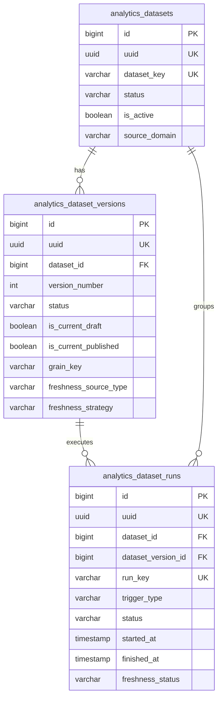
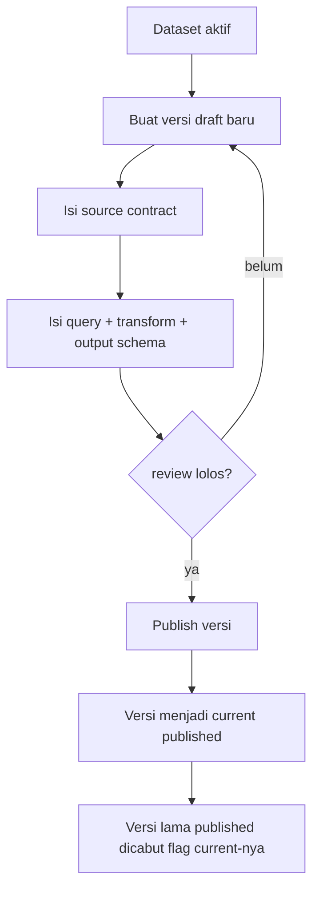
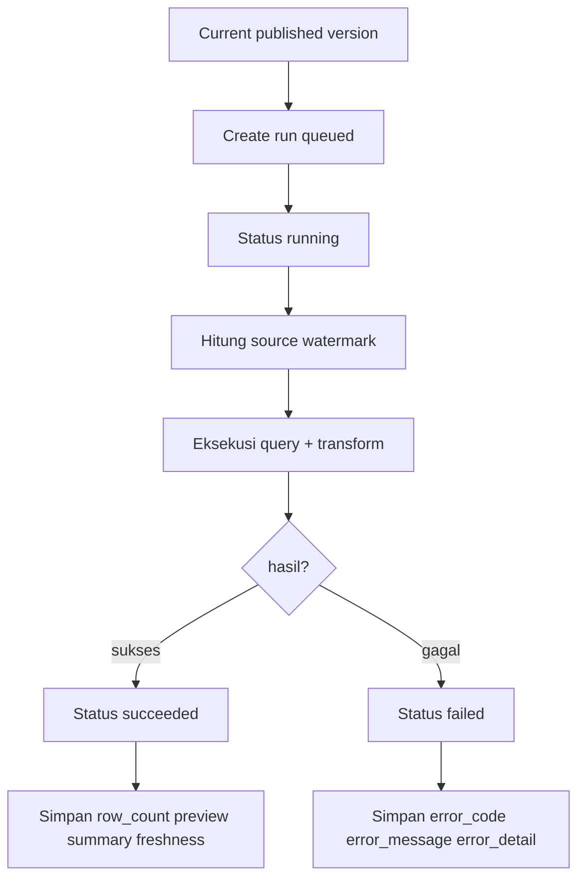

# Domain 5 — Schema Contract Analytics v1

Dokumen ini menurunkan blueprint Domain 5 menjadi kontrak schema yang lebih konkret untuk implementasi v1.

Dokumen induk terkait:
- `docs/architecture/domain-5-transition-and-boundary-audit-v1.md`
- `docs/architecture/domain-5-blueprint-v1.md`

Fokus dokumen ini:
- finalisasi schema contract untuk tiga tabel fondasi:
  - `analytics_datasets`
  - `analytics_dataset_versions`
  - `analytics_dataset_runs`
- field wajib dan nullable,
- enum minimum,
- constraint dan uniqueness rule,
- index minimum,
- pemisahan kolom relasional vs JSONB,
- contoh shape row,
- rule bisnis v1 yang harus dijaga sebelum masuk metric/chart/dashboard.

Dokumen ini masih berupa kontrak arsitektural, belum migration final.

---

## 1. Penjelasan awam dulu

Kalau dijelaskan sesederhana mungkin:
- `analytics_datasets` = kartu identitas dataset
- `analytics_dataset_versions` = resep resmi versi dataset
- `analytics_dataset_runs` = buku log setiap kali resep dijalankan

Tujuan schema contract ini adalah memastikan tiga hal itu punya bentuk tabel yang tegas.
Jadi nanti saat coding, kita tidak menebak-nebak lagi mana kolom wajib, mana JSONB, mana yang harus unik, dan mana yang harus diindex.

---

## 2. Prinsip kontrak schema

### 2.1. Dataset contract first
Domain 5 tidak dimulai dari chart/dashboard.
Kontrak dataset harus stabil dulu.

### 2.2. Versioning adalah fitur inti
Perubahan formula, grain, output schema, atau freshness policy tidak boleh overwrite diam-diam dataset published lama.

### 2.3. Source truth tetap di hulu
Domain 3 dan Domain 4 tetap pemilik source of truth.
Domain 5 hanya menyimpan kontrak analitik dan jejak refresh.

### 2.4. Relasional untuk field panas
Field yang sering dipakai untuk:
- filter,
- list,
- status,
- scoping,
- join,
- freshness lookup,
- pencarian current draft/current published,

harus jadi kolom relasional biasa.

### 2.5. JSONB untuk spec fleksibel
Field yang bentuknya bisa berkembang seperti:
- source contract,
- query spec,
- transform spec,
- output schema,
- preview result,
- error detail,

disimpan sebagai JSONB.

### 2.6. Freshness bisnis ≠ freshness refresh analytics
Contoh awam:
- `submissions.submitted_at` = kapan data bisnis terakhir masuk
- `analytics_dataset_runs.finished_at` = kapan dapur analitik terakhir selesai menghitung

Dua timestamp ini beda makna dan tidak boleh dicampur.

### 2.7. Dashboard nanti harus bisa ditelusuri
Walaupun dashboard belum dibuat, kontrak v1 harus memastikan output dashboard nanti bisa dijawab dengan pertanyaan:
- membaca dataset apa?
- versi berapa?
- run yang mana?
- refresh berdasarkan watermark sumber yang mana?

---

## 3. Scope schema v1

Schema contract ini hanya mengunci tiga tabel:
1. `analytics_datasets`
2. `analytics_dataset_versions`
3. `analytics_dataset_runs`

Belum masuk dulu:
- `analytics_metric_definitions`
- `analytics_chart_configs`
- `analytics_dashboards`
- `analytics_dashboard_widgets`
- scheduler/queue kompleks
- tabel materialized hasil final yang sangat spesifik per dataset

---

## 4. Mermaid — relasi inti tiga tabel



---

## 5. Enum minimum yang direkomendasikan

Nilai enum di bawah ini adalah baseline v1.
Kalau nanti bertambah, sebaiknya lewat migration/contract change yang jelas.

### 5.1. `analytics_dataset_status`
Untuk `analytics_datasets.status`:
- `draft`
- `active`
- `archived`

Makna awam:
- `draft` = dataset sudah didaftarkan tapi belum siap dipakai luas
- `active` = dataset aktif dan boleh punya versi published yang dipakai consumer
- `archived` = dataset tidak dipakai lagi, tapi histori tetap disimpan

### 5.2. `analytics_source_domain`
Untuk `analytics_datasets.source_domain`:
- `submission`
- `data_registry`
- `hybrid`

Makna awam:
- `submission` = bahan utama dari Domain 3
- `data_registry` = bahan utama dari Domain 4
- `hybrid` = gabungan submission + registry

### 5.3. `analytics_source_type`
Untuk `analytics_datasets.source_type`:
- `submission_fact`
- `published_registry_dimension`
- `aggregated_submission_fact`
- `hybrid_fact_dimension`

Catatan:
- `source_domain` menjelaskan domain pemilik sumber utama
- `source_type` menjelaskan bentuk sumber analitiknya

### 5.4. `default_reporting_year_mode`
Untuk `analytics_datasets.default_reporting_year_mode`:
- `active_year`
- `explicit`
- `all_time`

Makna awam:
- `active_year` = default ikut tahun aktif user
- `explicit` = caller harus mengirim tahun secara eksplisit
- `all_time` = default tidak dibatasi tahun

### 5.5. `analytics_dataset_version_status`
Untuk `analytics_dataset_versions.status`:
- `draft`
- `published`
- `archived`

Catatan:
- status ini hidup di level versi, bukan hanya di level dataset
- dataset bisa `active`, tapi versi tertentu bisa `archived`

### 5.6. `grain_key`
Nilai awal yang direkomendasikan untuk v1:
- `per_submission`
- `per_form_per_year`
- `per_scope_per_year`
- `per_registry_record_per_year`

Catatan awam:
- `grain_key` menjawab “satu row hasil dataset mewakili apa?”

### 5.7. `freshness_source_type`
Untuk `analytics_dataset_versions.freshness_source_type`:
- `submissions.submitted_at`
- `data_registry_versions.materialized_at`
- `hybrid_watermark`

Catatan:
- ini sengaja dibuat spesifik dan gampang dibaca manusia
- untuk v1, dataset submission-first disarankan memakai `submissions.submitted_at`

### 5.8. `freshness_strategy`
Untuk `analytics_dataset_versions.freshness_strategy`:
- `max_timestamp`
- `source_watermark_compare`
- `manual_assertion`

Makna awam:
- `max_timestamp` = ambil timestamp terbesar dari source resmi
- `source_watermark_compare` = bandingkan watermark source vs watermark run sebelumnya
- `manual_assertion` = dipakai bila source eksternal belum punya kontrak watermark yang matang

### 5.9. `analytics_run_trigger_type`
Untuk `analytics_dataset_runs.trigger_type`:
- `manual`
- `preview`
- `publish_hook`
- `cron`
- `system`

### 5.10. `analytics_run_status`
Untuk `analytics_dataset_runs.status`:
- `queued`
- `running`
- `succeeded`
- `failed`
- `cancelled`

### 5.11. `analytics_freshness_status`
Untuk `analytics_dataset_runs.freshness_status`:
- `unknown`
- `fresh`
- `stale`
- `failed`

Makna awam:
- `unknown` = sistem belum bisa menilai freshness dengan yakin
- `fresh` = hasil run konsisten dengan watermark sumber yang diharapkan
- `stale` = source lebih baru daripada hasil run ini
- `failed` = evaluasi freshness ikut gagal karena run/source problem

---

## 6. Kontrak tabel `analytics_datasets`

## 6.1. Tujuan
Menyimpan identitas, positioning bisnis, dan governance ringan untuk satu dataset analitik.

Satu row = satu dataset yang dikenali sistem.

Contoh:
- `submission_volume_by_form_year`
- `submission_volume_by_scope_year`

## 6.2. Field contract

### Wajib
- `id` bigint/integer PK
- `uuid` uuid unique not null
- `dataset_key` varchar unique not null
- `name` varchar not null
- `description` text nullable
- `source_domain` varchar not null
- `source_type` varchar not null
- `primary_source_ref` varchar nullable
- `status` varchar not null default `draft`
- `is_active` boolean not null default `true`
- `is_year_scoped` boolean not null default `true`
- `default_reporting_year_mode` varchar not null default `active_year`
- `owner_scope_type` varchar nullable
- `owner_scope_code` varchar nullable
- `owner_scope_name` varchar nullable
- `owner_scope_path` jsonb not null default `'[]'`
- `settings_json` jsonb not null default `'{}'`
- `tags_json` jsonb not null default `'[]'`
- `created_at` timestamp not null
- `updated_at` timestamp not null
- `deleted_at` timestamp nullable
- `created_by` fk nullable
- `created_by_uuid` uuid nullable
- `updated_by` fk nullable
- `updated_by_uuid` uuid nullable
- `deleted_by` fk nullable
- `deleted_by_uuid` uuid nullable

### Catatan awam per field penting
- `dataset_key`
  - nama teknis yang stabil
  - dipakai referensi internal, test, config, dan lookup
- `name`
  - label manusiawi untuk UI/admin
- `source_domain`
  - domain pemilik sumber utama
- `source_type`
  - bentuk dataset secara analitik
- `primary_source_ref`
  - pointer ringkas ke sumber utama
  - contoh: `form:*`, `registry:wilayah.administratif`, `submission:all`
- `is_year_scoped`
  - menandai apakah dataset normalnya dipakai per tahun
- `default_reporting_year_mode`
  - mengunci perilaku default saat caller tidak mengirim tahun
- `owner_scope_*`
  - fondasi scoping ringan bila dataset dimiliki unit/ruang lingkup tertentu
- `owner_scope_path`
  - jejak hirarki scope, misalnya dari provinsi -> kota/kabupaten -> kecamatan
- `settings_json`
  - metadata kecil yang tidak cocok dijadikan kolom satu per satu
- `tags_json`
  - label klasifikasi ringan untuk pengelompokan UI/admin

## 6.3. Kolom relasional vs JSONB

### Relasional
- `dataset_key`
- `name`
- `source_domain`
- `source_type`
- `primary_source_ref`
- `status`
- `is_active`
- `is_year_scoped`
- `default_reporting_year_mode`
- `owner_scope_type`
- `owner_scope_code`
- `owner_scope_name`

### JSONB
- `owner_scope_path`
- `settings_json`
- `tags_json`

Alasan:
- kolom relasional dipakai untuk filter/list/index
- JSONB dipakai untuk metadata fleksibel yang tidak selalu dipakai di WHERE

## 6.4. Constraint minimum
- unique `uuid`
- unique `dataset_key`
- check `status` in allowed enum
- check `source_domain` in allowed enum
- check `source_type` in allowed enum
- check `default_reporting_year_mode` in allowed enum
- `dataset_key` sebaiknya lowercase, snake_case, stabil

## 6.5. Index minimum
- index on `status`
- index on `is_active`
- index on `source_domain`
- index on `source_type`
- index on `is_year_scoped`
- index on `owner_scope_code`
- partial index on `deleted_at is null`

## 6.6. Rule bisnis v1
1. `dataset_key` tidak boleh berubah sembarangan setelah dipakai consumer.
2. Dataset `archived` tidak boleh menjadi target publish versi baru kecuali ada proses reactivation yang eksplisit.
3. `is_active=false` bukan berarti histori hilang; ini hanya menonaktifkan konsumsi default.
4. `owner_scope_*` boleh nullable di v1, tapi kalau dipakai harus konsisten sebagai snapshot ringan, bukan lookup dinamis yang berubah-ubah tiap query.

## 6.7. Contoh row awam

```json
{
  "dataset_key": "submission_volume_by_form_year",
  "name": "Volume Submission per Form per Tahun",
  "description": "Menghitung jumlah submission submitted per form dan per tahun pelaporan.",
  "source_domain": "submission",
  "source_type": "aggregated_submission_fact",
  "primary_source_ref": "submission:all",
  "status": "active",
  "is_active": true,
  "is_year_scoped": true,
  "default_reporting_year_mode": "active_year",
  "owner_scope_type": null,
  "owner_scope_code": null,
  "owner_scope_name": null,
  "owner_scope_path": [],
  "settings_json": {
    "supports_preview": true,
    "supports_materialization": true
  },
  "tags_json": ["kpi", "submission", "yearly"]
}
```

---

## 7. Kontrak tabel `analytics_dataset_versions`

## 7.1. Tujuan
Menyimpan versi kontrak dataset: source contract, query/transform contract, output contract, dan freshness policy.

Satu row = satu resep versi dataset.

## 7.2. Field contract

### Wajib
- `id` bigint/integer PK
- `uuid` uuid unique not null
- `dataset_id` fk not null
- `version_number` integer not null
- `status` varchar not null default `draft`
- `is_current_draft` boolean not null default `true`
- `is_current_published` boolean not null default `false`
- `source_contract_json` jsonb not null default `'{}'`
- `query_spec_json` jsonb not null default `'{}'`
- `transform_spec_json` jsonb not null default `'{}'`
- `join_registry_spec_json` jsonb not null default `'[]'`
- `grain_key` varchar not null
- `output_schema_json` jsonb not null default `'[]'`
- `dimension_definitions_json` jsonb not null default `'[]'`
- `metric_definitions_json` jsonb not null default `'[]'`
- `default_filters_json` jsonb not null default `'{}'`
- `sort_spec_json` jsonb not null default `'[]'`
- `freshness_source_type` varchar not null
- `freshness_source_ref` varchar nullable
- `freshness_strategy` varchar not null
- `freshness_policy_json` jsonb not null default `'{}'`
- `publish_notes` text nullable
- `published_at` timestamp nullable
- `created_at` timestamp not null
- `updated_at` timestamp not null
- `deleted_at` timestamp nullable
- `created_by` fk nullable
- `created_by_uuid` uuid nullable
- `updated_by` fk nullable
- `updated_by_uuid` uuid nullable
- `deleted_by` fk nullable
- `deleted_by_uuid` uuid nullable

### Catatan awam per field penting
- `version_number`
  - nomor versi resep
  - naik ketika kontrak berubah secara berarti
- `is_current_draft`
  - memudahkan editor/internal menemukan draft aktif
- `is_current_published`
  - menandai resep resmi yang dibaca default consumer
- `source_contract_json`
  - menjelaskan dataset ini membaca sumber apa dan dengan batas apa
- `query_spec_json`
  - menjelaskan aturan agregasi/filter/sort yang diizinkan backend
- `transform_spec_json`
  - menjelaskan pembentukan output dari hasil query mentah
- `join_registry_spec_json`
  - enrichment resmi ke Domain 4 bila memang dibutuhkan
- `grain_key`
  - jantung kontrak dataset
- `output_schema_json`
  - bentuk kolom output final
- `dimension_definitions_json`
  - daftar dimensi yang bisa dipakai chart/filter/grouping
- `metric_definitions_json`
  - daftar angka hasil hitung yang tersedia
- `default_filters_json`
  - filter baseline bila caller tidak override
- `freshness_*`
  - aturan bagaimana sistem menilai apakah hasil run masih segar

## 7.3. Isi minimum JSONB yang direkomendasikan

### `source_contract_json`
Minimal memuat:
- `source_domain`
- `source_entities`
- `primary_fact_entity`
- `allowed_statuses`
- `allowed_reporting_scope`
- `year_field`
- `period_field` bila ada
- `source_notes`

Contoh ringkas:

```json
{
  "source_domain": "submission",
  "source_entities": ["submissions", "forms"],
  "primary_fact_entity": "submissions",
  "allowed_statuses": ["submitted"],
  "year_field": "reporting_year",
  "timestamp_field": "submitted_at"
}
```

### `query_spec_json`
Minimal memuat:
- `filters`
- `group_by`
- `aggregations`
- `base_ordering`
- `limit_policy`

### `transform_spec_json`
Minimal memuat:
- `output_field_mapping`
- `derived_fields`
- `null_handling`
- `label_policy`

### `join_registry_spec_json`
Minimal memuat array objek seperti:
- `registry_slug`
- `join_type`
- `local_key`
- `remote_key`
- `selected_fields`
- `published_only`

### `output_schema_json`
Minimal memuat daftar field output:
- `field`
- `type`
- `nullable`
- `label`
- `description`

### `dimension_definitions_json`
Minimal memuat:
- `key`
- `field`
- `label`
- `type`
- `filterable`
- `groupable`

### `metric_definitions_json`
Minimal memuat:
- `key`
- `field`
- `label`
- `aggregation_kind`
- `format_hint`

### `default_filters_json`
Minimal memuat filter baseline yang aman, misalnya:
- `status=submitted`
- `reporting_year_mode=active_year`

### `sort_spec_json`
Minimal memuat daftar sort:
- `field`
- `direction`

### `freshness_policy_json`
Minimal memuat:
- `watermark_field`
- `comparison_mode`
- `stale_after_seconds` nullable
- `dependency_refs`
- `notes`

## 7.4. Kolom relasional vs JSONB

### Relasional
- `dataset_id`
- `version_number`
- `status`
- `is_current_draft`
- `is_current_published`
- `grain_key`
- `freshness_source_type`
- `freshness_source_ref`
- `freshness_strategy`
- `published_at`

### JSONB
- `source_contract_json`
- `query_spec_json`
- `transform_spec_json`
- `join_registry_spec_json`
- `output_schema_json`
- `dimension_definitions_json`
- `metric_definitions_json`
- `default_filters_json`
- `sort_spec_json`
- `freshness_policy_json`

Alasan:
- status/version/grain/freshness utama sering difilter dan harus mudah diindex
- detail contract/spec bisa berkembang, sehingga lebih cocok di JSONB tervalidasi

## 7.5. Constraint minimum
- unique `uuid`
- unique (`dataset_id`, `version_number`)
- partial unique index untuk satu current draft per dataset:
  - unique (`dataset_id`) where `is_current_draft = true` and `deleted_at is null`
- partial unique index untuk satu current published per dataset:
  - unique (`dataset_id`) where `is_current_published = true` and `deleted_at is null`
- check `status` in allowed enum
- check `grain_key` in allowed enum/list baseline v1
- check `freshness_source_type` in allowed enum
- check `freshness_strategy` in allowed enum
- check konsistensi minimum:
  - `is_current_published = true` -> `status` harus `published`
  - `published_at is not null` -> `status` seharusnya `published` atau `archived`

## 7.6. Index minimum
- index on (`dataset_id`, `status`)
- index on `is_current_draft`
- index on `is_current_published`
- index on `grain_key`
- index on `freshness_source_type`
- index on `freshness_strategy`
- index on `published_at`
- partial index on `deleted_at is null`

## 7.7. Rule bisnis v1
1. Satu dataset hanya boleh punya satu current draft aktif.
2. Satu dataset hanya boleh punya satu current published aktif.
3. Publish versi baru harus mematikan flag `is_current_published` dari versi sebelumnya.
4. Draft tidak boleh dibaca consumer produksi sebagai default.
5. Perubahan besar pada grain, output schema, atau freshness policy harus membuat versi baru.
6. `version_number` tidak boleh didaur ulang.
7. `join_registry_spec_json` hanya boleh menunjuk registry published, bukan draft/staging registry.

## 7.8. Mermaid — lifecycle versi dataset



## 7.9. Contoh row awam

```json
{
  "dataset_id": 1,
  "version_number": 1,
  "status": "published",
  "is_current_draft": false,
  "is_current_published": true,
  "grain_key": "per_form_per_year",
  "source_contract_json": {
    "source_domain": "submission",
    "source_entities": ["submissions", "forms"],
    "primary_fact_entity": "submissions",
    "allowed_statuses": ["submitted"],
    "year_field": "reporting_year",
    "timestamp_field": "submitted_at"
  },
  "query_spec_json": {
    "filters": [
      {"field": "status", "op": "eq", "value": "submitted"}
    ],
    "group_by": ["form_id", "reporting_year"],
    "aggregations": [
      {"field": "id", "func": "count", "as": "submission_count"},
      {"field": "submitted_at", "func": "max", "as": "latest_submitted_at"}
    ]
  },
  "transform_spec_json": {
    "output_field_mapping": [
      {"from": "form_id", "to": "form_id"},
      {"from": "reporting_year", "to": "reporting_year"},
      {"from": "submission_count", "to": "submission_count"},
      {"from": "latest_submitted_at", "to": "latest_submitted_at"}
    ]
  },
  "join_registry_spec_json": [],
  "output_schema_json": [
    {"field": "form_id", "type": "integer", "nullable": false},
    {"field": "form_uuid", "type": "uuid", "nullable": false},
    {"field": "form_name", "type": "string", "nullable": false},
    {"field": "reporting_year", "type": "integer", "nullable": false},
    {"field": "submission_count", "type": "integer", "nullable": false},
    {"field": "latest_submitted_at", "type": "datetime", "nullable": true}
  ],
  "dimension_definitions_json": [
    {"key": "form", "field": "form_name", "label": "Form", "type": "string", "filterable": true, "groupable": true},
    {"key": "reporting_year", "field": "reporting_year", "label": "Tahun", "type": "integer", "filterable": true, "groupable": true}
  ],
  "metric_definitions_json": [
    {"key": "submission_count", "field": "submission_count", "label": "Jumlah Submission", "aggregation_kind": "sum", "format_hint": "integer"}
  ],
  "default_filters_json": {
    "reporting_year_mode": "active_year"
  },
  "sort_spec_json": [
    {"field": "reporting_year", "direction": "asc"},
    {"field": "form_name", "direction": "asc"}
  ],
  "freshness_source_type": "submissions.submitted_at",
  "freshness_source_ref": "submission:all",
  "freshness_strategy": "max_timestamp",
  "freshness_policy_json": {
    "watermark_field": "submitted_at",
    "comparison_mode": "max_source_timestamp"
  },
  "published_at": "2026-06-02T17:15:00Z"
}
```

---

## 8. Kontrak tabel `analytics_dataset_runs`

## 8.1. Tujuan
Menyimpan histori eksekusi refresh dataset untuk versi tertentu.

Satu row = satu percobaan run.
Bahkan run gagal tetap harus disimpan.

## 8.2. Field contract

### Wajib
- `id` bigint/integer PK
- `uuid` uuid unique not null
- `dataset_id` fk not null
- `dataset_version_id` fk not null
- `run_key` varchar unique not null
- `trigger_type` varchar not null
- `trigger_ref` varchar nullable
- `requested_reporting_year` integer nullable
- `requested_reporting_period_id` fk nullable
- `requested_filters_json` jsonb not null default `'{}'`
- `status` varchar not null default `queued`
- `started_at` timestamp nullable
- `finished_at` timestamp nullable
- `duration_ms` bigint nullable
- `source_watermark` varchar nullable
- `freshness_status` varchar not null default `unknown`
- `source_snapshot_json` jsonb not null default `'{}'`
- `freshness_evaluated_at` timestamp nullable
- `result_row_count` bigint nullable
- `result_schema_json` jsonb not null default `'[]'`
- `result_preview_json` jsonb not null default `'[]'`
- `materialization_ref` varchar nullable
- `summary_json` jsonb not null default `'{}'`
- `error_code` varchar nullable
- `error_message` text nullable
- `error_detail_json` jsonb not null default `'{}'`
- `created_at` timestamp not null
- `updated_at` timestamp not null
- `deleted_at` timestamp nullable
- `created_by` fk nullable
- `created_by_uuid` uuid nullable
- `updated_by` fk nullable
- `updated_by_uuid` uuid nullable
- `deleted_by` fk nullable
- `deleted_by_uuid` uuid nullable

### Catatan awam per field penting
- `run_key`
  - nomor tiket unik untuk satu eksekusi
  - berguna untuk tracing/log/job audit
- `trigger_type`
  - kenapa run ini terjadi
- `requested_reporting_year`
  - konteks tahun saat run dijalankan
- `requested_filters_json`
  - override filter saat run
- `status`
  - antrian/jalan/sukses/gagal/batal
- `source_watermark`
  - batas terbaru data sumber yang dipakai run ini
- `source_snapshot_json`
  - ringkasan sumber yang dipakai saat run
- `result_preview_json`
  - sampel kecil hasil, bukan full data besar
- `materialization_ref`
  - pointer ke storage hasil bila nanti ada tabel/objek materialized
- `error_*`
  - observability saat run gagal

## 8.3. Isi minimum JSONB yang direkomendasikan

### `requested_filters_json`
Minimal memuat:
- filter override dari caller
- informasi apakah filter diwarisi dari default contract atau override manual

### `source_snapshot_json`
Minimal memuat:
- `source_domain`
- `source_entities`
- `source_watermark_components`
- `resolved_reporting_year`
- `resolved_reporting_period_id`
- `dependency_versions` bila ada join registry

### `result_schema_json`
Minimal memuat schema hasil run aktual.
Boleh menyalin/menurunkan dari `output_schema_json` versi dataset pada saat run.

### `result_preview_json`
Minimal memuat sample kecil, misalnya 5-20 row pertama yang aman untuk preview/debug.

### `summary_json`
Minimal memuat:
- `group_count` bila relevan
- `metric_summary`
- `notes`

### `error_detail_json`
Minimal memuat:
- stack/trace yang sudah dibersihkan bila perlu
- stage yang gagal
- context kontrak yang relevan
- retriable atau tidak

## 8.4. Kolom relasional vs JSONB

### Relasional
- `dataset_id`
- `dataset_version_id`
- `run_key`
- `trigger_type`
- `trigger_ref`
- `requested_reporting_year`
- `requested_reporting_period_id`
- `status`
- `started_at`
- `finished_at`
- `duration_ms`
- `source_watermark`
- `freshness_status`
- `freshness_evaluated_at`
- `result_row_count`
- `materialization_ref`
- `error_code`

### JSONB
- `requested_filters_json`
- `source_snapshot_json`
- `result_schema_json`
- `result_preview_json`
- `summary_json`
- `error_detail_json`

Alasan:
- semua data yang sering dipakai monitoring/opsional filter dibuat relasional
- detail snapshot/result/error tetap fleksibel di JSONB

## 8.5. Constraint minimum
- unique `uuid`
- unique `run_key`
- fk `dataset_id` -> `analytics_datasets.id`
- fk `dataset_version_id` -> `analytics_dataset_versions.id`
- check `trigger_type` in allowed enum
- check `status` in allowed enum
- check `freshness_status` in allowed enum
- check konsistensi waktu minimum:
  - `finished_at >= started_at` bila keduanya terisi
  - `duration_ms >= 0` bila terisi
- check konsistensi hasil minimum:
  - `status = succeeded` tidak boleh menyimpan `started_at` null
  - `status = failed` sebaiknya punya `error_message` minimal

## 8.6. Index minimum
- index on `dataset_id`
- index on `dataset_version_id`
- index on `trigger_type`
- index on `status`
- index on `started_at`
- index on `finished_at`
- index on `requested_reporting_year`
- index on `requested_reporting_period_id`
- index on `freshness_status`
- index on `materialization_ref`
- partial index on `deleted_at is null`

## 8.7. Rule bisnis v1
1. Satu run selalu menunjuk ke satu versi dataset tertentu.
2. `dataset_id` dan `dataset_version_id` harus konsisten; versi harus milik dataset yang sama.
3. Run gagal tetap disimpan sebagai histori.
4. Hasil consumer produksi nantinya harus bisa ditelusuri ke run yang sukses.
5. `source_watermark` harus dihasilkan dari kontrak freshness versi dataset, bukan diisi manual sembarangan.
6. `result_preview_json` hanya preview kecil, bukan tempat menyimpan full dataset besar.
7. `materialization_ref` boleh nullable di v1 karena belum semua dataset harus materialized.

## 8.8. Mermaid — lifecycle run



## 8.9. Contoh row awam

```json
{
  "dataset_id": 1,
  "dataset_version_id": 1,
  "run_key": "adrun_20260602_171800_submission_volume_by_form_year_v1",
  "trigger_type": "manual",
  "trigger_ref": "user:42",
  "requested_reporting_year": 2026,
  "requested_reporting_period_id": null,
  "requested_filters_json": {
    "reporting_year": 2026
  },
  "status": "succeeded",
  "started_at": "2026-06-02T17:18:00Z",
  "finished_at": "2026-06-02T17:18:02Z",
  "duration_ms": 2100,
  "source_watermark": "2026-06-02T16:55:41Z",
  "freshness_status": "fresh",
  "source_snapshot_json": {
    "source_domain": "submission",
    "source_entities": ["submissions", "forms"],
    "resolved_reporting_year": 2026
  },
  "freshness_evaluated_at": "2026-06-02T17:18:02Z",
  "result_row_count": 24,
  "result_schema_json": [
    {"field": "form_id", "type": "integer"},
    {"field": "reporting_year", "type": "integer"},
    {"field": "submission_count", "type": "integer"}
  ],
  "result_preview_json": [
    {"form_id": 1, "reporting_year": 2026, "submission_count": 18},
    {"form_id": 2, "reporting_year": 2026, "submission_count": 6}
  ],
  "materialization_ref": null,
  "summary_json": {
    "group_count": 24,
    "notes": "manual refresh after publish"
  },
  "error_code": null,
  "error_message": null,
  "error_detail_json": {}
}
```

---

## 9. Relationship dan integritas lintas tabel

## 9.1. Aturan foreign key minimum
- `analytics_dataset_versions.dataset_id` -> `analytics_datasets.id`
- `analytics_dataset_runs.dataset_id` -> `analytics_datasets.id`
- `analytics_dataset_runs.dataset_version_id` -> `analytics_dataset_versions.id`

## 9.2. Aturan integritas bisnis yang tidak cukup hanya dengan FK

### Rule A — versi harus milik dataset yang sama
Walau `analytics_dataset_runs` punya `dataset_id` dan `dataset_version_id`, sistem tetap harus memastikan:
- `dataset_version.dataset_id == run.dataset_id`

Ini bisa dijaga lewat service layer, dan bila perlu nanti ditambah guard database/triggers jika benar-benar dibutuhkan.

### Rule B — current draft dan current published tunggal
Ini paling aman dijaga dengan partial unique index + service layer.

### Rule C — publish tidak boleh dari kontrak invalid
Sebelum `status=dipublished`, versi harus lolos validasi minimum:
- `grain_key` terisi
- `output_schema_json` tidak kosong
- `metric_definitions_json` valid
- `freshness_source_type` dan `freshness_strategy` valid

---

## 10. Rekomendasi NOT NULL paling aman untuk v1

Supaya implementasi tidak terlalu longgar, ini daftar kolom yang menurutku paling aman dibuat `NOT NULL` sejak awal.

### `analytics_datasets`
- `uuid`
- `dataset_key`
- `name`
- `source_domain`
- `source_type`
- `status`
- `is_active`
- `is_year_scoped`
- `default_reporting_year_mode`
- `owner_scope_path`
- `settings_json`
- `tags_json`
- `created_at`
- `updated_at`

### `analytics_dataset_versions`
- `uuid`
- `dataset_id`
- `version_number`
- `status`
- `is_current_draft`
- `is_current_published`
- `source_contract_json`
- `query_spec_json`
- `transform_spec_json`
- `join_registry_spec_json`
- `grain_key`
- `output_schema_json`
- `dimension_definitions_json`
- `metric_definitions_json`
- `default_filters_json`
- `sort_spec_json`
- `freshness_source_type`
- `freshness_strategy`
- `freshness_policy_json`
- `created_at`
- `updated_at`

### `analytics_dataset_runs`
- `uuid`
- `dataset_id`
- `dataset_version_id`
- `run_key`
- `trigger_type`
- `requested_filters_json`
- `status`
- `freshness_status`
- `source_snapshot_json`
- `result_schema_json`
- `result_preview_json`
- `summary_json`
- `error_detail_json`
- `created_at`
- `updated_at`

---

## 11. Use case v1 yang dipatok untuk validasi kontrak

Dataset pertama tetap disarankan:
- `submission_volume_by_form_year`

## 11.1. Kenapa dataset ini dipakai untuk menguji kontrak
Karena dia:
- sederhana,
- mudah dijelaskan ke orang awam,
- mudah diverifikasi ke sumber,
- langsung menguji boundary Domain 3 -> Domain 5,
- belum butuh join registry rumit.

## 11.2. Contract minimum use case ini

### Di `analytics_datasets`
- `dataset_key = submission_volume_by_form_year`
- `source_domain = submission`
- `source_type = aggregated_submission_fact`
- `is_year_scoped = true`
- `default_reporting_year_mode = active_year`

### Di `analytics_dataset_versions`
- `grain_key = per_form_per_year`
- `freshness_source_type = submissions.submitted_at`
- `freshness_strategy = max_timestamp`
- output minimum:
  - `form_id`
  - `form_uuid`
  - `form_name`
  - `reporting_year`
  - `submission_count`
  - `latest_submitted_at`

### Di `analytics_dataset_runs`
- `requested_reporting_year` boleh diisi dari active year actor
- `source_watermark` diambil dari max `submissions.submitted_at`
- `result_row_count` = jumlah group hasil agregasi, bukan jumlah raw submission mentah

---

## 12. Yang sengaja belum dimasukkan ke schema contract v1

Belum dulu:
- storage fisik final hasil materialized per dataset
- tabel schedule execution
- tabel dependency graph dataset antar dataset
- policy permission detail per metric/chart/dashboard
- cache layer visualisasi
- chart preset di level dataset
- compatibility matrix antar widget/dashboard

Alasan:
- ketiganya belum dibutuhkan untuk membuktikan fondasi dataset contract
- kalau terlalu cepat dimasukkan, schema jadi gemuk sebelum use case pertama tervalidasi

---

## 13. Keputusan final Turn B yang terkunci

1. Domain 5 v1 foundation tetap hanya tiga tabel.
2. Naming memakai prefix `analytics_` untuk memperjelas bounded context.
3. `analytics_datasets` menyimpan identitas, bukan hasil hitung.
4. `analytics_dataset_versions` menyimpan kontrak versi, bukan sekadar catatan publish.
5. `analytics_dataset_runs` wajib ada untuk audit refresh dan freshness.
6. Source freshness submission-first tetap mengacu ke `submissions.submitted_at`.
7. Satu dataset hanya boleh punya satu current draft dan satu current published.
8. Dashboard/consumer default nanti wajib membaca versi published dan run yang bisa ditelusuri.

---

## 14. Next step yang sehat setelah schema contract ini

Urutan paling aman setelah ini:
1. turunkan ke migration/schema implementation plan,
2. finalkan model SQLAlchemy + enum constants,
3. tulis test contract untuk current draft/current published uniqueness,
4. tulis thin service slice untuk:
   - create dataset,
   - create draft version,
   - publish version,
   - create run,
   - mark run success/failure,
5. baru setelah itu pikirkan metric/chart/dashboard.

---

## 15. Kesimpulan awam

Kalau kita sederhanakan banget:
- tabel 1 bilang “dataset ini apa”
- tabel 2 bilang “dataset ini dihitung dengan resep apa”
- tabel 3 bilang “resep itu terakhir dijalankan kapan dan hasilnya apa”

Kalau tiga pertanyaan itu sudah bisa dijawab rapi oleh database, maka Domain 5 punya fondasi yang sehat.
Kalau belum, dashboard secantik apa pun nanti tetap rawan bikin angka yang sulit dipercaya.
