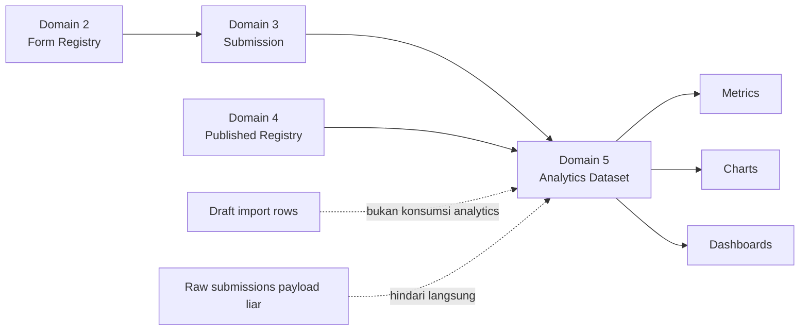
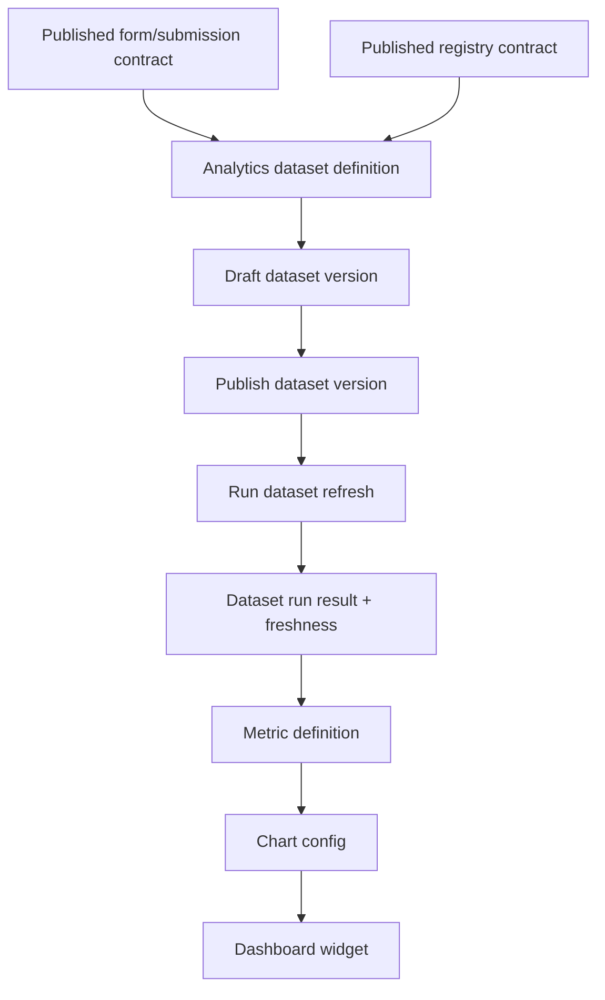

# Domain 5 Transition & Boundary Audit v1

Dokumen ini dipakai untuk memulai transisi dari Domain 4 `Master Data / Data Registry` ke Domain 5 `Analytics & Visualization` dengan audit boundary yang tipis tetapi tegas.

## 1. Kenapa sekarang masuk ke Domain 5

Status repo saat audit ini:
- commit terakhir repo: `fd6f610 Domain 4 refactor`
- histori Domain 4 sebelumnya sudah berurutan dan rapi:
  - `ef29807 Data Registry v3`
  - `449e163 Data registry v2`
  - `630cb44 Data Registry v1 Contract`
  - `225d6aa finalize Domain 4 master data registry v1 blueprint`
- dokumentasi final Domain 4 sudah ada di:
  - `docs/architecture/domain-4-final-audit-and-workflow-v1.md`
- belum ada modul khusus analytics/dataset/dashboard di `app/modules/`

Artinya secara praktis:
- Domain 4 sudah cukup settled untuk dijadikan fondasi hilir.
- Domain 5 sekarang bisa dimulai tanpa mencampur ulang concern registry/import/materialization.
- Karena Domain 5 masih greenfield, kita punya kesempatan bagus untuk mendesain kontraknya rapi sejak awal.

---

## 2. Penjelasan awam: bedanya Domain 4 dan Domain 5

Cara paling gampang membayangkannya:

- Domain 4 = gudang bahan baku yang sudah dirapikan, diberi label, dan siap dipakai.
- Domain 5 = dapur + plating + meja saji untuk mengubah bahan tadi menjadi informasi yang enak dilihat dan mudah dipahami.

Contoh sederhana:
- Domain 4 menyimpan daftar wilayah, daftar program, daftar unit, atau hasil publish data reusable.
- Domain 5 menghitung:
  - berapa jumlah submission per wilayah,
  - tren per tahun,
  - top kategori,
  - chart batang/pie/line,
  - dashboard pimpinan.

Jadi Domain 4 menjawab:
- "data bakunya apa?"
- "versi published yang resmi yang mana?"
- "lookup/registry yang valid yang mana?"

Sedangkan Domain 5 menjawab:
- "apa insight-nya?"
- "berapa totalnya?"
- "bagaimana tren dan perbandingannya?"
- "bagaimana divisualisasikan di dashboard?"

---

## 3. Audit boundary tipis Domain 4 -> Domain 5

### 3.1. Yang tetap milik Domain 4

Tetap di Domain 4:
- definisi registry
- draft/published lifecycle registry
- schema contract registry
- import batch, staging row, validation, materialization
- lineage source data registry
- reusable option list / lookup / tree / geojson published contract
- record master data yang menjadi dimensi referensial

Kalimat sederhananya:
- Domain 4 berhenti saat data reusable sudah resmi, rapi, dan bisa dipakai ulang.

### 3.2. Yang mulai menjadi milik Domain 5

Masuk Domain 5:
- definisi dataset analitik
- pemilihan source dataset dari submission dan/atau published registry
- transform/query spec untuk agregasi
- hasil refresh/materialization dataset
- metric definition
- chart config
- dashboard dan widget
- freshness dataset/dashboard

Kalimat sederhananya:
- Domain 5 mulai saat kita bertanya, "dari data resmi itu, insight apa yang mau dihitung dan ditampilkan?"

### 3.3. Yang tidak boleh dilakukan Domain 5

Domain 5 tidak boleh:
- menjadi tempat kebenaran wilayah/master data
- mengedit registry published secara liar
- menganggap raw `submissions.payload` sebagai API publik tanpa contract dataset
- menempelkan logic bisnis registry ke chart/dashboard langsung

Kalau ini dilanggar, nanti dashboard memang cepat jadi, tapi rapuh.

---

## 4. Sumber data awal Domain 5 yang sudah realistis di repo ini

Dari audit codebase saat ini, sumber yang paling masuk akal untuk Domain 5 tahap awal adalah:

### A. Domain 3 `submissions`
Dipakai sebagai sumber fakta bisnis utama.

Kenapa:
- sudah punya `submitted_at`
- sudah punya `reporting_year`
- sudah punya `reporting_period_id`
- sudah punya relasi ke `form` dan `form_version`
- sudah punya prinsip freshness yang jelas

### B. Domain 4 published registry
Dipakai sebagai dimensi/lookup yang memperkaya dataset.

Kenapa:
- Domain 4 sekarang sudah bisa mempublish curated records
- cocok untuk label dimensi seperti wilayah, kategori, unit, atau master entitas lain
- lebih aman daripada membaca source import/staging mentah

### C. Domain 2 form metadata
Dipakai terbatas untuk konteks dataset.

Contoh:
- form mana yang menjadi source dataset
- versi schema apa yang menjadi acuan interpretasi field

---

## 5. Boundary kontrak data yang disarankan

Agar awet, Domain 5 jangan langsung lompat ke chart.

Urutan yang sehat:
1. source contract
2. dataset contract
3. dataset refresh/materialization
4. metric definition
5. chart config
6. dashboard

Kenapa begitu?
Karena chart yang bagus tapi dataset contract-nya belum stabil biasanya cepat jadi "hiasan yang bohong".

### 5.1. Source contract
Source contract menjawab:
- data diambil dari domain mana?
- pakai row apa?
- filter default apa?
- period-awareness-nya bagaimana?
- published-only atau raw?

### 5.2. Dataset contract
Dataset contract menjawab:
- kolom output dataset apa saja?
- grain dataset-nya apa?
- 1 row mewakili apa?
- field mana dimensi dan field mana metric?
- apakah hasilnya snapshot, aggregated table, atau on-demand preview?

### 5.3. Refresh/materialization contract
Menjawab:
- kapan dataset dihitung ulang?
- source watermark-nya apa?
- hasil refresh terakhir sukses atau gagal?
- cache/dashboard last refreshed kapan?

---

## 6. Grain analitik: keputusan kecil yang penting

Sebelum bikin tabel Domain 5, kita perlu sadar bahwa ada beberapa level butir data:

### Level 1 — row-level normalized dataset
Contoh:
- satu row = satu submission yang sudah dipilih kolom-kolom pentingnya

Cocok untuk:
- tabel eksplorasi
- filter fleksibel
- menjadi bahan agregasi berikutnya

### Level 2 — aggregated dataset
Contoh:
- satu row = total submission per wilayah per tahun

Cocok untuk:
- KPI card
- chart tren
- dashboard ringkas

### Level 3 — visual contract
Contoh:
- chart line jumlah submission tahunan
- pie chart distribusi status

Cocok untuk:
- dashboard akhir

Saran untuk proyek ini:
- jangan mulai dari Level 3
- mulai dari Level 1/2 dulu lewat dataset contract yang jelas

---

## 7. Candidate entity Domain 5 v1

Supaya tidak kebanyakan tabel dari hari pertama, kandidat entity dibagi dua lapis.

### 7.1. Lapis minimum yang paling aman

1. `analytics_datasets`
- definisi dataset
- siapa source utamanya
- status aktif/tidak
- apakah year-scoped

2. `analytics_dataset_versions`
- versi kontrak dataset
- transform/query spec snapshot
- schema output snapshot
- lifecycle draft/published

3. `analytics_dataset_runs`
- jejak refresh/materialization dataset
- source watermark
- refreshed_at
- status run (`queued`, `running`, `succeeded`, `failed`)
- row_count/output summary

Kenapa tiga ini dulu:
- sudah cukup untuk membuktikan fondasi analytics tanpa memaksa chart/dashboard dari awal
- bisa dites dan diverifikasi dengan TDD lebih mudah

### 7.2. Lapis berikutnya setelah fondasi stabil

4. `analytics_metric_definitions`
5. `analytics_chart_configs`
6. `analytics_dashboards`
7. `analytics_dashboard_widgets`

---

## 8. Service boundary yang disarankan untuk Domain 5 v1

### 8.1. `AnalyticsDatasetService`
Tugas:
- create dataset
- create draft version
- publish version
- get dataset detail
- list datasets

### 8.2. `AnalyticsDatasetRunService`
Tugas:
- preview dataset source
- run refresh/materialization
- save run result
- get freshness status

### 8.3. `AnalyticsQuerySpecValidator`
Tugas:
- memastikan transform/query spec tidak liar
- membatasi operator yang diizinkan
- menjaga agar route/UI tidak mengeksekusi query bebas

Poin penting:
- repository hanya query/persist
- service memegang rule analytics
- transform/query spec harus tervalidasi, bukan SQL bebas dari UI

---

## 9. Rekomendasi irisan pertama Domain 5

Kalau kita mau pelan-pelan dan aman, irisan pertama jangan dashboard dulu.

### Irisan pertama yang direkomendasikan

Buat `Dataset Contract Foundation`.

Isi irisan pertama:
1. migration untuk:
   - `analytics_datasets`
   - `analytics_dataset_versions`
   - `analytics_dataset_runs`
2. model + repository + service minimal
3. satu kontrak source paling sederhana:
   - source = `submissions` published/submitted only
4. satu kontrak dataset paling sederhana:
   - "jumlah submission per form per reporting_year"
5. satu endpoint preview atau service preview
6. satu endpoint refresh sinkron tipis
7. test freshness dataset terhadap `submissions.submitted_at`

Kenapa ini paling sehat:
- langsung nyambung dengan kontrak freshness yang sudah matang di Domain 3
- belum tergantung UI dashboard besar
- cepat membuktikan apakah desain Domain 5 benar atau cuma konsep kertas

---

## 10. Contoh use case dataset pertama

Use case paling aman:

### Dataset: `submission_volume_by_form_year`

Pertanyaan bisnis yang dijawab:
- per form, berapa jumlah submission yang masuk per tahun?

Source:
- `submissions`

Filter baseline:
- `status = submitted`

Dimensi:
- `form_id`
- `form_uuid`
- `form_name`
- `reporting_year`

Metric:
- `submission_count`
- `latest_submitted_at`

Nilai strategis dataset ini:
- gampang dipahami orang awam
- gampang diverifikasi dengan query langsung
- langsung menguji boundary Domain 3 -> Domain 5
- jadi fondasi untuk KPI card dan chart tren pertama

---

## 11. Mermaid boundary sederhana

---

## 12. Mermaid alur yang sehat untuk Domain 5 v1

---

## 13. Apa yang sebaiknya belum kita lakukan dulu

Belum dulu:
- query builder bebas dari UI
- dashboard builder drag-drop penuh
- scheduled ETL berat
- map visualization kompleks
- cross-form mega dataset yang logiknya campur aduk
- chart yang langsung membaca raw JSONB submission tanpa dataset contract

Kenapa ditahan:
- itu semua menarik, tapi cepat membuat fondasi keropos kalau source contract dan dataset versioning belum jadi

---

## 14. Rekomendasi langkah berikutnya

Urutan paling enak setelah Domain 4 settled:

1. finalkan blueprint Domain 5 v1
2. kunci entity minimum Domain 5
3. kunci use case dataset pertama
4. tulis schema-contract + service-contract plan
5. baru coding migration foundation

Kalau mau super aman, sesi berikut bisa dibagi begini:
- Turn A: blueprint Domain 5 v1
- Turn B: schema contract Domain 5 v1
- Turn C: coding plan evaluable untuk migration + tests + thin slice
- Turn D: eksekusi coding

---

## 15. Kesimpulan singkat

Kesimpulan audit boundary:
- Domain 4 sekarang sudah cukup matang untuk menjadi upstream resmi Domain 5.
- Domain 5 sebaiknya dimulai dari `dataset contract`, bukan dari `chart/dashboard`.
- Source utama Domain 5 tahap awal paling aman adalah `submissions`, diperkaya published registry dari Domain 4.
- Prinsip kunci: Domain 4 mempublikasikan data reusable; Domain 5 mengubah data reusable itu menjadi insight.

Kalau dipaksa satu kalimat awam:
- Domain 4 merapikan bahan baku, Domain 5 memasak dan menyajikannya.
